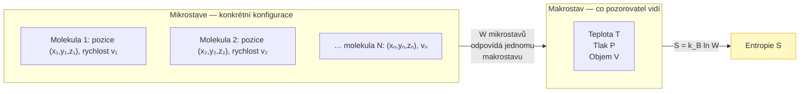
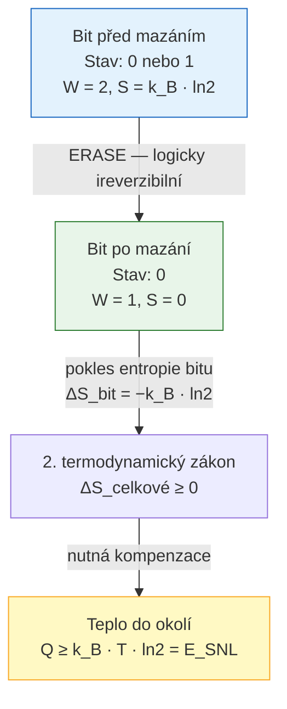
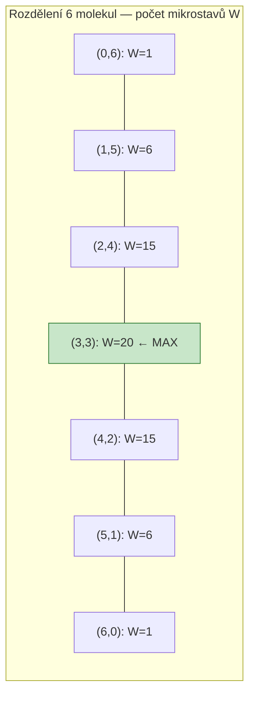
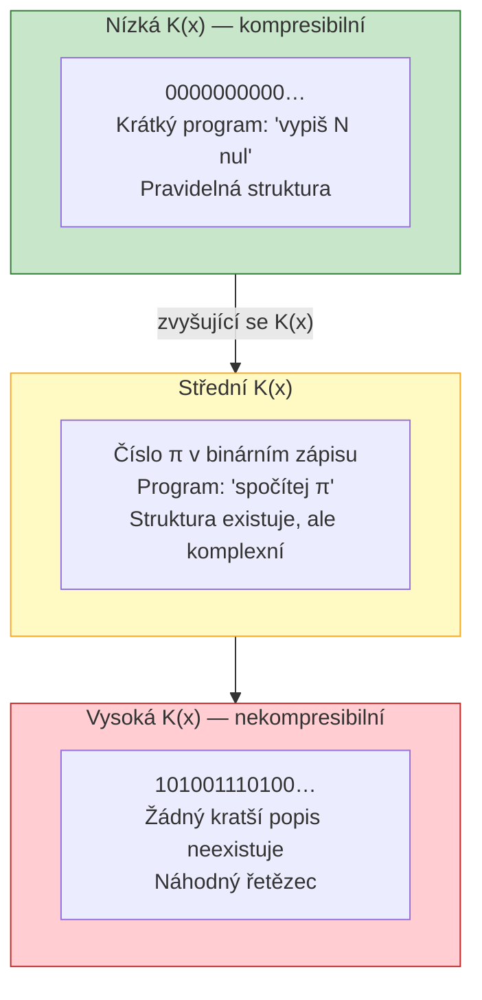
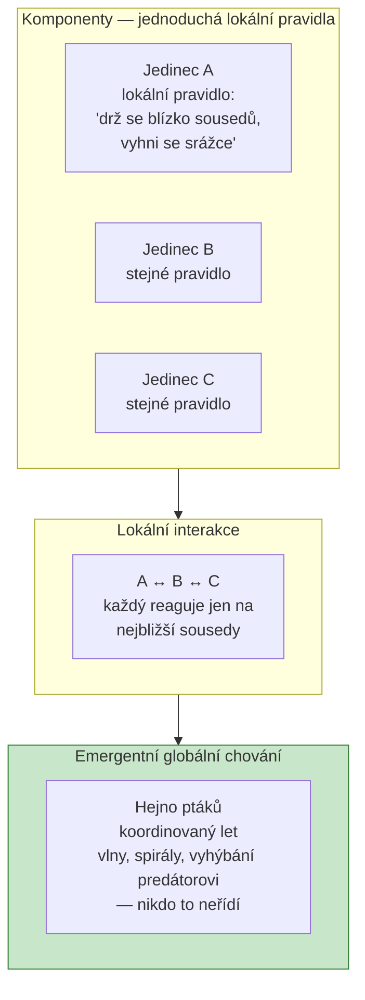
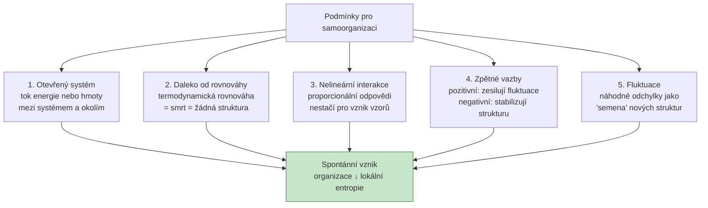
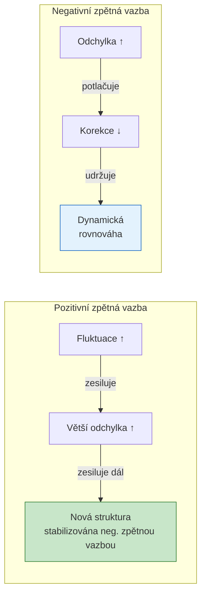

# 01 Úvod, inspirace v přírodě, entropie a samoorganizace

---

## Entropie — fyzika a informace

> [!info] Boltzmannova entropie: S = kB ln W — co jsou kB a W?

**Boltzmannova entropie** je základní vztah statistické fyziky, který propojuje mikroskopický popis systému (rozložení částic) s makroskopickou termodynamickou veličinou (entropií):

$$S = k_B \ln W$$

**Proměnné:**

- $k_B = 1{,}38 \times 10^{-23}\ \text{J/K}$ — **Boltzmannova konstanta** — konverzní faktor mezi mikroskopickým světem (počty mikrostavů, bezrozměrné) a makroskopickým (energie, teplota v Kelvinech). Pojmenována po Ludwigu Boltzmannovi, který tento vztah odvodil v 19. století.

- $W$ — **počet mikrostavů** (Wahrscheinlichkeit = německy pravděpodobnost) odpovídajících danému **makrostavu**. Makrostav je pozorovatelný stav systému (teplota, tlak, objem), mikrostavy jsou všechny konkrétní konfigurace molekul, které tento makrostav vytvářejí.

**Fyzikální intuice:**

Makrostav s více mikrostave je **pravděpodobnější** — systém spontánně tíhne k makrostavům s největším $W$ (největší $S$). To je statistická interpretace druhého termodynamického zákona: entropie izolovaného systému roste, protože systém přechází do stále pravděpodobnějších makrostavů.

**Klíčové vlastnosti vztahu $S = k_B \ln W$:**

| Situace | $W$ | $S$ |
|---------|:---:|:---:|
| Jeden možný mikrostat (dokonalý krystal při 0 K) | 1 | 0 |
| Málo mikrostavů (uspořádaný stav) | Malé | Malá |
| Mnoho mikrostavů (chaotický stav) | Velké | Velká |

Logaritmus zajišťuje **aditivitu**: pro dva nezávislé systémy A a B platí $W_{total} = W_A \cdot W_B$, a tedy $S_{total} = k_B \ln(W_A \cdot W_B) = k_B \ln W_A + k_B \ln W_B = S_A + S_B$. Entropie je aditivní veličina, jak požaduje termodynamika.

**Historický kontext:** Boltzmann tento vztah navrhl v 1870s jako statistický základ termodynamiky. Byl tak přesvědčen o jeho základní povaze, že ho nechal vytesat na svůj náhrobní kámen ve Vídni.

---

> [!info] V nevratných (nereverzibilních) výpočetních systémech: uveďte vztah pro energii na 1 bit při teplotě T (ESNL = kB T ln 2).

**Landauerův princip (1961)** — fyzikální zákon spojující informaci a energii:

$$E_{SNL} = k_B \cdot T \cdot \ln 2$$

Tato energie musí být **disipována do okolí** (jako teplo) při každém **logicky ireverzibilním** výpočetním kroku — tedy při každém, kdy dochází ke ztrátě informace (mazání bitu, přepsání registru, operace AND/OR).

**Odkud pochází $\ln 2$:**

Jeden bit kóduje výběr z 2 možností. Před vymazáním bitu: $W = 2$ (bit může být 0 nebo 1). Po vymazání: $W = 1$ (bit je definitivně 0). Změna entropie bitu:
$$\Delta S_{bit} = k_B \ln 1 - k_B \ln 2 = -k_B \ln 2$$

Entropie bitu klesla o $k_B \ln 2$. Druhý termodynamický zákon vyžaduje $\Delta S_{celkové} \geq 0$, tedy okolí musí přijmout alespoň $+k_B \ln 2$ entropie, což odpovídá teplu $Q = T \cdot k_B \ln 2 = E_{SNL}$.

**Číselný příklad při $T = 300$ K (pokojová teplota):**

$$E_{SNL} = 1{,}38 \times 10^{-23} \times 300 \times \ln 2 \approx 2{,}87 \times 10^{-21}\ \text{J} \approx 2{,}87\ \text{zJ}$$

**Proč je to důležité pro výpočetní techniku:**

| Technologie / rok | Energie/přepnutí | Násobek E_SNL |
|-------------------|:----------------:|:-------------:|
| Landauerův limit (300 K) | $2{,}87 \times 10^{-21}$ J | 1× |
| Moderní CMOS (5 nm, 2024) | $\sim 10^{-16}$ J | $\sim 35\ 000$× |
| Mozek (synaptická operace) | $\sim 10^{-14}$ J | $\sim 3{,}5 \times 10^6$× |

Reálné technologie jsou stále daleko od Landauerova limitu, ale jak miniaturizace pokračuje, limit se stává relevantním designovým faktorem. Cesta k ultra-nízkoenergetickým obvodům vede přes **reverzibilní výpočty** (Toffoliho hradla, kvantové obvody) — ty nevypouštějí informaci a nepotřebují disipovat teplo.

---

> [!info] Pojmy z entropie: vypočítejte pravděpodobnost makrostavu (příklad: 6 molekul plynu — které makrostav mají největší pravděpodobnost?).

**Příklad: 6 molekul plynu ve dvou komorách**

Uvažujme nádobu rozdělenou přepážkou na levou (L) a pravou (R) část. Každá ze 6 molekul je nezávisle v jedné z komor. Makrostav popisujeme číslem $n_L$ (molekul vlevo), implicitně $n_R = 6 - n_L$.

**Počet mikrostavů pro každý makrostav:**

$$W(n_L) = \binom{6}{n_L} = \frac{6!}{n_L! \cdot (6-n_L)!}$$

| Makrostav $(n_L, n_R)$ | $W = \binom{6}{n_L}$ | Relativní pravděpodobnost |
|:----------------------:|:--------------------:|:-------------------------:|
| (0, 6) | 1 | 1/64 = 1,6 % |
| (1, 5) | 6 | 6/64 = 9,4 % |
| (2, 4) | 15 | 15/64 = 23,4 % |
| **(3, 3)** | **20** | **20/64 = 31,3 %** ← maximum |
| (4, 2) | 15 | 15/64 = 23,4 % |
| (5, 1) | 6 | 6/64 = 9,4 % |
| (6, 0) | 1 | 1/64 = 1,6 % |

Celkový počet mikrostavů: $2^6 = 64$. Pravděpodobnost makrostavu $(n_L, n_R)$ je $W / 64$.

**Závěry:**

- **Nejpravděpodobnější makrostav** je rovnoměrné rozdělení (3,3) s pravděpodobností 31,3 %
- Zcela nerovnoměrné rozdělení (6,0) nebo (0,6) je extrémně nepravděpodobné (1,6 % každý)
- Pro větší $n$ (reálný plyn $\sim 10^{23}$ molekul) je pravděpodobnost odchylky od rovnoměrného rozdělení astronomicky malá — proto se plyn sám rovnoměrně rozloží

**Entropie maximálního makrostavu:**

$$S_{max} = k_B \ln 20 \approx k_B \times 3 = 4{,}14 \times 10^{-23}\ \text{J/K}$$

$$S_{min} = k_B \ln 1 = 0$$

Tento příklad ilustruje, proč systémy spontánně směřují k větší entropii — je to jednoduše důsledek statistiky a obrovského počtu mikrostavů.

---

> [!info] Algoritmická (Kolmogorovova) entropie: co to je? (definice a význam).

**Algoritmická entropie** (také Kolmogorovova složitost nebo Kolmogorovova-Chaitinova komplexita) je míra **informačního obsahu** objektu — konkrétně délka nejkratšího programu na univerzálním Turingově stroji, který tento objekt vygeneruje:

$$K(x) = \min\{|p| : U(p) = x\}$$

kde $U$ je univerzální Turingův stroj, $p$ je program, $|p|$ je délka programu v bitech, a $x$ je cílový řetězec.

**Intuice — různé řetězce délky 1000 bitů:**

| Řetězec | Nejkratší popis | $K(x)$ přibližně |
|---------|-----------------|:----------------:|
| `0000…0` (1000 nul) | `vypiš 1000 nul` | $\sim 10$ bitů — nízká |
| `010101…` (střídání) | `vypiš 01 500krát` | $\sim 15$ bitů — nízká |
| $\pi$ v binárním zápisu | `spočítej π na 1000 bitů` | $\sim 50$ bitů — střední |
| Náhodný řetězec | Nelze zkomprimovat — nejkratší popis je řetězec samotný | $\sim 1000$ bitů — vysoká |

**Klíčové vlastnosti algoritmické entropie:**

**1. Nezávislost na jazyku:** Volba programovacího jazyka (nebo konkrétního UTM) ovlivní $K(x)$ pouze o konstantu — pro dostatečně dlouhé řetězce je tato konstanta zanedbatelná.

**2. Nevyčíslitelnost:** $K(x)$ není vyčíslitelná funkce — neexistuje algoritmus, který by pro libovolný $x$ spočítal přesnou hodnotu $K(x)$. Důvod: kdyby existoval, dalo by se použít k řešení problému zastavení. Lze ji pouze **aproximovat shora** (nalezením nějakého programu, který $x$ generuje).

**3. Vztah k Shannonově entropii:** Pro náhodné zdroje s distribucí $P$ je $K(x) \approx -\log_2 P(x)$ pro typické výstupy zdroje. Algoritmická entropie je zobecněním Shannonovy entropie pro jednotlivé objekty (nikoliv distribuce).

**4. Praktická aplikace:** Algoritmická entropie motivuje **kompresní algoritmy** — čím lépe algoritmus komprimuje, tím blíže se dostane k $K(x)$. Soubory jako ZIP nebo gzip aproximují algoritmickou složitost.

**Srovnání entropií:**

| Typ entropie | Definice | Měří | Vyčíslitelná? |
|--------------|----------|------|:-------------:|
| Boltzmannova $S = k_B \ln W$ | Počet mikrostavů | Termodynamický nepořádek | ✅ |
| Shannonova $H = -\sum p_i \log p_i$ | Střední délka zprávy | Neurčitost zdroje | ✅ |
| Kolmogorovova $K(x) = \min|p|$ | Délka nejkratšího programu | Složitost konkrétního objektu | ❌ |

---

## Samoorganizace a emergence

> [!info] Emergence: definujte vznik globálního chování z lokálních interakcí a uveďte příklady z přírody.

**Emergence** (z latinského *emergere* = vynořit se) je fenomén, kdy **globální vlastnosti nebo chování systému** nelze predikovat ani vysvětlit pouze z vlastností jeho jednotlivých komponent — vznikají teprve z jejich **vzájemných lokálních interakcí**.

**Formální charakteristika emergence:**

Systém je emergentní, pokud:
1. Skládá se z mnoha komponent s jednoduchými lokálními pravidly
2. Komponenty se navzájem ovlivňují pouze lokálně (bez globální koordinace nebo "velitele")
3. Globální chování systému je kvalitatívně jiné než chování jednotlivých komponent
4. Globální vzor se vynořuje spontánně — není naprogramován přímo

**Příklady emergence v přírodě:**

**Biologické systémy:**
- **Hejna ptáků (murmurace):** Každý pták sleduje jen 6–7 nejbližších sousedů. Globálně vznikají vlnové vzory a komplexní kolektivní pohyb, který žádný jedinec "neplánuje". Model Reynoldsových "boids" (1987) toto reprodukuje třemi pravidly: separace, zarovnání, soudržnost.
- **Kolonie mravenců:** Jednotliví mravenci mají velmi omezenou "inteligenci", ale kolonie jako celek efektivně buduje složité hnízdy, hledá nejkratší cesty k potravě (feromonové stezky) a optimálně alokuje práci.
- **Mozek:** Neurony jsou "hloupé" — spouštějí se nebo ne. Z miliard těchto jednoduchých událostí vzniká vědomí, paměť, kreativita.

**Fyzikální systémy:**
- **Bénardovy konvekční buňky:** Zahřátá kapalina spontánně vytvoří pravidelné hexagonální vzory proudění. Žádná molekula "neplánuje" hexagon — vzor vzniká z fyzikálních interakcí.
- **Sněhové vločky:** Každá molekula vody se přidává lokálně dle krystalografických pravidel, výsledkem je dokonale symetrická komplexní struktura.
- **Fázové přechody:** Přechod vody na led — lokální fluktuace teplotní energie se globálně projeví dramatickou změnou struktury.

**Chemické systémy:**
- **Belousov-Žabotinský reakce:** Chemické oscilace produkují spirálové vlnové vzory v zálivce, i když žádná molekula "neví" o celkovém vzoru.

**Rozlišení slabé a silné emergence:**

| Typ | Popis | Příklad |
|-----|-------|---------|
| Slabá emergence | Globální chování je principiálně odvoditelné z lokálních pravidel (ale výpočetně náročně) | Boids, Game of Life |
| Silná emergence | Globální vlastnosti nejsou redukovatelné na vlastnosti komponent — přidávají novou ontologickou vrstvu | Vědomí z neuronů (kontroverzní) |

---

> [!info] Původ samoorganizace: jaké faktory (dynamika, nelinearita, zpětné vazby) vedou ke spontánnímu vzniku organizace v otevřených systémech?

**Samoorganizace** je proces, při kterém systém **spontánně** přechází z méně uspořádaného stavu do více uspořádaného — **bez vnějšího záměrného řízení**. Jde o zdánlivý paradox: lokální entropie systému klesá, ale to je umožněno tokem energie nebo hmoty ze systému do okolí (disipací).

**Nezbytné podmínky pro samoorganizaci:**

**Klíčové faktory podrobně:**

**1. Otevřený systém a tok energie:**

Uzavřený izolovaný systém nevyhnutelně konverguje k termodynamické rovnováze (maximální entropie, žádná struktura). Samoorganizace vyžaduje **trvalý přísun energie**, která pohání systém daleko od rovnováhy a umožňuje lokální pokles entropie (za cenu větší produkce entropie v okolí):

$$\frac{dS_{systém}}{dt} < 0, \quad \frac{dS_{okolí}}{dt} > \left|\frac{dS_{systém}}{dt}\right| \implies \frac{dS_{celkové}}{dt} > 0$$

**2. Nelinearita:**

Lineární systémy nelze "překvapit" — výstup je proporcionální vstupu, malá fluktuace produkuje malou, proporcionální odezvu. Nelineární systémy mohou mít **prahové efekty**, kde malá změna spustí dramatickou strukturální přeměnu (bifurkaci). Příklad: vznik turbulence při překročení kritického Reynoldsova čísla.

**3. Pozitivní zpětná vazba (autokatalýza):**

Pozitivní zpětná vazba zesiluje fluktuace — malá odchylka od průměru se dále amplifikuje. Sama o sobě by vedla k explozivnímu růstu (nestabilitě), ale v kombinaci s negativní zpětnou vazbou vede ke vzniku nových stabilních struktur.

Příklad: Feromonová stezka mravenců — první mravenci zanechají feromon → více mravenců jde touto cestou → více feromonu → … (pozitivní zpětná vazba) → stabilní stezka k potravě (negativní zpětná vazba: konečné množství potravy).

**4. Negativní zpětná vazba:**

Negativní zpětná vazba stabilizuje — kompenzuje odchylky a udržuje systém v dynamické rovnováze. Bez ní by pozitivní zpětná vazba vedla k nekontrolovanému růstu.

**Teorie disipativních struktur (Prigogine, Nobelova cena 1977):**

Ilya Prigogine formalizoval tyto principy v teorii **disipativních struktur** — uspořádaných stavů, které vznikají v otevřených systémech daleko od rovnováhy a jsou udržovány trvalou disipací energie.

Disipativní struktury:
- Existují pouze za trvalého toku energie (bez energie se rozpadnou do rovnováhy)
- Jsou stabilní vůči malým perturbacím (negativní zpětná vazba)
- Vznikají přes **bifurkace** — bod, kde starý stav ztrácí stabilitu a systém přechází do nového uspořádání
- Příklady: Bénardovy buňky, biologické rytmy, vzory na zvířecí srsti (Turingovy vzory), živé buňky

**Propojení se složitými systémy a EA:**

Principy samoorganizace jsou přímo relevantní pro evoluční algoritmy:
- **Evoluce** je forma samoorganizace v prostoru genotypů — populace se spontánně organizuje do oblastí vysoké fitness
- **Emergence v EA:** Komplexní adaptivní chování (strategie, struktury) vzniká z jednoduchých selekčních a variačních operátorů
- **Otevřenost:** EA je "otevřený" systém — fitness funkce dodává energii (selekční tlak) umožňující vznik adaptovaných struktur
- **Atraktory v prostoru fitness:** Lokální optima fungují jako atraktory, globální optimum jako "globální atraktor" — cílem je dostat populaci do správného bazénu přitažlivosti

---

*Rozšířené studijní materiály pro přednášku 01 — Úvod, inspirace v přírodě, entropie a samoorganizace*