# 02 Evoluční design

---

## Základy evoluční teorie / Klíčové pojmy v EA

> [!info] Definice alely, neutrální mutace a atraktor — vysvětlete každý pojem.

**Alela:**

Alela je **konkrétní varianta (hodnota) genu** na daném lokusu (pozici) v chromozomu. Analogicky z biologie: gen pro barvu očí má alely "modrá", "hnědá", "zelená". V EA:
- Pro binární kódování: alely jsou `{0, 1}`
- Pro celočíselné kódování: alely jsou prvky z definované abecedy (např. `{0, 1, 2, 3}`)
- Pro reálné kódování: alely jsou hodnoty z intervalu `[a, b]`

Různé alely na stejném lokusu produkují různé fenotypy (nebo ne — viz neutrální mutace).

**Neutrální mutace:**

Neutrální mutace je **změna alely, která nemění fitness** (ani fenotyp, nebo mění fenotyp, ale ne fitness). Příklady:
- Změna genu v neaktivním uzlu CGP chromozomu → fenotyp stejný, fitness stejná
- Synonymní kodony v biologii: různé tripletye DNA kódují stejnou aminokyselinu
- Změna parametru v oblasti, kde fitness funkce je "plochá" (konstantní)

Neutrální mutace jsou důležité pro **evolvabilitu** — umožňují pohyb v prostoru genotypů bez selekčního tlaku, čímž se "připravuje půda" pro budoucí prospěšné mutace.

**Atraktor:**

Atraktor je **množina stavů dynamického systému, ke které systém konverguje z různých počátečních podmínek**. Každý atraktor má svůj **basin přitažlivosti (basin of attraction)** — oblast počátečních podmínek, ze kterých systém do tohoto atraktoru skončí.

Typy attraktorů:
- **Pevný bod (fixní atraktor):** Systém se ustálí v jednom bodě (lokální optimum)
- **Limitní cyklus:** Systém osciluje mezi konečnou sadou stavů
- **Podivný atraktor:** Chaotické, fraktální chování (Lorenzův atraktor)

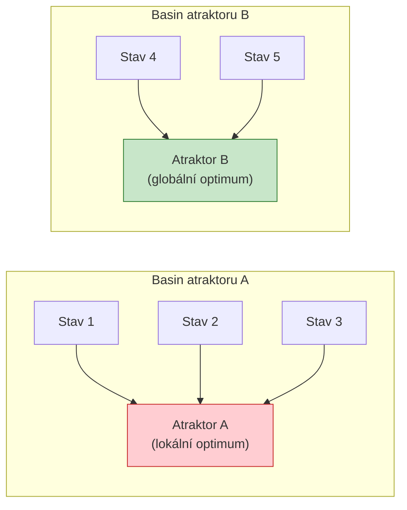

V EA je analogie atraktoru oblast prostoru řešení, do které EA konverguje. Lokální optima jsou atraktory lokálního prohledávání — basin přitažlivosti určuje, ze kterých počátečních pozic populace do nich EA "sklouznout". Cílem diverzitních mechanismů (mutace, niching, restart) je umožnit úniku z menších attraktorů a nalezení globálního optima.

---

> [!info] Formálně: co znamená, že kandidát `x` dominuje `y` při dvou fitness `f1` a `f2`? (matematický zápis)

**Dominance v multikriteriální optimalizaci** (Pareto dominance):

Kandidát $x$ **dominuje** kandidáta $y$ (značíme $x \succ y$ nebo $x \# y$), pokud:

$$x \succ y \iff \forall i: f_i(x) \geq f_i(y) \quad \land \quad \exists j: f_j(x) > f_j(y)$$

Slovně: $x$ je alespoň tak dobrý jako $y$ ve **všech** kritériích, a zároveň je **striktně lepší** alespoň v jednom.

**Pro dvě maximalizovaná kritéria $f_1$ a $f_2$:**

$$x \succ y \iff (f_1(x) \geq f_1(y) \land f_2(x) \geq f_2(y)) \land (f_1(x) > f_1(y) \lor f_2(x) > f_2(y))$$

**Příklady:**

| Řešení | $f_1$ | $f_2$ | Dominuje koho? |
|--------|:-----:|:-----:|:--------------|
| A | 5 | 3 | dominuje C, D |
| B | 3 | 5 | dominuje C, D |
| C | 2 | 2 | není dominantní |
| D | 1 | 3 | není dominantní vůči B |

**Vztahy mezi páry:**
- A vs. B: $f_1(A) > f_1(B)$, ale $f_2(A) < f_2(B)$ → **navzájem nedominují** (jsou na Pareto frontě)
- A vs. C: $f_1(A) > f_1(C)$ a $f_2(A) > f_2(C)$ → **A dominuje C** ($A \succ C$)

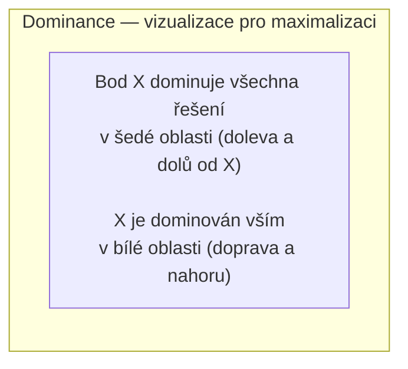

---

> [!info] Pareto fronta (obě fitness `P` a `A` maximalizujeme): která řešení jsou dominována, nakreslete Pareto frontu, co přibude bez kritéria `C1`, zapište `x#y`.

**Pareto fronta** je množina všech **nedominovaných řešení** — těch, kde není možné zlepšit jedno kritérium, aniž by se zhoršilo jiné.

**Vizualizace Pareto fronty pro dvě maximalizovaná kritéria:**

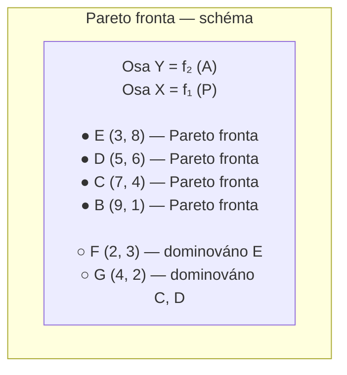

**Jak určit, která řešení jsou dominována daným bodem X = (5, 6):**

X dominuje všechna řešení Y, kde $f_1(Y) \leq 5$ **a** $f_2(Y) \leq 6$ a alespoň jedno je ostré. Tedy vše v "jihozápadním kvadrantu" od X v prostoru kritérií.

**Co se stane bez kritéria C1 (vyřadíme $f_1$):**

- Optimalizujeme pouze $f_2$ (kritérium A)
- Řešení se porovnávají jen dle $f_2$
- Řešení, která byla dříve na Pareto frontě díky vysokému $f_1$ (ale nízkému $f_2$), se nyní stanou dominovanými
- Do "nové fronty" přibydou dříve dominovaná řešení s vysokým $f_2$, která byla diskvalifikována kvůli nízkému $f_1$

**Zápis dominance:**

$x \# y$ nebo $x \succ y$ znamená „$x$ dominuje $y$". Pokud $x \# y$ i $y \# x$ jsou nepravdivé, jsou řešení **navzájem nedominovaná** (incomparable) a oba patří na Pareto frontu.

---

> [!info] Agregace vícekriteriální fitness: napište tvar funkce `F` při popisu jednou fitness (např. `F = Σ (f_i * w_i)`).

**Agregace (scalarizace)** je nejjednodušší přístup k vícekriteriální optimalizaci — více kritérií se sloučí do jednoho čísla, a EA pak maximalizuje (nebo minimalizuje) toto číslo.

**Vážený součet:**

$$F(x) = \sum_{i=1}^{k} w_i \cdot f_i(x), \quad \sum_{i=1}^{k} w_i = 1, \quad w_i \geq 0$$

Váhy $w_i$ vyjadřují **relativní důležitost** kritérií. Volba vah je netriviální — závisí na znalostech domény a preferencích uživatele.

**Varianty agregace:**

| Metoda | Vzorec | Vhodné pro |
|--------|--------|-----------|
| Vážený součet | $\sum w_i f_i$ | Spojité, konvexní Pareto fronty |
| Vážený součin | $\prod f_i^{w_i}$ | Kritéria se vzájemně kompenzují nelineárně |
| Čebyševova norma | $\max_i w_i |f_i - f_i^*|$ | Nekonvexní Pareto fronty |
| Penalizační člen | $f_1 - \lambda \cdot g(x)$ | Omezení jako "měkká" penalizace |

**Normalizace kritérií:**

Pokud mají kritéria různé škály (PSNR v dB, počet hradel v desítkách), je nutno je normalizovat před váženým součtem:

$$f_i^{norm}(x) = \frac{f_i(x) - f_i^{min}}{f_i^{max} - f_i^{min}}$$

**Nevýhoda vážené agregace:**

Váhy určují předem, jaký kompromis je žádoucí. Pokud nevíme správné váhy, nebo pokud je Pareto fronta nekonvexní, vážená agregace nenajde všechna Pareto-optimální řešení. V takovém případě je lepší použít přímo vícekriteriální EA (NSGA-II, MOEA/D).

---

> [!info] Pravděpodobnost výběru: jedinci s fitness 40, 50, 60 — jaká je pravděpodobnost výběru jedince s hodnotou 60 při turnajovém výběru? (porovnání s ruletovým výběrem).

**Ruletový výběr (fitness-proportionate selection):**

Každý jedinec je vybrán s pravděpodobností úměrnou jeho fitness:

$$p_i = \frac{f_i}{\sum_j f_j}$$

Pro jedince s fitness 60:
$$p(60) = \frac{60}{40 + 50 + 60} = \frac{60}{150} = 0{,}4 = 40\%$$

**Turnajový výběr (tournament selection):**

Náhodně se vybere $k$ jedinců, a z nich se vrátí ten s nejvyšší fitness. Pravděpodobnost výběru nejlepšího jedince závisí na $k$ a na tom, zda se výběr opakuje nebo ne.

**Pro populaci 3 jedinců a turnaj bez opakování:**

Pravděpodobnost, že jedinec s fitness 60 **není** vybrán do turnaje velikosti $k$:
$$P(\text{60 nevybrán do turnaje}) = \frac{\binom{2}{k}}{\binom{3}{k}}$$

Pro $k = 2$ (turnaj dvou):
- Celkový počet dvojic: $\binom{3}{2} = 3$
- Dvojice bez jedince 60: $\binom{2}{2} = 1$ (pouze {40, 50})
- $P(\text{60 nevybrán}) = 1/3$
- $P(\text{60 vybrán a vyhraje}) = 1 - 1/3 = 2/3 \approx 0{,}667$

Pro $k = 3$ (turnaj všech tří):
- Jedinec 60 je vždy vybrán a vždy vyhraje
- $P = 1{,}0 = 100\%$

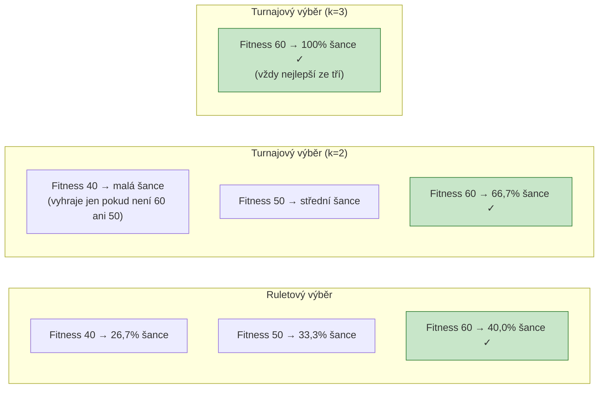

**Srovnání vlastností:**

| Vlastnost | Ruletový | Turnajový |
|-----------|:--------:|:---------:|
| Selekční tlak | Nízký–střední | Nastavitelný přes $k$ |
| Citlivost na škálování fitness | Vysoká | Žádná |
| Efektivita | $O(n)$ | $O(k)$ |
| Zachování diverzity | Lepší | Závisí na $k$ |
| Vhodný pro negativní fitness | Ne | Ano |

Turnajový výběr je dnes **nejpoužívanější** — selekční tlak se snadno reguluje přes $k$, nevyžaduje normalizaci fitness a funguje pro libovolné hodnoty (i záporné).

---

## Evoluce jako inspirace pro inženýrství / Design jako úloha prohledávání

> [!info] Kdy použít evoluční algoritmy? Uveďte předpoklady a omezení.

**EA jsou vhodné, když:**

1. **Prostor řešení je diskrétní nebo kombinatorický** — nelze snadno použít gradientní metody
2. **Fitness funkce je nediferencovatelná nebo šumová** — gradientní metody selhávají
3. **Prostor řešení je vícekriteriální** — EA přirozeně hledají Pareto fronty
4. **Struktura problému není dobře pochopena** — EA nevyžadují analytické znalosti o problému
5. **Chceme prohledat globálně** — EA odolávají lokálním minimům lépe než lokální metody

**Nezbytné předpoklady pro použití EA:**

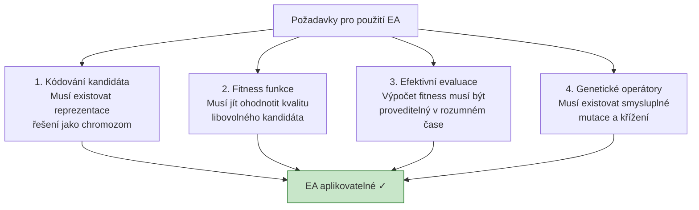

**Kdy EA nepoužívat:**

- Funkce je **hladká a diferencovatelná** → gradientní sestup je rychlejší a přesnější
- Prostor řešení je **malý a prohledatelný vyčerpávajícím způsobem** → prohledávání do šířky
- Existuje **analytické nebo exaktní řešení** → zbytečná heuristika
- **Evaluace je extrémně drahá** a nelze ji zparalelizovat → EA bude příliš pomalý (nebo nutno použít surrogate model)

**Praktická omezení EA:**

| Omezení | Popis | Řešení |
|---------|-------|--------|
| Počet evaluací | Každá evaluace = spuštění simulátoru / fyzického testu | Paralelizace, surrogate modely |
| Předčasná konvergence | Populace se homogenizuje, ztratí diverzita | Niching, restart, vyšší mutace |
| Epistáze | Geny jsou navzájem závislé → operátory fungují špatně | Vhodná reprezentace, EDAs |
| Škálovatelnost | Pro velké dimenze prostor roste exponenciálně | Dekompozice, koevoluční EA |

---

> [!info] Formalizace návrhu jako optimalizační úlohy: co musí obsahovat kódování kandidáta, fitness funkce a ukončovací podmínky?

**Formalizace návrhu jako optimalizačního problému** je prvním a nejdůležitějším krokem. Špatná formalizace = špatné výsledky, i s perfektním EA.

**Tři klíčové komponenty:**

**1. Kódování kandidáta (reprezentace):**

Kódování musí:
- Pokrývat **celý prohledávaný prostor** — každé validní řešení musí mít alespoň jedno zakódování
- Ideálně být **kompletní a nerepetitivní** — každý chromozom odpovídá jednomu řešení
- Umožňovat **smysluplné genetické operátory** — křížení/mutace by měly produkovat jiné validní kandidáty
- Mít **vhodnou granularitu** — příliš hrubé kódování přeskočí dobrá řešení, příliš jemné zbytečně zvětší prostor

**2. Fitness funkce:**

Fitness funkce musí:
- Být **konzistentní s cílem** — lepší kandidáti musí mít vyšší (nebo nižší) fitness
- Být **dostatečně jemná** — rozlišit různě dobré kandidáty, nejen "správně/špatně"
- Být **efektivně vyčíslitelná** — jinak bude EA příliš pomalý
- Pokrývat **celý prostor** — i špatní kandidáti musí dostat informativní fitness (ne jen 0/1)

**3. Ukončovací podmínka:**

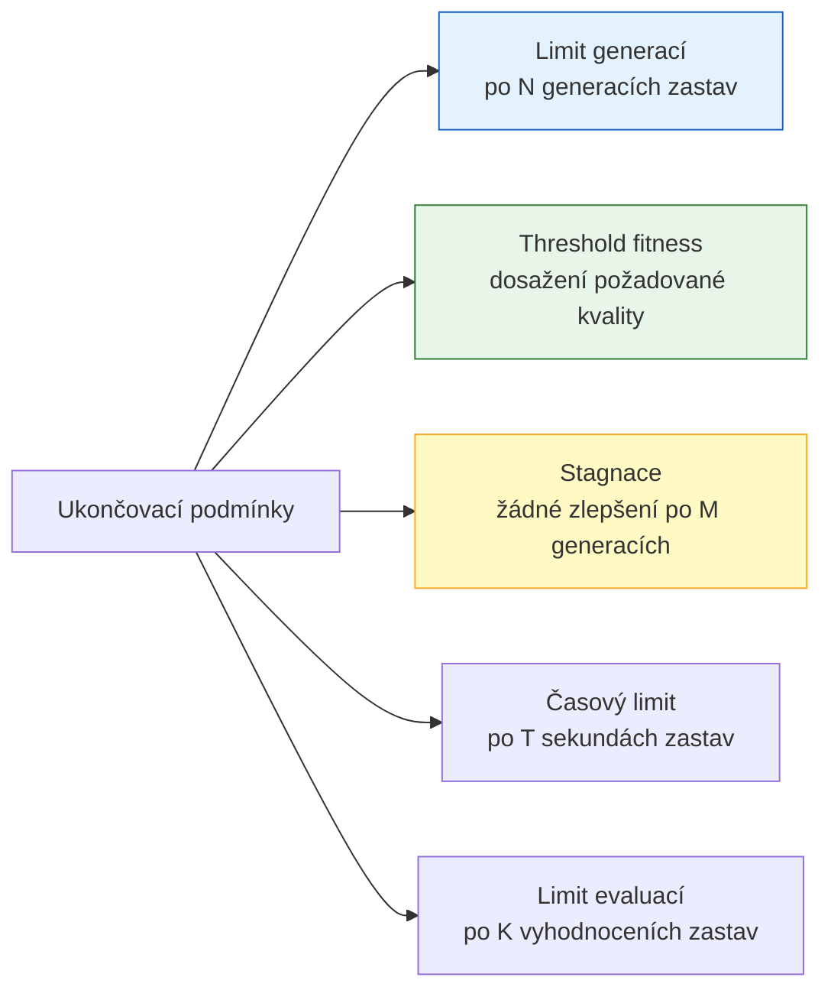

**Typická kombinace:** Primární podmínka = threshold fitness (dosažení cíle), záložní = limit generací (prevence nekonečné smyčky).

**Příklad formalizace — návrh antény:**

- **Kódování:** 3D souřadnice segmentů drátu (reálný vektor) nebo GP strom generující geometrii
- **Fitness:** Kombinace SWR (impedanční přizpůsobení), zisku a šířky pásma — vážený součet
- **Ukončení:** Dosažení SWR < 1.5 při požadovaném zisku, nebo 10 000 generací

---

> [!info] Porovnání vyhledávacích metod: šířka/hloubka, gradientní metody, tabu search, simulované žíhání, EA.

Různé metody prohledávání mají různé předpoklady a silné stránky. Výběr závisí na charakteru problému.

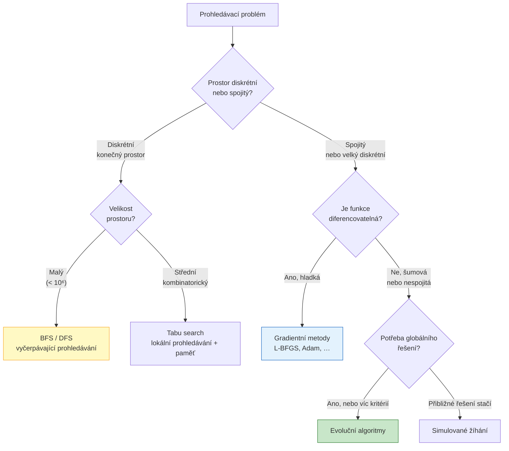

**Detailní srovnání:**

| Metoda | Silné stránky | Slabé stránky | Typické použití |
|--------|--------------|---------------|----------------|
| BFS | Nalezne optimum v konečném prostoru | Exponenciální paměť | Malé diskrétní prostory, nejkratší cesta |
| DFS | Malá paměť | Může uvíznout v nekonečné větvi | Prohledávání stromů, backtracking |
| Gradientní | Rychlá konvergence, přesné | Pouze lokální optima, potřeba gradient | ML trénink, optimalizace parametrů |
| Tabu search | Uniká z lokálních optim přes paměť | Nastavení parametrů (délka tabu listu) | Kombinatorická optimalizace (TSP, plánování) |
| Simulované žíhání | Jednoduché, robustní vůči šumu | Pomalé, mnoho parametrů | Jednoduchá diskrétní optimalizace |
| **EA** | Globální prohledávání, vícekriteriální, paralelní | Drahé evaluace, mnoho parametrů | Složité, vícekriteriální, nepříznivě strukturované problémy |

**Proč EA a ne SA pro složité problémy:**

Simulované žíhání pracuje s **jedním** řešením — pohybuje se prostorem postupně a přijímá horší řešení s klesající pravděpodobností (analogie chlazení kovu). EA pracuje s **populací** řešení současně — sdílení informace přes křížení umožňuje kombinovat dobré bloky z různých částí prostoru. Pro problémy s mnoha lokálními optimy a složitou strukturou je populační přístup výrazně lepší.

---

## Evoluční algoritmy (EA) — praktické aspekty

> [!info] Kostra EA: popište kroky — inicializace, evaluace, selekce, rekombinace, mutace, náhrada.

**Pseudokód EA:**

```
1. t = 0
2. P(t) = INICIALIZUJ populaci N jedinců náhodně
3. EVALUUJ fitness každého jedince v P(t)
4. DOKUD není splněna ukončovací podmínka:
   a. VYBER rodiče z P(t) dle selekčního schématu
   b. REKOMBINUJ rodiče → potomci
   c. MUTUJ potomky
   d. EVALUUJ fitness potomků
   e. NAHRAĎ P(t) novými jedinci → P(t+1)
   f. t = t + 1
5. VRAŤ nejlepšího jedince
```

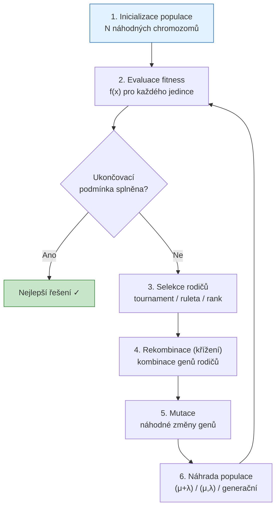

**Klíčová rozhodnutí při implementaci EA:**

**Inicializace:** Nejčastěji náhodně a rovnoměrně přes celý prohledávaný prostor. Pokud máme apriorní znalosti, lze inicializovat blízko slibných oblastí (seeded initialization). Pozor: příliš podobná iniciální populace → předčasná konvergence.

**Strategie náhrady (replacement):**

| Strategie | Popis | Vliv na diverzitu |
|-----------|-------|:----------------:|
| Generační (μ,λ) | Celá populace je nahrazena potomky | Vysoká diverzita |
| Steady-state | Nahrazuje se jen nejhorší jedinec | Nízká diverzita |
| Elitismus | Nejlepší jedinci přežívají vždy | Zachování optima |
| (μ+λ) | Rodiče i potomci soutěží o místa | Střední diverzita |

**Selekční tlak:** Silný selekční tlak (turnaj s velkým $k$, pouze nejlepší přežívají) → rychlá konvergence, ale ztráta diverzity. Slabý selekční tlak → pomalá konvergence, ale lepší prohledávání.

---

> [!info] Klíčové pojmy: definujte `gén`, `chromozóm`, `fenotyp` a `populaci`, a vysvětlete jejich vztahy.

**Mapování biologické → EA terminologie:**

| Biologie | EA | Popis |
|----------|-----|-------|
| Gen | Gen | Základní jednotka genetické informace; jedna "proměnná" kandidáta |
| Alela | Hodnota genu | Konkrétní hodnota genu z povolené abecedy |
| Chromozom | Chromozom / genotyp | Celý zápis kandidátního řešení; vektor genů |
| Organismus | Jedinec | Jeden kandidát v populaci; má chromozom i fenotyp |
| Fenotyp | Fenotyp | Interpretace chromozomu v doméně problému |
| Populace | Populace | Množina N jedinců, se kterou EA pracuje |

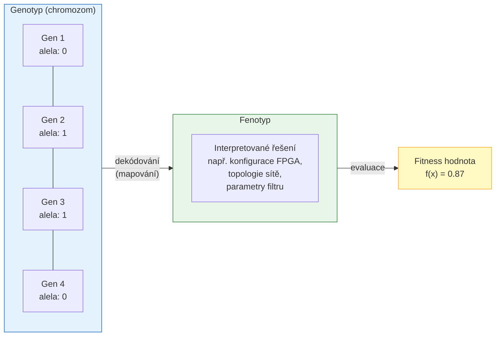

**Detailní vysvětlení:**

**Gen:** Nejmenší stavební jednotka chromozomu. Odpovídá jedné "proměnné" návrhu — například hodnota jednoho parametru, typ jednoho hradla, nebo jedno rozhodnutí v kombinatorickém problému.

**Chromozom (genotyp):** Kompletní zakódování jednoho kandidátního řešení. Je to to, co EA přímo manipuluje (mutuje, kříží). Chromozom nemusí přímo odpovídat fenotypu — mapování může být netriviální (příklad: CGP, kde neaktivní geny jsou v chromozomu, ale ne ve fenotypu).

**Fenotyp:** Interpretace chromozomu v reálném světě — to, co se evaluuje. Pro CGP: konkrétní DAG obvod. Pro TSP: pořadí navštívených měst. Pro evoluci neuronové sítě: konkrétní váhová matice a architektura.

**Populace:** Množina N jedinců sdílí výpočetní zdroje EA. Populace zajišťuje **paralelní prohledávání** více regionů prostoru současně a umožňuje **rekombinaci** informace mezi jedinci. Velikost populace N je klíčový hyperparametr — malá populace = rychlá, ale náchylná k předčasné konvergenci; velká populace = pomalá, ale diverzitní.

---

> [!info] Návrh fitness pro evoluční obrazový filtr (Koza): metriky (PSNR, MSE) a penalizace (složitost).

**Kontext — evoluční návrh obrazového filtru:**

Cílem je vyvinout výpočetní obvod (například 3×3 konvoluční filtr), který zpracovává obraz — odstraňuje šum, detekuje hrany, zostřuje. Fitness musí hodnotit, jak dobře filtr splňuje svůj účel.

**Základní metriky kvality obrazu:**

**MSE (Mean Squared Error):**
$$\text{MSE} = \frac{1}{N} \sum_{i=1}^{N} (y_i - \hat{y}_i)^2$$

kde $y_i$ jsou pixely referenčního (ideálního) výstupu a $\hat{y}_i$ jsou pixely výstupu filtru. Nižší MSE = lepší filtr. Minimalizovat.

**PSNR (Peak Signal-to-Noise Ratio):**
$$\text{PSNR} = 10 \log_{10}\left(\frac{MAX_I^2}{\text{MSE}}\right) \text{ [dB]}$$

kde $MAX_I = 255$ pro 8-bitové obrazy. Vyšší PSNR = lepší filtr (typicky >30 dB je přijatelné, >40 dB excelentní). Maximalizovat.

Vztah MSE a PSNR je monotónní — optimalizace jednoho je ekvivalentní optimalizaci druhého. PSNR je preferována, protože je srozumitelnější pro lidi (v dB).

**Penalizace za složitost:**

Jednoduchý filtr je preferován před složitým se stejnou kvalitou výstupu — méně hradel = menší plocha čipu, nižší spotřeba, snazší verifikace.

$$F(x) = \alpha \cdot \text{PSNR}(x) - \beta \cdot \text{složitost}(x)$$

kde složitost může být:
- Počet aktivních hradel v CGP fenotypu
- Počet aritmetických operací
- Hloubka obvodu (zpoždění)
- Počet různých typů operací (variabilita výroby)

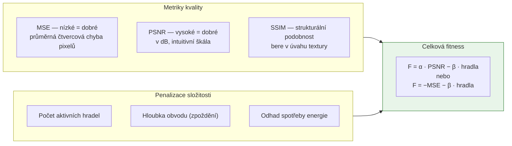

**Praktické úvahy při návrhu fitness:**

- **Volba trénovacích obrazů:** Fitness závisí na testovacím obrazu. Pro robustní filtr testujeme na sadě různých obrazů a fitness je průměr přes sadu.
- **Vyvažování $\alpha$ a $\beta$:** Příliš velká $\beta$ → evoluce najde triviální filtr (identita — 0 hradel, ale špatný PSNR). Příliš malá $\beta$ → složité filtry se stejným PSNR jako jednoduché.
- **Fitness landscape:** PSNR jako fitness je obecně hladší než bitová přesnost — snazší pro EA.

---

> [!info] Reprezentace a kódování: porovnejte binární vektory, reálné vektory, permutační kódování, stromy (GP) a grafové reprezentace (CGP).

Volba reprezentace ovlivňuje **expresivitu** (co lze vyjádřit), **efektivitu operátorů** (jak smysluplné jsou mutace a křížení) a **velikost prohledávacího prostoru**.

**Binární vektory:**

Chromozom je řetězec bitů `{0, 1}`. Nejjednodušší a historicky první (Hollandovy GA). Operátory: bitflip mutace, jednobodové křížení.

- **Vhodné pro:** Diskrétní volby, logické funkce, kombinatorické problémy s binárními rozhodnutími
- **Příklad:** Výběr podmnožiny (knapsack), konfigurace FPGA přepínačů
- **Problém:** Zakódování reálných čísel vyžaduje binární kódování → ztráta přesnosti, nelineární mapování

**Reálné vektory:**

Chromozom je vektor reálných čísel. Mutace = přidání gaussovského šumu, křížení = průměrování nebo BLX-α.

- **Vhodné pro:** Optimalizace spojitých parametrů, neuronové sítě (váhy), inženýrské parametry
- **Příklad:** Váhy neuronové sítě, rozměry mechanické součástky, koeficienty filtru
- **Výhoda:** Přímé a přirozené kódování, operátory jednoduché

**Permutační kódování:**

Chromozom je permutace prvků. Křížení musí zachovat vlastnost permutace (OX, PMX, ERX).

- **Vhodné pro:** Problémy s pořadím — TSP, rozvrhování, přiřazování zdrojů
- **Příklad:** Pořadí měst v TSP, pořadí operací ve výrobě
- **Klíčová výzva:** Standardní křížení generuje nevalidní permutace — nutno použít speciální operátory

**Stromy (GP):**

Chromozom je strom s operátory v uzlech a proměnnými/konstantami v listech. Křížení = výměna podstromů, mutace = záměna uzlu.

- **Vhodné pro:** Symbolická regrese, vývoj programů, matematické výrazy
- **Příklad:** Matematický vzorec pro predikci, logický výraz, pravidlo pro klasifikaci
- **Problém:** Bloat (nekontrolovaný růst stromu), proměnná délka chromozomu

**Grafové reprezentace (CGP):**

Chromozom je pevná sada čísel kódující DAG. Fenotyp je podgraf (aktivní uzly).

- **Vhodné pro:** Kombinační obvody, sítě, DAG struktury
- **Příklad:** Logické obvody, neuronové sítě s pevnou topologií, obrazové filtry
- **Výhoda:** Pevná délka, přirozená neutralita, žádný bloat

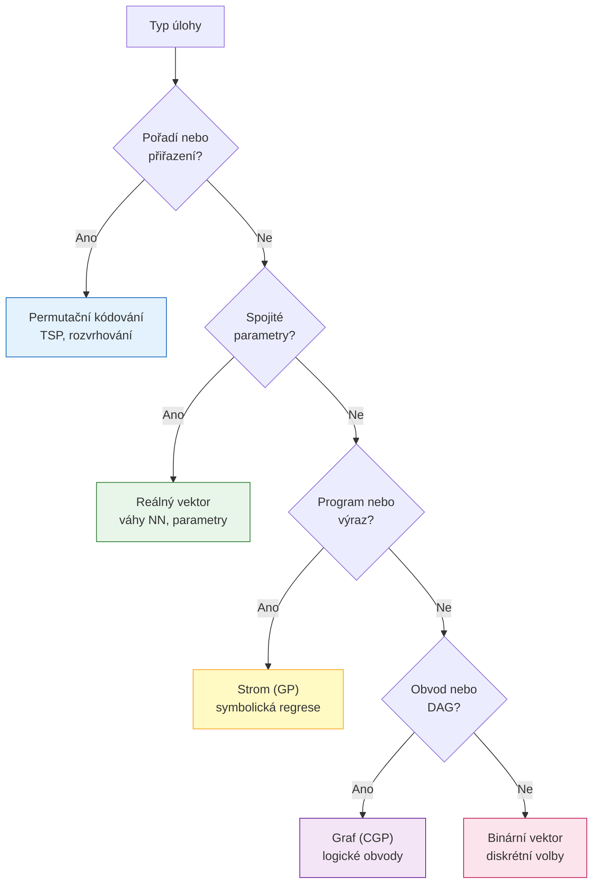

**Srovnávací tabulka:**

| Reprezentace | Délka | Bloat | Neutralita | Přírodní operátory | Typická doména |
|--------------|:-----:|:-----:|:----------:|:-----------------:|----------------|
| Binární vektor | Pevná | Žádný | Nízká | Bitflip, 1-bod X | Diskrétní volby |
| Reálný vektor | Pevná | Žádný | Nízká | Gaussová mutace, BLX | Optimalizace parametrů |
| Permutace | Pevná | Žádný | Nízká | OX, PMX | Pořadí, TSP |
| Strom (GP) | Proměnná | Silný | Nízká | Výměna podstromů | Symbolická regrese |
| Graf (CGP) | Pevná | Žádný | **Vysoká** | Bodová mutace | Obvody, DAG |

---

*Rozšířené studijní materiály pro přednášku 02 — Evoluční design*