# 03 Kartézské genetické programování (CGP)

---

## Úvod do GP a reprezentací

> [!info] Hlavní použití GP: co je symbolická regrese a jaké problémy řeší? Uveďte příklady aplikací.

**Symbolická regrese** je úloha, při které hledáme **explicitní matematický výraz** $f(x_1, x_2, \ldots, x_n)$, jenž co nejlépe popisuje naměřená data. Na rozdíl od klasické (parametrické) regrese, která předpokládá fixní tvar funkce a pouze ladí koeficienty (např. $y = ax + b$), symbolická regrese hledá **zároveň strukturu i parametry**.

**Klíčový rozdíl od standardního ML:**

| Přístup | Co se hledá | Výsledek |
|---------|-------------|----------|
| Lineární regrese | Pouze koeficienty $a, b$ pro $y = ax + b$ | Čísla |
| Neuronová síť | Váhy sítě | "Černá skříňka" |
| **Symbolická regrese (GP)** | **Celá struktura výrazu + parametry** | **Interpretovatelný vzorec** |

**Proč je symbolická regrese zajímavá:**
- Výsledek je **interpretovatelný** — člověk může vzorec přečíst a pochopit
- Může odhalit skutečné fyzikální zákony z dat (nikoliv jen fitovat parametry)
- Nevyžaduje předem znát tvar funkce

**Postup v GP pro symbolickou regresi:**
1. Kandidáti jsou stromy reprezentující matematické výrazy (uzly = operátory, listy = proměnné/konstanty)
2. Fitness = odchylka od naměřených dat, typicky $F = \sum_{i=1}^{N} |y_i - f(x_i)|$ nebo MSE
3. GP operátory (křížení podstromů, mutace uzlů) generují nové kandidáty
4. Evoluce hledá výraz s nejnižší chybou

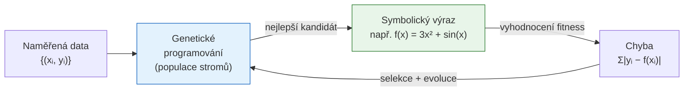

**Konkrétní aplikace symbolické regrese:**

- **Fyzika:** Znovuobjevení Newtonových zákonů, Keplerových zákonů nebo Hamiltonovy mechaniky ze simulovaných dat (projekt AI Feynman, 2020)
- **Biologie:** Modelování kinetiky enzymatické reakce z experimentálních dat
- **Inženýrství:** Identifikace přenosové funkce systému ze vstupně-výstupních dat (black-box identifikace)
- **Finance:** Nalezení predikčních vzorců pro tržní data
- **Materiálové vědy:** Predikce vlastností materiálů z chemického složení

**Praktická omezení:**
- Výrazy mohou být velmi dlouhé a obtížně interpretovatelné (problém "bloat" — nekontrolovaný růst stromu)
- Prostor řešení je enormní — nutno omezit množinu povolených operátorů
- Nalezení globálního optima není zaručeno

---

> [!info] Reprezentace v GP: porovnejte stromy (GP), gramatiky (GE), lineární instrukce a grafy (CGP). Kdy použít kterou reprezentaci?

Volba reprezentace je jedním z nejzásadnějších rozhodnutí při návrhu GP systému — přímo ovlivňuje velikost prohledávacího prostoru, efektivitu operátorů a interpretovatelnost výsledků.

**Stromy (klasické GP — Koza 1992):**

Nejpřirozenější reprezentace pro hierarchické výrazy. Strom s operátory v uzlech a proměnnými/konstantami v listech přímo odpovídá matematickému výrazu nebo programu.

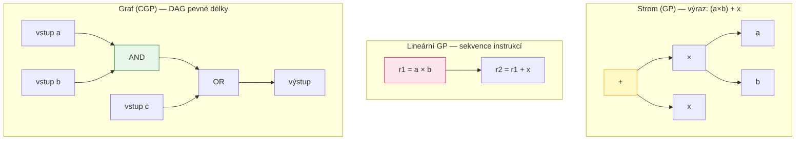

**Gramatická evoluce (GE):**

Chromozom je sekvence celých čísel, která se interpretuje přes **kontextově-volnou gramatiku** — pravidla gramatiky definují, jaké výrazy jsou syntakticky platné. Díky tomu lze jednoduše zaručit, že každý kandidát bude syntakticky správný program v cílovém jazyce (Python, C, VHDL…).

**Lineární GP:**

Chromozom je sekvence instrukcí ve stylu assembleru. Instrukce pracují s registry — například `r1 = a * b; r2 = r1 + c`. Výhodou je pevná délka a přirozené mapování na procesory s registry. Hojně využíváno pro návrh programů blízkých strojovému kódu.

**Podrobné srovnání:**

| Vlastnost | Strom (GP) | GE (gramatika) | Lineární GP | CGP (graf) |
|-----------|:----------:|:--------------:|:-----------:|:----------:|
| Délka genotypu | Proměnná | Proměnná | Pevná | Pevná |
| Syntaktická platnost | Vždy ✓ | Vždy ✓ (přes gramatiku) | Vždy ✓ | Vždy ✓ |
| Neutralita | Nízká | Střední | Střední | **Vysoká** |
| Škálovatelnost | Střední | Dobrá | Dobrá | Dobrá |
| Vhodné pro | Symbolické výrazy | Programy v libovolném jazyce | Instrukční programy | Obvody, DAG struktury |
| Problém bloat | Silný | Střední | Slabý | Žádný (pevná délka) |
| Křížení | Přirozené (podstromy) | Přirozené | Jednobodové | Problematické |
| Interpretovatelnost | Vysoká | Střední | Střední | Střední |

**Pravidlo výběru:**
- Hledám matematický vzorec nebo program s přirozenou hierarchií → **strom (GP)**
- Výsledek musí být syntakticky validní kód v konkrétním jazyce → **GE**
- Cílová platforma je procesor s registry, instrukční sada → **lineární GP**
- Navrhuji kombinační obvod, číslicový filtr, nebo potřebuji pevnou délku genotypu → **CGP**

---

## Cartesian Genetic Programming (CGP) — přehled

> [!info] Popište základní principy CGP: genotyp pevné délky, uspořádání uzlů, aktivita/neaktivita uzlů a transformace na fenotyp (DAG).

**CGP** (navrhl Julian Miller, 1999) reprezentuje výpočetní obvod jako **orientovaný acyklický graf (DAG)** uložený v chromozomu **pevné délky** — sada celých čísel.

**Klíčové vlastnosti CGP:**

1. **Pevná délka genotypu** — délka chromozomu se nemění během evoluce, což eliminuje problém bloat
2. **Mřížka uzlů** — uzly jsou uspořádané do obdélníkové mřížky $u \times v$ (řádky × sloupce)
3. **Acyklická struktura** — díky parametru L-back se uzly mohou napojovat pouze na předchozí sloupce (ne zpět)
4. **Neutralita** — ne všechny uzly musí být aktivní; mutace v neaktivních uzlech nemění fenotyp

**Struktura chromozomu:**

Pro každý uzel v mřížce jsou v chromozomu uloženy:
- Index funkce (co uzel počítá: AND, OR, XOR, ADD, …)
- Indexy vstupů (ze kterých předchozích uzlů nebo primárních vstupů bere data)

Na konci chromozomu jsou **výstupní geny** — indexy uzlů, jejichž výstupy tvoří výstupy celého obvodu.

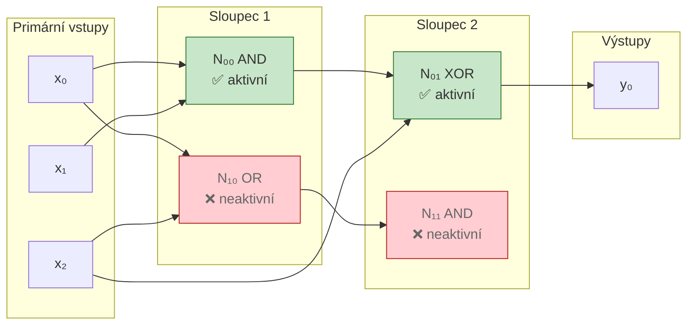

**Jak vzniká fenotyp z genotypu:**

1. Začni od výstupních genů (posledních hodnot chromozomu)
2. Každý výstupní gen ukazuje na konkrétní uzel — označ ho jako **aktivní**
3. Pro každý aktivní uzel: označ jako aktivní i uzly, ze kterých bere vstupy
4. Opakuj rekurzivně, dokud nedosáhneš primárních vstupů
5. **Fenotyp = množina aktivních uzlů + jejich propojení** = DAG

Uzly, na které žádný aktivní uzel neodkazuje, jsou **neaktivní** — zůstávají v chromozomu (genotypu), ale do výpočtu nevstupují. Tato redundance je zdrojem **neutrality CGP**.

---

> [!info] Proč CGP poskytuje neutralitu (neaktivní geny) a jaký to má vliv na evoluční hledání?

**Neutralita** v CGP vzniká přirozeně z faktu, že ne všechny uzly v mřížce musí být dosažitelné z výstupů. Mutace v neaktivním uzlu **nezmění fenotyp ani fitness** kandidáta.

**Jak neutralita pomáhá evolučnímu prohledávání:**

Klasický problém evolučních algoritmů je **uvíznutí v lokálním optimu** — každá malá změna genotypu zhorší fitness, takže evoluce nemůže postoupit dál.

Neutralita toto řeší tak, že evoluce může provádět **neutrální drift** — pohyb v prostoru genotypů beze změny fenotypu. Tím se "připravuje půda" pro budoucí mutace v aktivních uzlech, které mohou otevřít cestu k lepším řešením.

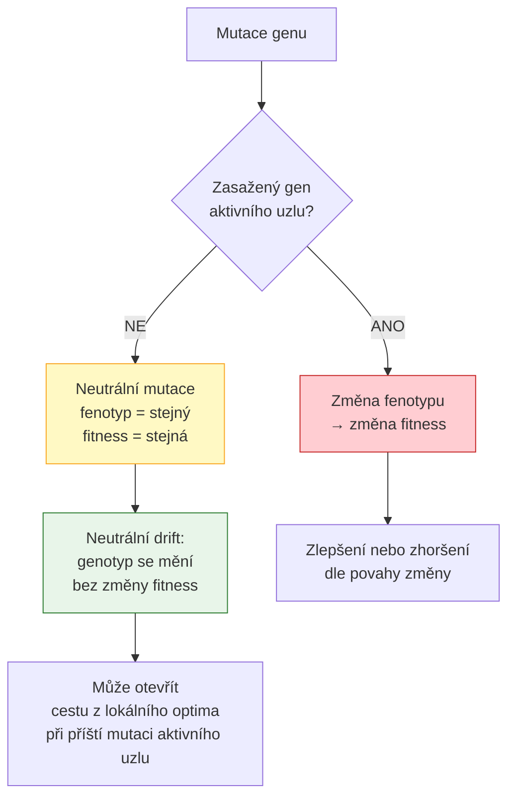

**Analogie z biologie:** Velká část DNA živých organismů je tzv. "junk DNA" — nekódující sekvence, které nemají přímý fenotypový efekt. Mutace v těchto oblastech jsou neutrální a umožňují evoluci akumulovat genetické změny bez okamžitého selekčního tlaku.

**Měřená neutralita v CGP:**

Pro typickou konfiguraci CGP (například 50 uzlů, ale aktivních jen 15) je přibližně 70 % chromozomu tvořeno neaktivními geny. To znamená, že přibližně 70 % mutací je neutrálních — a to je vlastnost, která CGP odlišuje od jiných GP reprezentací a činí ho efektivním zejména pro diskrétní optimalizační problémy.

**Nevýhoda neutrality:**

Příliš vysoká neutralita může zpomalit konvergenci — pokud je aktivních uzlů příliš málo, skoro žádná mutace nemá efekt a evoluce se zastaví. Proto je nutné správně nastavit poměr aktivních / celkových uzlů.

---

## Parametry a formální definice

> [!info] CGP — základní parametry: co představují `ni`, `no`, `v`, `u`, arita uzlu, množina funkcí `Γ` a `L-back`? Vysvětlete vliv `L-back` na konektivitu.

**Formální parametry CGP:**

| Parametr | Označení | Popis |
|----------|----------|-------|
| Počet primárních vstupů | $n_i$ | Proměnné, které dostává obvod na vstupu |
| Počet výstupů | $n_o$ | Kolik hodnot obvod produkuje |
| Počet řádků | $u$ | Výška mřížky uzlů |
| Počet sloupců | $v$ | Hloubka mřížky uzlů |
| Arita uzlů | $n_a$ | Kolik vstupů má každý uzel (typicky 2) |
| Množina funkcí | $\Gamma$ | Povolené operace: {AND, OR, XOR, NOT, ADD, MUL, …} |
| Parametr zpětného dosahu | $L$ | Z kolika předchozích sloupců může uzel brát vstupy |

**Vliv L-back na konektivitu:**

L-back určuje "dosah" každého uzlu do minulosti. Pro uzel ve sloupci $j$ může brát vstupy ze sloupců $j-1, j-2, \ldots, j-L$ a také ze všech primárních vstupů.

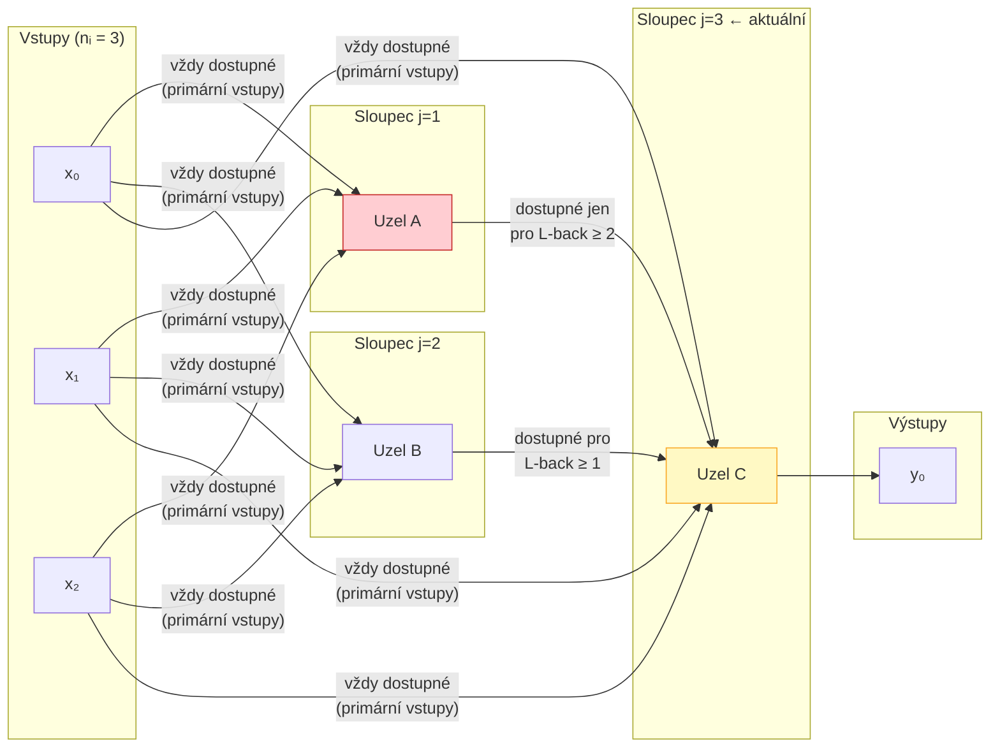

**Dopady různých hodnot L-back:**

- **L = 1 (striktní pipeline):** Každý uzel vidí pouze bezprostředně předchozí sloupec. Obvod je hluboká pipeline. Čistá, ale omezená — neumožňuje "zkrácené cesty".
- **L = 2:** Uzel může přeskočit jednu vrstvu. Umožňuje implementovat složitější funkce s méně uzly.
- **L = v (plná konektivita):** Uzel vidí všechny předchozí sloupce i primární vstupy. Maximální flexibilita — CGP může implementovat libovolné DAG struktury.

**Vliv L na velikost prohledávacího prostoru:**

Počet možných vstupů pro jeden uzel ve sloupci $j$ je $n_i + L \cdot u$ (primární vstupy + uzly v dosahu). Větší L → více možných zapojení → větší prostor řešení → obtížnější prohledávání, ale větší expresivita.

**Doporučení v praxi:** Pro kombinační logické obvody se osvědčilo $L = v$ (plná konektivita) — evoluce sama si vybere vhodná propojení. Pro úlohy, kde je žádoucí hlubší hierarchie (jako DNN), může být menší L výhodné.

---

> [!info] CGP — implementace mediánu pro 7 vstupů (8‑bitové vstupy a výstupy): počet vstupů a výstupů, omezení G = {AND, OR}, délka chromozómu pro 15 řádků a 4 sloupce, návrh fitness funkce.

**Formulace problému:**

Máme 7 osmibitových čísel. Chceme obvod, který spočítá jejich **medián** (čtvrté největší číslo po seřazení). Medián je 8bitové číslo.

**Počet vstupů a výstupů:**
- $n_i = 7 \times 8 = 56$ primárních vstupů (každé číslo = 8 bitů)
- $n_o = 8$ výstupů (medián je 8bitové číslo)

**Omezení množiny funkcí $\Gamma = \{\text{AND}, \text{OR}\}$:**

AND a OR tvoří tzv. **monotónní booleovskou logiku** — výstupy jsou monotónní funkce vstupů (přidání jedničky na vstup nikdy nezmenší výstup). To má důsledky:
- **Nelze implementovat negaci (NOT)** — monotónní logika neumožňuje XOR ani obecné komplementy
- Medián lze vyjádřit jako threshold funkci, která je monotónní → realizovatelné, ale potřebujeme více uzlů
- Obvod bude větší než s plnou sadou operátorů (nutno obejít absenci NOT pomocí více AND/OR kombinací)
- **Nelze implementovat:** XOR, XNOR, žádnou funkci s výstupem závisejícím na paritě

**Výpočet délky chromozomu:**

Každý uzel je reprezentován $n_a + 1$ geny: jeden gen pro funkci + $n_a$ genů pro každý vstup.

$$G = \underbrace{u \cdot v \cdot (n_a + 1)}_{\text{geny uzlů}} + \underbrace{n_o}_{\text{geny výstupů}}$$

Pro $u = 15$ řádků, $v = 4$ sloupce, $n_a = 2$ (binární arita), $n_o = 1$:

$$G = 15 \cdot 4 \cdot (2 + 1) + 1 = 15 \cdot 4 \cdot 3 + 1 = 180 + 1 = \mathbf{181}$$

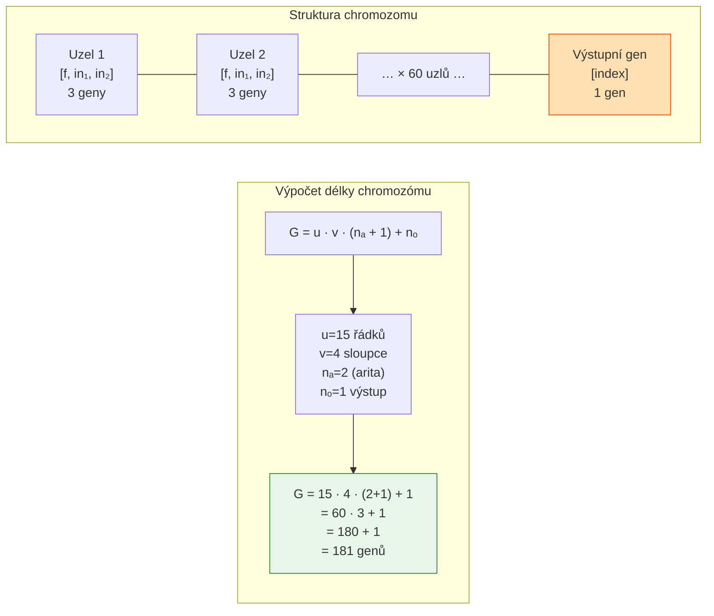

**Návrh fitness funkce:**

Fitness musí zachytit, jak dobře obvod počítá medián. Nejjednodušší přístup: **počet správně spočtených bitů** přes testovací množinu vstupů.

Pro vyčerpávající test by bylo potřeba $256^7 \approx 7{,}2 \times 10^{16}$ kombinací — nereálné. Proto se používá **trénovací vzorka** (náhodný vzorek vstupních kombinací):

$$F = \frac{1}{|T|} \sum_{(x,y) \in T} \sum_{b=0}^{7} \mathbf{1}[\text{bit}_b(\text{výstup}(x)) = \text{bit}_b(y)]$$

kde $T$ je trénovací množina dvojic (vstup, správný medián) a $\text{bit}_b$ je $b$-tý bit hodnoty.

**Rozšíření fitness:**

```
F_rozšířená = F_základní
            − α · (počet aktivních uzlů)    // penalizace za složitost
            − β · (kritická délka cesty)     // penalizace za zpoždění
```

---

## Genotyp → fenotyp a aktivita uzlů

> [!info] Vysvětlete postup sestavení fenotypu z chromozómu: jak se identifikují aktivní uzly a proč některé zůstávají neaktivní?

**Algoritmus identifikace aktivních uzlů** (zpětné sledování závislostí):

```
1. Inicializuj: active = prázdná množina
2. Pro každý výstupní gen o:
       přidej uzel o do active
3. Dokud se active mění:
       Pro každý uzel n ∈ active:
           Pro každý vstupní index i uzlu n:
               Pokud i odkazuje na uzel (ne na primární vstup):
                   přidej uzel i do active
4. Fenotyp = uzly v active + jejich propojení
```

**Proč některé uzly zůstávají neaktivní:**

Neaktivní uzly vznikají ze dvou důvodů:
1. **Nikdo na ně neodkazuje** — ani výstupní geny, ani jiné aktivní uzly jejich výstupy nevyužívají
2. **Odkazují pouze na neaktivní uzly** — jejich výstup by nikam nešel

Tato situace je záměrná a prospěšná: CGP záměrně alokuje **více uzlů, než je nutné**, aby měla evoluce "rezervní kapacitu" pro budoucí strukturální změny bez nutnosti měnit délku chromozomu.

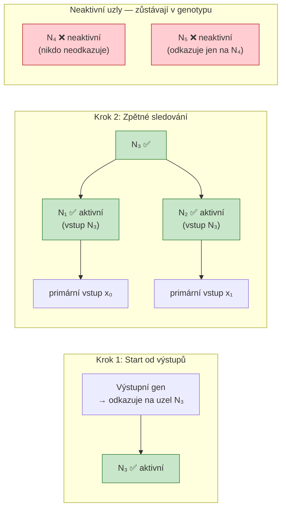

**Důležitá vlastnost:** Mutace v neaktivních uzlech (červené) jsou automaticky neutrální — nezmění fenotyp ani fitness. Mutace výstupního genu nebo aktivního uzlu fenotyp změní. Mutace vstupního indexu aktivního uzlu může způsobit, že dříve neaktivní uzel se stane aktivním (nebo naopak) — to je mechanismus, jak CGP strukturálně mění fenotyp.

---

> [!info] Navrhněte dvě různá fitness kritéria pro daný CGP obvod a ukažte mutaci, která bude škodlivá pro jedno kritérium, ale neutrální pro druhé.

**Dvě fitness kritéria:**

**$F_1$ — Funkčnost (maximalizovat):**
$$F_1 = \text{počet správně spočtených bitů přes všechny testovací kombinace}$$
$F_1$ je "hlavní" cíl — obvod musí implementovat správnou funkci.

**$F_2$ — Složitost (minimalizovat):**
$$F_2 = \text{počet aktivních uzlů v fenotypu}$$
$F_2$ je "vedlejší" cíl — preferujeme jednodušší, menší obvody (méně hradel = menší plocha čipu, nižší spotřeba).

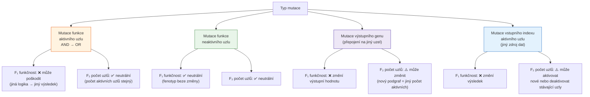

**Konkrétní příklad — mutace AND → OR v aktivním uzlu:**

- $F_1$: Pokud byl AND uzel zodpovědný za správné výsledky, jeho změna na OR pravděpodobně způsobí chyby → $F_1$ klesne (škodlivá mutace)
- $F_2$: Počet aktivních uzlů se nezmění — stále je aktivní stejná sada uzlů, jen jeden z nich dělá OR místo AND → $F_2$ se nezmění (neutrální mutace)

**Vícekriteriální optimalizace v CGP:**

V praxi se tyto dvě fitness kombinují do jednoho čísla nebo se používá **Pareto-dominance** (nevýhodné není řešení, které je horší v obou kritériích). CGP typicky nejprve maximalizuje $F_1$ (správnost), a teprve po dosažení maximální správnosti minimalizuje $F_2$ (složitost) — tzv. **dvoustupňová evoluce**.

---

## Fitness a hodnocení

> [!info] Typická fitness v CGP: jak se počítá a jaká rozšíření můžete přidat (penalizace za počet uzlů, zpoždění, energie)?

**Základní fitness pro kombinační obvody:**

$$F = \sum_{\mathbf{x} \in T} \sum_{b} \mathbf{1}[\text{výstup}_b(\mathbf{x}) = \text{referenční}_b(\mathbf{x})]$$

kde $T$ je množina testovacích vektorů a $b$ iteruje přes výstupní bity.

Pro jednobitový výstup a úplnou testovací sadu ($|T| = 2^{n_i}$ kombinací) je $F_{\max} = 2^{n_i}$ a $F = 0$ znamená "vždy špatně".

**Rozšíření fitness o penalizace:**

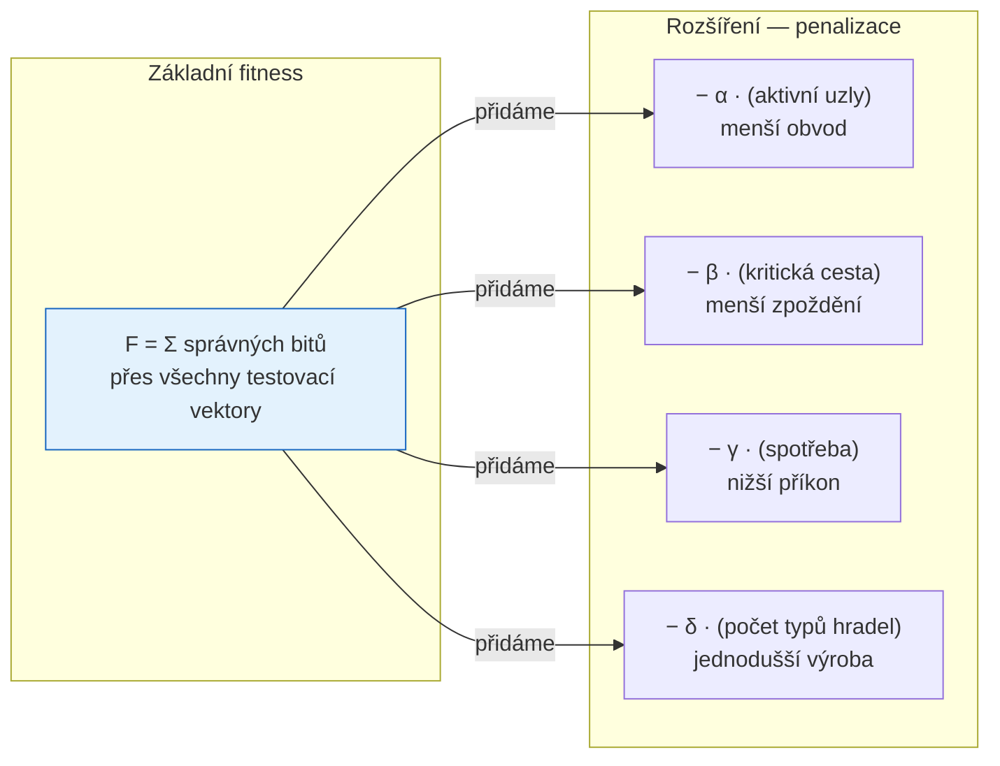

**Kritická cesta (timing):**

Zpoždění digitálního obvodu je dáno **nejdelší cestou** od vstupu k výstupu (v počtu hradel). Tuto délku lze efektivně spočítat topologickým průchodem DAG:

```
pro každý aktivní uzel v topologickém pořadí:
    depth[uzel] = max(depth[vstupní uzly]) + 1
kritická_cesta = max(depth[výstupní uzly])
```

**Spotřeba energie** se v digitálních obvodech dá odhadnout jako součet přepínání každého hradla přes testovací vektory (dynamická spotřeba je úměrná počtu přepnutí).

---

> [!info] Bitově‑paralelní simulace: vysvětlete princip a uveďte, o kolik se zrychlí simulace při 16‑bitovém procesoru.

**Problém:** Vyhodnocení fitness pro kombinační obvod s $n_i$ vstupy vyžaduje otestovat $2^{n_i}$ kombinací. Každý testovací vektor se musí propagovat přes celý DAG. Pro $n_i = 10$ vstupů a 50 uzlů to je 1024 × 50 = 51 200 logických operací.

**Klíčová myšlenka bit-paralelní simulace:**

Místo zpracování jedné vstupní kombinace po druhé, uložíme **více vstupních kombinací do jednoho strojového slova**. Logická operace AND/OR na 64bitovém slově pak zpracuje 64 kombinací **najednou**.

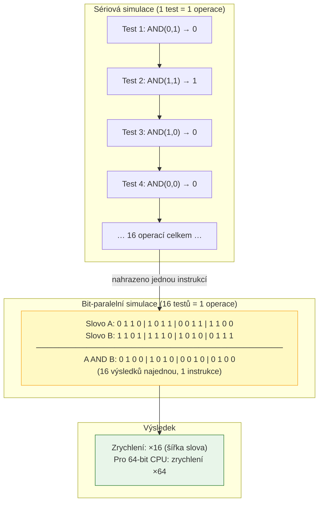

**Postup bit-paralelní simulace:**

1. Připrav vstupní slova: pro každý primární vstup $x_j$ vytvoř slovo, kde bit $k$ říká, jakou hodnotu má $x_j$ v testovacím vektoru $k$
2. Pro testování na $2^{n_i}$ kombinacích: $x_0$ má pattern $0101\ldots$, $x_1$ má pattern $0011\ldots$, atd. (Gray code nebo binary counter pattern)
3. Propaguj přes DAG pomocí bitových operací (`& | ^ ~`) — každá operace zpracuje W testů najednou (W = šířka slova)
4. Z výsledných slov přečti jednotlivé výsledky pro každý testovací vektor

**Zrychlení a omezení:**

| Šířka slova CPU | Zrychlení | Počet testů najednou |
|:---------------:|:---------:|:--------------------:|
| 16 bit | ×16 | 16 |
| 32 bit | ×32 | 32 |
| 64 bit | ×64 | 64 |
| 256 bit (AVX2) | ×256 | 256 |

Omezení: funguje dobře pro **binární (dvoustavové) obvody**. Pro vícehodnotovou logiku nebo aritmetické obvody je bit-paralelismus komplikovanější.

---

## Genetické operátory a prohledávací schéma

> [!info] Popište běžné mutace v CGP a proč většina uživatelů CGP preferuje mutaci před křížením.

**Typy mutací v CGP:**

CGP používá tzv. **bodovou mutaci** (point mutation) — náhodně se vybere jeden nebo více genů chromozomu a nahradí se náhodnou platnou hodnotou.

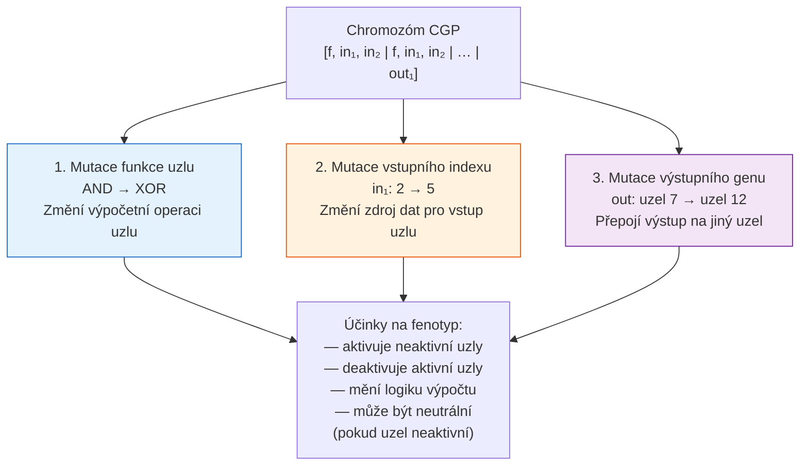

**Parametr mutace — počet mutovaných genů:**

Typicky se mutuje pevný počet genů $m$ nebo každý gen s pravděpodobností $p_m$. Optimální hodnota závisí na problému — příliš malé $m$ → pomalá konvergence; příliš velké $m$ → náhodné prohledávání.

Experimentálně se osvědčilo mutovat přibližně **1–5 % genů** chromozomu.

**Proč CGP preferuje mutaci před křížením:**

Standardní jednobodové nebo dvoubodové křížení **nefunguje dobře** pro CGP z několika důvodů:

1. **Epistáze:** Geny v CGP jsou navzájem provázané — hodnota vstupního indexu uzlu 15 závisí na tom, které uzly existují před ním (sloupce 1–14). Výměna segmentů chromozomu mezi dvěma rodiči může vytvořit neplatné nebo nesmyslné reference.

2. **Neutralita způsobuje nízkou korelaci fenotypu a genotypu:** Dva jedinci se stejnou fitness a podobným fenotypem mohou mít zcela odlišné genotypy (různá rozmístění neaktivních uzlů). Křížení takových jedinců nevytvoří "kombinaci dobrých vlastností" — výsledek je nepředvídatelný.

3. **Subgrafová výměna (semantické křížení):** Speciální forma křížení, kde se vyměňují celé podgrafy (aktivní části), funguje lépe, ale je výpočetně náročnější na implementaci.

**Praktické doporučení:** Julian Miller a kolegové opakovaně demonstrovali, že čistá mutační strategie $(1+\lambda)$ dosahuje v CGP srovnatelných nebo lepších výsledků než strategie zahrnující křížení.

---

> [!info] Prohledávací schéma `(1+λ)`: princip a praktické důsledky (výběr rodiče, generování potomků, rozhodování při remíze).

**Schéma $(1+\lambda)$** je evoluční strategie s **jedním rodičem** a $\lambda$ potomky. Jde o velmi jednoduchou, ale efektivní variantu EA.

**Jeden cyklus evoluce:**

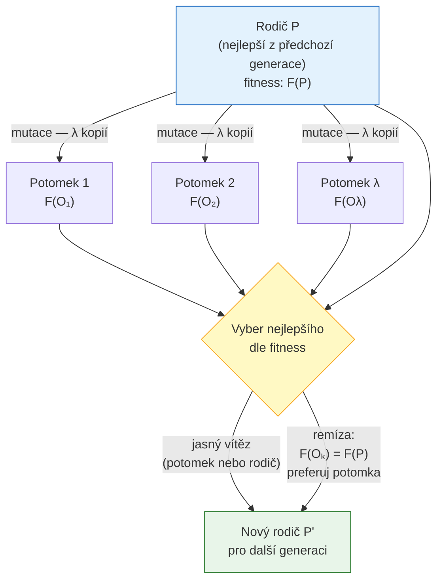

**Typické hodnoty $\lambda$:**

- $\lambda = 1$: Čistě sekvenční prohledávání — pomalé, ale jednoduché
- $\lambda = 4$: Nejčastěji používaná hodnota v CGP literatuře — dobrý kompromis
- $\lambda = 10+$: Více paralelismu, rychlejší konvergence, ale více výpočtů na generaci

**Proč preferovat potomka při remíze:**

Klíčové pravidlo $(1+\lambda)$ v CGP: pokud potomek má **stejnou** fitness jako rodič ($F(\text{potomek}) = F(\text{rodič})$), **vyber potomka** jako nového rodiče.

Důvod: Potomek se od rodiče liší (mutace změnila nějaký gen). Pokud byly mutace v neaktivních uzlech, fenotyp je stejný — ale genotyp je jiný. Preferováním potomka umožníme **neutrální drift** — pohyb v prostoru genotypů beze změny fitness.

Neutrální drift je prospěšný, protože:
1. Genotyp se mění a "vzdaluje" od lokálního optima v genotypovém prostoru
2. Příští mutace aktivního uzlu pak může prozkoumat jiné okolí fenotypového prostoru
3. Statisticky vede k rychlejšímu nalezení lepších řešení než fixace na jeden genotyp

**Srovnání selekčních strategií:**

| Strategie při remíze | Efekt |
|---------------------|-------|
| Preferuj rodiče | Stabilita, fixace genotypu, náchylnost k lokálním optimům |
| Preferuj potomka ✓ | Neutrální drift, lepší prohledávání prostoru |
| Náhodný výběr | Střední varianta, suboptimální |

---

## Příklady a experimenty

> [!info] Uveďte příklady problémů řešených CGP: parity, medián, násobičky — stručně popište, jak se liší konfigurace pro tyto úlohy.

Tři klasické benchmarkové problémy pro CGP pokrývají různé typy výzev:

**Parita (n-bit parity):**

Obvod implementuje XOR všech $n$ vstupních bitů — výstup je `1` právě tehdy, když je lichý počet jedniček na vstupu.

- $n_i = n$, $n_o = 1$
- Ideální funkce: $y = x_0 \oplus x_1 \oplus \ldots \oplus x_{n-1}$
- Nutno mít XOR v $\Gamma$ — bez XOR je parita velmi obtížně realizovatelná (exponenciálně více hradel)
- Fitness je ostře bimodální — buď bit správně, nebo ne → evoluci buď najde XOR strukturu, nebo bloudí
- Obtížné pro větší $n$ (24-bit parita je klasická výzva pro CGP)

**Medián (7 čísel × 8 bitů):**

- $n_i = 56$, $n_o = 8$
- Vyžaduje porovnávání a třídění → potřeba více uzlů a vrstev
- $\Gamma = \{\text{AND, OR}\}$ stačí (monotónní funkce), ale obvod bude větší
- Fitness: počet správných bitů ve výstupu mediánu
- Obtížnější škálování — roste s počtem bitů kvadraticky

**Násobička ($n$-bit × $n$-bit):**

- $n_i = 2n$, $n_o = 2n$ (výsledek má až $2n$ bitů)
- Nejvíce komplexní struktura — carry propagace, parciální součty
- Potřeba plná sada $\Gamma = \{\text{AND, XOR, OR, \ldots}\}$
- Nejnáročnější benchmark — 8-bit násobička (16 vstupů, 16 výstupů) vyžaduje velkou mřížku

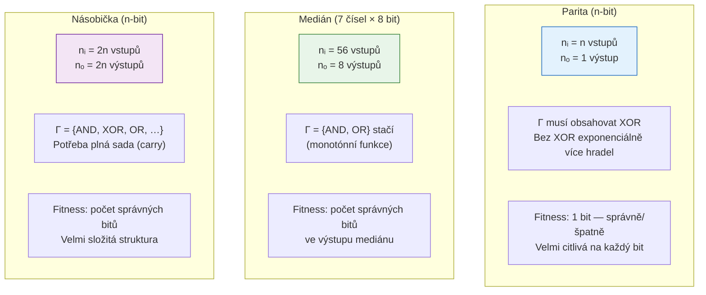

**Typické konfigurace mřížky:**

| Problém | $u$ (řádky) | $v$ (sloupce) | $L$-back | $\lambda$ |
|---------|:-----------:|:-------------:|:--------:|:---------:|
| 8-bit parita | 1 | 30 | 30 | 4 |
| Medián 7 čísel | 15 | 4 | 4 | 4 |
| 8-bit násobička | 10 | 30 | 30 | 4 |

---

> [!info] CGP: vliv nastavení parametrů (počet uzlů, L‑back) na úspěšnost hledání a na složitost vnitřní struktury.

**Vliv počtu uzlů:**

Vztah mezi počtem uzlů a úspěšností hledání je **nelineární** — existuje optimum:

- **Příliš málo uzlů:** Obvod nemá dostatek "kapacity" pro implementaci cílové funkce. Řešení je nedosažitelné → úspěšnost nízká.
- **Optimální počet:** Dostatečná expresivita, prostor řešení zvládnutelný → nejvyšší úspěšnost.
- **Příliš mnoho uzlů:** Prostor řešení je obrovský, mutace mají nižší šanci zasáhnout smysluplné části → konvergence zpomaluje, úspěšnost klesá.

**Vliv L-back:**

- **Malé L:** Přísná pipeline, omezená konektivita → menší prostor, rychlejší prohledávání, ale nižší expresivita.
- **Velké L (= v):** Maximální konektivita → větší prostor, pomalejší prohledávání, ale schopnost implementovat libovolné DAG struktury.

**Vliv pozice uzlu na aktivitu:**

Uzly blíže ke vstupům (levé sloupce) mají statisticky vyšší šanci být aktivní — jsou dosažitelné z více uzlů v pravé části mřížky. Uzly v posledním sloupci před výstupy jsou téměř vždy aktivní.

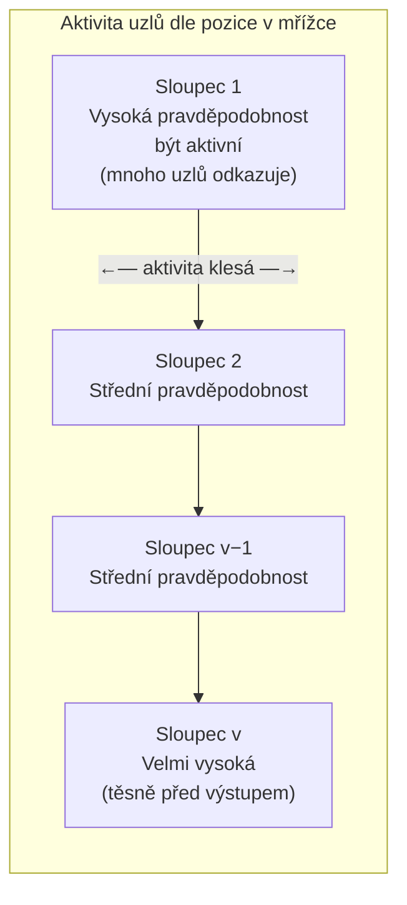

**Praktická doporučení pro nastavení parametrů:**

1. Začni s $L = v$ (plná konektivita) — omezení lze přidat pokud je prohledávání příliš pomalé
2. Počet uzlů: 2–5× více než minimálně nutný (odhad z referenčního řešení)
3. $\lambda = 4$ je dobrý výchozí bod — změň pokud máš paralelní výpočetní kapacitu
4. Množina funkcí $\Gamma$: zahrň jen ty operace, které jsou relevantní pro problém — každá zbytečná funkce zvětší prostor řešení

---

*Rozšířené studijní materiály pro přednášku 03 — Kartézské genetické programování (CGP)*