# 04 Limity abstraktního a fyzického počítání

---

## Landauerův a termodynamický limit energie

> [!info] Uveďte vztah pro minimální energii disipace při zmazání jednoho bitu informace (ESNL = kB T ln 2). Vysvětlete proměnné a fyzikální význam.

Minimální energie disipovaná při **ztrátě 1 bitu** je:

$$E_{SNL} = k_B \cdot T \cdot \ln 2$$

**Proměnné:**
- $k_B = 1{,}38 \times 10^{-23}\ \text{J/K}$ — Boltzmannova konstanta, spojuje mikroskopický (statistický) a makroskopický (tepelný) svět
- $T$ — absolutní teplota v Kelvinech (při pokojové teplotě $T \approx 300\ \text{K}$)
- $\ln 2 \approx 0{,}693$ — logaritmický faktor odpovídající ztrátě právě 1 bitu (binárního rozhodnutí); pochází z toho, že jeden bit reprezentuje výběr z 2 možností, a $\log_2 2 = 1$ bit $= \ln 2$ v přirozených jednotkách

**Fyzikální intuice — odkud se bere $\ln 2$:**

Boltzmannova entropie jednoho bitu v neurčitém stavu (rovnoměrná pravděpodobnost `0` nebo `1`) je:
$$S = k_B \ln W = k_B \ln 2$$
Po vymazání bitu (deterministicky víme, že je `0`) je $W = 1$, tedy $S = 0$.

Změna entropie bitu: $\Delta S_{bit} = 0 - k_B \ln 2 = -k_B \ln 2$.

Druhý termodynamický zákon požaduje $\Delta S_{celkové} \geq 0$, tedy okolí musí přijmout alespoň:
$$\Delta S_{okolí} \geq k_B \ln 2 \implies Q_{okolí} \geq T \cdot k_B \ln 2 = E_{SNL}$$

**Číselný příklad** při $T = 300\ \text{K}$:
$$E_{SNL} \approx 1{,}38 \times 10^{-23} \times 300 \times 0{,}693 \approx 2{,}87 \times 10^{-21}\ \text{J} \approx 2{,}87\ \text{zJ}$$

**Srovnání s reálnou technologií:**

| Technologie / rok | Energie na přepnutí | Násobek Landauerova limitu |
|-------------------|--------------------|-----------------------------|
| Landauerův limit (300 K) | $2{,}87 \times 10^{-21}$ J | 1× |
| Intel 4004 (1971) | $\sim 10^{-11}$ J | $\sim 3{,}5 \times 10^{9}$× |
| Intel Core (2010) | $\sim 10^{-15}$ J | $\sim 3{,}5 \times 10^{5}$× |
| Nejlepší CMOS (2024) | $\sim 10^{-16}$ J | $\sim 3{,}5 \times 10^{4}$× |
| Experimentální reverzibilní | $\sim 10^{-18}$ J | $\sim 350$× |

Landauerův limit je tedy fyzikální **spodní mez** — pro dnešní technologie stále vzdálená, ale jako technologie miniaturizuje, stává se relevantní.

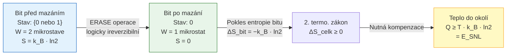

> [!tip] Zkratka SNL
> **S**hannon (informační entropie, 1948) → von **N**eumann (kvantová entropie, 1932) → **L**andauer (fyzikální disipace, 1961): tato trojice propojuje teorii informace s termodynamikou. Shannonova entropie $H = -\sum p_i \log p_i$ je formálně totožná s Boltzmannovou entropií — Shannon tuto analogii znal a vědomě ji použil.

---

> [!info] Jak souvisí Boltzmannova entropie se změnou entropie při nereverzibilním výpočtu?

**Boltzmannova entropie** propojuje mikroskopický popis systému s makroskopickou termodynamikou:

$$S = k_B \ln W$$

kde $W$ je počet **mikrostavů** (konkrétních konfigurací molekul/elektronů) odpovídajících danému **makrostavu** (pozorovatelnému stavu systému jako teplota, tlak, nebo: hodnota bitu).

**Klíčový rozdíl mezi makrostavem a mikrostavem:**

- **Makrostav "bit = 0":** Pozorovatel vidí logickou nulu — ale elektron v kapacitoru může být v mnoha různých kvantových stavech a tepelné pohyby se neustále mění. Všechny tyto fyzické konfigurace jsou **různé mikrostave** odpovídající témuž makrostavu.
- **Makrostav "bit neurčitý":** Bit je buď 0 nebo 1 — fyzicky je dvojnásobek mikrostavů.

**Výpočet změny entropie při resetu bitu:**

| Stav bitu | Mikrostave $W$ | Entropie $S = k_B \ln W$ |
|:---------:|:--------------:|:------------------------:|
| Neurčitý (0 nebo 1) | $2 \cdot W_0$ | $k_B(\ln W_0 + \ln 2)$ |
| Resetovaný na 0 | $W_0$ | $k_B \ln W_0$ |
| **Rozdíl** | — | $-k_B \ln 2$ |

(kde $W_0$ jsou mikrostave odpovídající jedné hodnotě bitu — ty se nezmění, bitu zůstane fyzická komplexita)

**Proč druhý termodynamický zákon vynucuje disipaci:**

Druhý termodynamický zákon říká $\Delta S_{celkový} = \Delta S_{systém} + \Delta S_{okolí} \geq 0$.

Pokud $\Delta S_{systém} = -k_B \ln 2$ (bit ztratí entropii), pak nutně:
$$\Delta S_{okolí} \geq k_B \ln 2 \implies Q_{do\ okolí} = T \cdot \Delta S_{okolí} \geq k_B T \ln 2$$

Toto teplo musí fyzicky přejít ze systému do okolí — nelze se mu vyhnout žádnou chytrou inženýrskou technikou, pokud je operace logicky ireverzibilní.

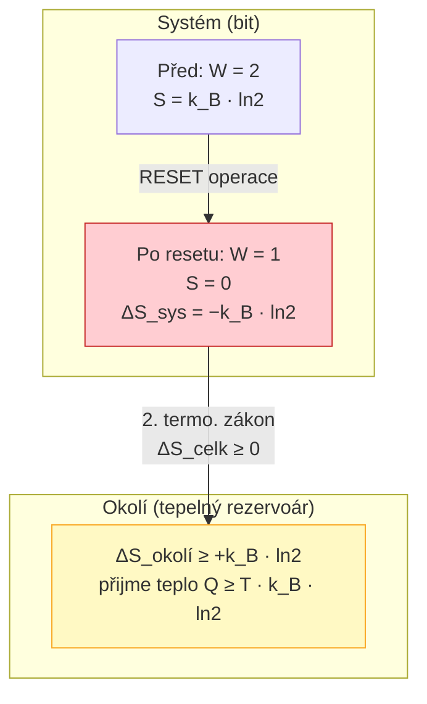

**Důsledek pro výpočetní architektury:**

Každá **logicky ireverzibilní** operace (AND, OR, NAND, reset registru, přepsání paměti) musí disipovat alespoň $k_B T \ln 2$ za každý ztracený bit. Moderní CPU provede $\sim 10^{18}$ logicky ireverzibilních operací za sekundu — i při tisícinásobku Landauerova limitu jde o nezanedbatelný příkon.

---

## Reverzibilní počítání a logická reverzibilita

> [!info] Co musí platit o logice výpočtu, aby byl systém fyzicky reverzibilní? (definice logické reverzibility, bijektivní funkce, garbage výstupy)

**Logická reverzibilita** je podmínka, při které lze z výstupů funkce jednoznačně rekonstruovat vstupy. Formálně: funkce $f: \{0,1\}^n \to \{0,1\}^m$ musí být **injektivní** (a pokud $n = m$, pak bijektivní).

**Proč standardní hradla nejsou reverzibilní — AND jako příklad:**

AND hradlo zobrazuje 4 vstupy na 2 výstupy — tři různé vstupy produkují výstup `0`, takže ze samotného výstupu `0` nelze rekonstruovat vstup. Dochází ke **ztrátě informace** = musí dojít k disipaci.

| A | B | AND(A,B) | Rekonstruovatelné? |
|:-:|:-:|:--------:|:------------------:|
| 0 | 0 | **0** | ❌ tři vstupy → stejný výstup |
| 0 | 1 | **0** | ❌ |
| 1 | 0 | **0** | ❌ |
| 1 | 1 | **1** | ✅ jednoznačné |

Počet vstupních kombinací (4) > počet výstupních hodnot (2) → funkce není injektivní → **logicky ireverzibilní**.

**Srovnání logicky reverzibilních a ireverzibilních hradel:**

| Hradlo | Vstupy | Výstupy | Bijektivní? | Reverzibilní? |
|--------|:------:|:-------:|:-----------:|:-------------:|
| NOT | 1 | 1 | ✅ | ✅ |
| XOR | 2 | 1 | ❌ | ❌ |
| AND | 2 | 1 | ❌ | ❌ |
| NAND | 2 | 1 | ❌ | ❌ |
| CNOT | 2 | 2 | ✅ | ✅ |
| Toffoli | 3 | 3 | ✅ | ✅ |
| Fredkin | 3 | 3 | ✅ | ✅ |

**Řešení — garbage (odpadní) výstupy:**

Aby se ireverzibilní funkce stala reverzibilní, přidají se výstupní bity nesoucí informaci potřebnou k rekonstrukci vstupu. Tyto bity se nazývají **garbage** — jsou logicky nutné, ale nenesou užitný výsledek.

**Příklad reverzibilní verze AND:**

$$f_{rev}(A, B) = \underbrace{(A \cdot B)}_{\text{výsledek}},\ \underbrace{A,\ B}_{\text{garbage}}$$

Funkce má 2 vstupy a 3 výstupy — z výstupu $(A \cdot B, A, B)$ lze triviálně rekonstruovat $(A, B)$. Bijektivita je splněna.

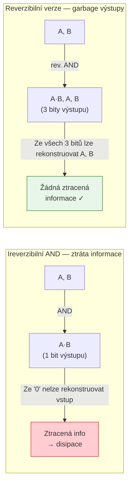

> [!warning] Fyzická vs. logická reverzibilita
> Logická reverzibilita je **nutná, ale ne dostačující** podmínka fyzické reverzibility. Fyzicky reverzibilní výpočet navíc vyžaduje provádění operací **kvazistaticky** (nekonečně pomalu, aby se systém vždy stihl vyrovnat s okolím) a bez tření/odporu. V praxi vždy dojde k nějakým ztrátám — ale lze se asymptoticky přibližovat Landauerovu limitu.

---

> [!info] Uveďte příklady hradel, která jsou reverzibilní, a vysvětlete proč (např. Toffoli, Fredkin).

Reverzibilní hradla mají **stejný počet vstupů a výstupů** a implementují bijektivní permutaci na prostoru vstupních kombinací.

### NOT hradlo
Triviálně reverzibilní: $\text{NOT}(\text{NOT}(A)) = A$. Invertuje sám sebe — je svou vlastní inverzí.

### CNOT (Controlled-NOT, 2 vstupy)

Vstup $(A, B)$, výstup $(A, A \oplus B)$. Řídicí bit $A$ prochází beze změny, cílový bit $B$ se překlopí jen pokud $A = 1$:

| A | B | A' | B' = A⊕B |
|:-:|:-:|:--:|:--------:|
| 0 | 0 | 0  | 0 |
| 0 | 1 | 0  | 1 |
| 1 | 0 | 1  | 1 |
| 1 | 1 | 1  | 0 |

Každý řádek výstupu je unikátní → bijekce. CNOT je svou vlastní inverzí: $\text{CNOT}(\text{CNOT}(A,B)) = (A,B)$.

### Toffoliho hradlo (CCNOT — Controlled-Controlled-NOT)

Tři vstupy $(A, B, C)$, tři výstupy $(A', B', C')$:
$$A' = A, \quad B' = B, \quad C' = C \oplus (A \cdot B)$$

$A$ a $B$ procházejí jako "řídicí" bity beze změny. Třetí bit $C$ se překlopí **pouze tehdy**, když $A = 1$ **a zároveň** $B = 1$.

| A | B | C | A' | B' | C' |
|:-:|:-:|:-:|:--:|:--:|:--:|
| 0 | 0 | 0 | 0  | 0  | 0  |
| 0 | 0 | 1 | 0  | 0  | 1  |
| 0 | 1 | 0 | 0  | 1  | 0  |
| 0 | 1 | 1 | 0  | 1  | 1  |
| 1 | 0 | 0 | 1  | 0  | 0  |
| 1 | 0 | 1 | 1  | 0  | 1  |
| 1 | 1 | 0 | 1  | 1  | **1** |
| 1 | 1 | 1 | 1  | 1  | **0** |

Všech 8 výstupních trojic je unikátních → bijekce. Toffoli je opět svou vlastní inverzí.

> [!tip] Toffoli je univerzální
> Toffoliho hradlem lze sestavit libovolnou logickou funkci a je tedy **reverzibilně univerzální**:
> - Pokud $C = 0$: výstup $C' = A \cdot B$ → simuluje AND
> - Pokud $A = B = 1$: výstup $C' = \text{NOT}(C)$ → simuluje NOT
> - Kombinací AND a NOT lze sestavit libovolnou booleovskou funkci

### Fredkinovo hradlo (CSWAP — Controlled-SWAP)

Tři vstupy $(A, B, C)$. Pokud $A = 1$, prohodí $B$ a $C$; jinak vše projde beze změny:

$$A' = A, \quad B' = \begin{cases}C & \text{pokud } A=1 \\ B & \text{pokud } A=0\end{cases}, \quad C' = \begin{cases}B & \text{pokud } A=1 \\ C & \text{pokud } A=0\end{cases}$$

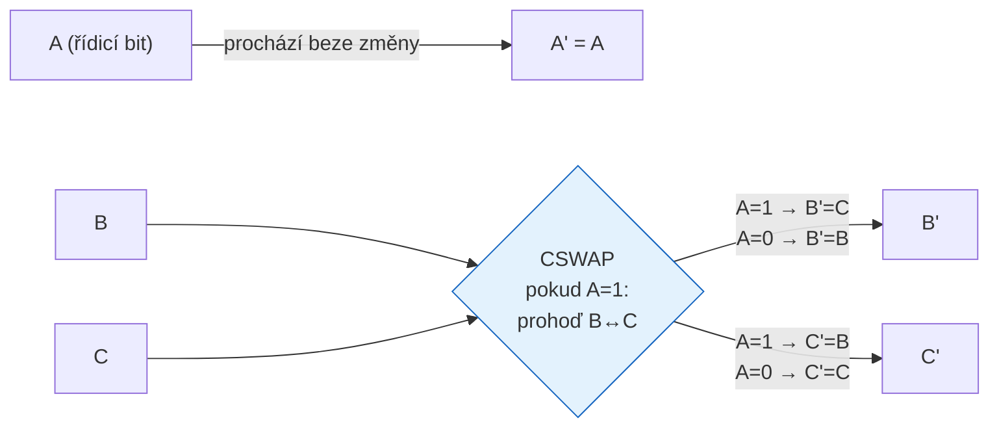

> [!tip] Fredkin zachovává počet jedniček
> Fredkinovo hradlo je **konzervativní** — počet jedniček na vstupu vždy roven počtu jedniček na výstupu (SWAP nemění počet, pouze pořadí). Tato vlastnost je zásadní pro kvantové obvody, kde zachování počtu kvant (fotonů, elektronů) je fundamentálním fyzikálním zákonem. Proto je Fredkin přirozeným stavebním blokem pro kvantové hradlové obvody.

**Jak přes Fredkin implementovat AND:**
- Nastavíme $B = 1$, $C = 0$
- Výstup $C' = B = 1$ pokud $A = 1$, jinak $C' = C = 0$
- Tedy $C' = A \cdot B_{fixed} = A$ — jednoduchý buffer, ale s kombinací více hradel lze dosáhnout AND.

---

## Abstraktní vs. fyzické stroje — fyzikální omezení

> [!info] Diskutujte praktická fyzikální omezení implementace abstraktních modelů: konečné zdroje (hmota, energie), rychlost šíření informace (rychlost světla) a dopad na realizovatelnost teoretických modelů.

Abstraktní modely (Turingův stroj, RAM) jsou matematické idealizace bez fyzikálních omezení. Reálné fyzické systémy tato omezení mají — a jsou fundamentální, nikoliv pouze technologická.

**1. Konečné zdroje — hmota a energie:**

- Pozorovatelný vesmír obsahuje odhadem $\sim 10^{80}$ atomů → absolutní horní mez velikosti paměti
- Energie ve vesmíru je konečná → nelze provést nekonečně mnoho výpočetních kroků
- Nekonečná páska Turingova stroje je fyzicky nerealizovatelná — paměť musí být vždy konečná
- Důsledek: každý reálný počítač je ve skutečnosti **konečný automat** (s obrovským, ale konečným počtem stavů)

**2. Rychlost světla — informační limit:**

Nic se nešíří rychleji než $c \approx 3 \times 10^8\ \text{m/s}$. To má přímé důsledky pro takt procesoru:

$$f_{max} = \frac{c}{d}$$

kde $d$ je charakteristická délka procesoru. Pro čip 10 mm: $f_{max} = 3 \times 10^{10}\ \text{Hz} = 30\ \text{GHz}$.

Reálné takty jsou nižší (signál musí projít přes mnoho hradel), ale ukazuje to fyzikální strop. Distribuce hodinového signálu přes velký čip nebo cluster vytváří **nevyhnutelné latence** — proto paralelní systémy potřebují synchronizační protokoly.

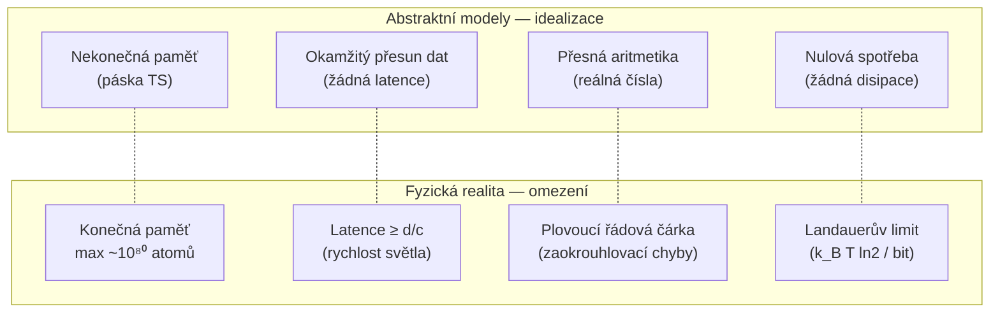

**3. Kvantové efekty při miniaturizaci:**

Pod přibližně 2–3 nm velikosti tranzistoru začínají dominovat kvantové efekty:
- **Kvantové tunelování:** Elektrony přechází přes energetickou bariéru, i když klasicky nemají dostatek energie → nekontrolované přepínání tranzistoru
- **Diskrétní fluktuace nosičů náboje:** Na tak malých plochách je pohyb jednotlivých elektronů statisticky dominantní → šum
- **Těsná vazba s prostředím:** Dekoherence kvantových stavů způsobuje chyby, pokud není systém izolován

**4. Tepelný šum (Johnson-Nyquist):**

Každý elektrický obvod s nenulovou teplotou má tepelný šum o výkonu:
$$P_{noise} = k_B T \cdot \Delta f$$

Pro dostatečně malé obvody může tento šum spontánně překlopit stav logického hradla.

---

> [!info] Jak Heisenbergův princip a měření omezují fyzikální výpočty v mikrosvětě?

**Heisenbergův princip neurčitosti** existuje ve dvou vzájemně propojených formách:

$$\Delta x \cdot \Delta p \geq \frac{\hbar}{2}, \qquad \Delta E \cdot \Delta t \geq \frac{\hbar}{2}$$

kde $\hbar = h/2\pi \approx 1{,}055 \times 10^{-34}\ \text{J·s}$ je redukovaná Planckova konstanta.

**Překlad do výpočetního kontextu:**

**Poloha vs. hybnost ($\Delta x \cdot \Delta p \geq \hbar/2$):**
- Tranzistor musí lokalizovat elektron v kanálu (definovat jeho "polohu" = zda přechází nebo ne)
- Čím přesněji je elektron lokalizován ($\Delta x \to 0$), tím větší je neurčitost jeho hybnosti ($\Delta p \to \infty$)
- Při velmi malých tranzistorech je elektron "rozmazán" přes bariéru → tunelování je nevyhnutelné

**Energie vs. čas ($\Delta E \cdot \Delta t \geq \hbar/2$):**
- Přesné nastavení energetického stavu tranzistoru (aby byl jistě zapnut nebo vypnut) trvá minimálně:
$$\Delta t \geq \frac{\hbar}{2 \Delta E}$$
- Čím rychlejší přepnutí chceme ($\Delta t \to 0$), tím větší energetická neurčitost → stav není dobře definován
- To implikuje **fyzikální horní mez taktu** nezávislou na implementaci

**Měření v kvantové mechanice — kolaps vlnové funkce:**

V klasickém počítači lze pasivně "přečíst" stav registru bez jeho narušení. V kvantovém světě každé měření nevratně změní stav systému (kolaps vlnové funkce). To má klíčové důsledky:
- Kvantový bit (qubit) v superpozici $|\psi\rangle = \alpha|0\rangle + \beta|1\rangle$ při měření "skočí" do $|0\rangle$ nebo $|1\rangle$ s pravděpodobnostmi $|\alpha|^2$, $|\beta|^2$
- Intermediate výsledky kvantového výpočtu nelze "sledovat" bez zničení výpočtu
- Kvantové chybové kódování proto musí pracovat bez přímého měření dat

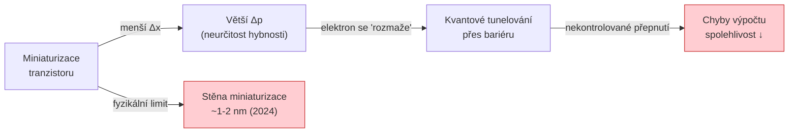

---

## Turingův stroj, nerozhodnutelnost a Church‑Turingova teze

> [!info] Definujte Turingův stroj a stručně vysvětlete pojem nerozhodnutelného problému (příklad: problém zastavení).

**Formální definice Turingova stroje** je sestice:

$$\text{TM} = (Q, \Sigma, \Gamma, \delta, q_0, q_{accept}, q_{reject})$$

| Symbol | Typ | Význam |
|--------|-----|--------|
| $Q$ | Konečná množina | Všechny možné vnitřní stavy řídící jednotky |
| $\Sigma$ | Abeceda | Symboly na vstupu (bez prázdného symbolu $\sqcup$) |
| $\Gamma$ | Pásková abeceda | $\Sigma \subseteq \Gamma$; obsahuje $\sqcup$ (blank) a pracovní symboly |
| $\delta$ | Přechodová funkce | $Q \times \Gamma \to Q \times \Gamma \times \{L, R\}$ — srdce stroje |
| $q_0 \in Q$ | Počáteční stav | Stav na začátku výpočtu |
| $q_{F} \in Q$ | Koncovy stav | Vstup je přijat/odmitnut, výpočet končí |

**Krok výpočtu:**
1. Přečti symbol $s$ pod hlavou
2. Podle $(q_{current}, s) \xrightarrow{\delta} (q_{new}, s_{write}, dir)$:
   - Přejdi do stavu $q_{new}$
   - Zapiš symbol $s_{write}$ na aktuální pozici
   - Posuň hlavu doleva (L) nebo doprava (R)

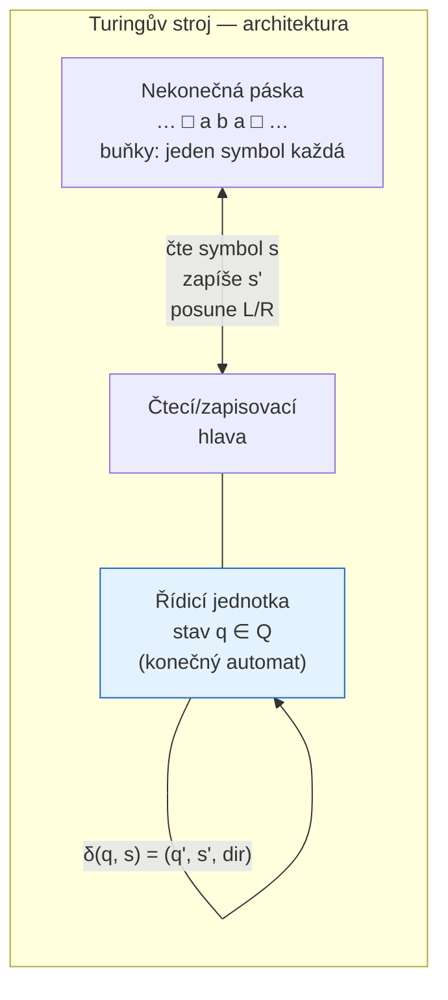

**Nerozhodnutelný problém** — formální definice:

Problém $P$ je **rozhodnutelný**, pokud existuje TS, který pro každý vstup $w$:
- Zastaví a přijme, pokud $w \in P$
- Zastaví a odmítne, pokud $w \notin P$

Problém je **nerozhodnutelný**, pokud žádný takový TS neexistuje.

**Problém zastavení (Halting Problem) — $H$:**

> *Vstup:* Kód programu $\langle P \rangle$ a vstupní data $w$  
> *Otázka:* Zastaví se $P$ na $w$?

**Důkaz nerozhodnutelnosti diagonalizací (Turingův argument, 1936):**

Předpokládejme sporem, že existuje TS $H$ rozhodující zastavení:
$$H(\langle P \rangle, w) = \begin{cases}\text{accept} & \text{pokud } P \text{ zastaví na } w \\ \text{reject} & \text{pokud } P \text{ nezastaví na } w\end{cases}$$

Zkonstruujeme program $D$ ("diagonalizátor"):
$$D(\langle P \rangle) = \begin{cases}\text{zacykli navždy} & \text{pokud } H(\langle P \rangle, \langle P \rangle) = \text{accept} \\ \text{zastav} & \text{pokud } H(\langle P \rangle, \langle P \rangle) = \text{reject}\end{cases}$$

Ptáme se: co udělá $D(\langle D \rangle)$?

- Pokud $D$ na $\langle D \rangle$ **zastaví** → $H(\langle D \rangle, \langle D \rangle) = \text{accept}$ → $D$ se zacyklí → **spor**
- Pokud $D$ na $\langle D \rangle$ **nezastaví** → $H(\langle D \rangle, \langle D \rangle) = \text{reject}$ → $D$ zastaví → **spor**

$H$ tedy nemůže existovat. ∎

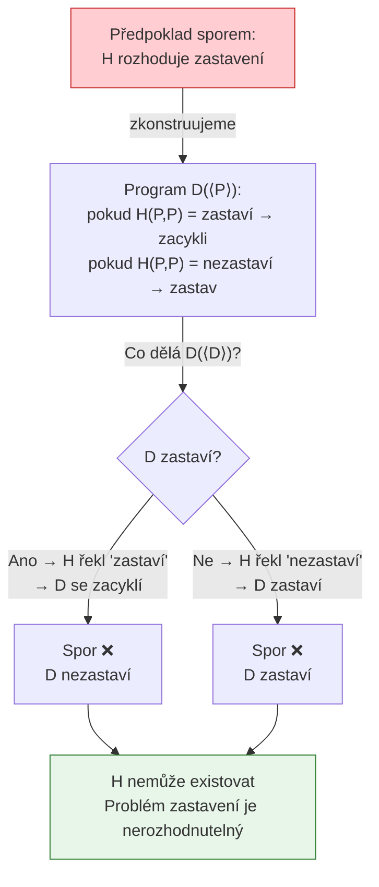

---

> [!info] Co říká Church‑Turingova teze a jaký je rozdíl mezi abstraktní a fyzickou verzí této teze?

**Church‑Turingova teze** je hypotéza (nikoliv věta — nelze ji formálně dokázat v rámci matematiky, protože pojem "efektivní výpočet" je intuitivní, nikoliv formální):

> *„Každá funkce, která je efektivně (algoritmicky) vyčíslitelná, je vyčíslitelná Turingovým strojem."*

Teze byla formulována nezávisle Alonzem Churchem (lambda kalkul, 1936) a Alanem Turingem (TS, 1936) — přičemž oba modely se ukázaly ekvivalentní.

**Proč tezi nelze dokázat:**
- "Efektivně vyčíslitelná" je intuitivní pojem — co člověk považuje za algoritmus
- Formální modely (TS, lambda kalkul) jsou přesné — ale nelze formálně dokázat, že pokrývají vše, co je intuitivně algoritmické
- Teze je spíše **empirické pozorování**: všechny dosud navržené rozumné výpočetní modely jsou ekvivalentní TS

**Abstraktní (matematická) verze:**

Různé formální modely výpočtu jsou výpočetně ekvivalentní — co jeden vypočítá, vypočítají všechny:

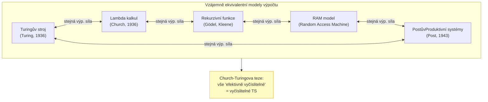

**Fyzická (silná) verze:**

> *„Každý fyzicky realizovatelný výpočetní proces může být efektivně simulován Turingovým strojem."*

Tato verze je **kontroverzní** a může být porušena:

| Model | Porušuje fyzickou CT tezi? | Důvod |
|-------|:--------------------------:|-------|
| Klasický počítač | ❌ | Ekvivalentní TS |
| Kvantový počítač | Možná ⚠️ | Exponenciálně rychlejší pro některé problémy (BQP), ale stejná vyčíslitelnost |
| Analogový počítač | Možná ⚠️ | Reálná čísla s plnou přesností → nekonečná informace v jedné hodnotě |
| Biologický mozek | Neznámo ❓ | Závisí na fyzikálních principech neuronálního výpočtu |

---

## Super‑Turingovské modely a jejich limity

> [!info] Popište alespoň dvě vlastnosti super‑Turingových (nekonvenčních) modelů, v nichž porušují předpoklady Turingova stroje.

Standardní TS předpokládá: (1) fixní, předem daný vstup, (2) neměnnou přechodovou funkci $\delta$, (3) izolaci od okolí během výpočtu, (4) spočetně mnoho kroků, (5) sekvenční výpočet.

**Super-Turingovské modely porušují tyto předpoklady:**

**1. Interaktivita s okolím za běhu výpočtu:**
- TS dostane veškerý vstup před startem a pak pracuje izolovaně
- Interaktivní systém přijímá vstupy **průběžně** — přechodová funkce se tak efektivně mění
- Příklady: operační systémy, webové servery, řídicí systémy — neterminující reaktivní procesy
- Důsledek: nejde popsat jako funkce $f: \Sigma^* \to \Sigma^*$; výstup je nekonečný proud

**2. Přístup k orákulu (Oracle TM):**
- TS $M^\mathcal{O}$ může v jednom kroku "zavolat" funkci $\mathcal{O}$ a dostat odpověď
- Orákulum $\mathcal{O}$ může být nerekurzivní — např. $\mathcal{O}$ odpovídá na problém zastavení
- $M^\mathcal{O}$ pak dokáže rozhodovat problémy, které standardní TS nedokáže
- Hierarchie oracle tříd: $\emptyset' < \emptyset'' < \emptyset''' < \ldots$ (aritmetická hierarchie)

**3. Nekonečná přesnost (analogový výpočet):**
- Reálné číslo má nekonečně mnoho desetinných míst — jedno číslo kóduje nekonečně bitů
- Shannon ukázal, že analogový kanál s Gaussovým šumem má konečnou kapacitu → fyzické analogové systémy jsou omezené šumem
- Hypotetický šumový analogový počítač by byl super-Turingovský

**4. Funkcionálnost měnící se za běhu:**
- U standardního TS je $\delta$ pevně dána před startem
- Evoluční systémy, systémy učení za běhu nebo systémy s epigenetikou mohou měnit svá pravidla v reakci na prostředí
- Tím se dostávají za hranice, co lze popsat jako jeden fixní TS

**5. Konečnost výpočtu:**
- TS musí zastavit, aby poskytl výsledek
- U super-Turingovských modelů může být výstup generován **během výpočtu** — nemusí nikdy zastavit, ale stále poskytuje užitečné informace

---

> [!info] Uveďte abstraktní modely jako accelerating Turing machine nebo TM s orákulem a diskutujte, proč nejsou fyzicky realizovatelné.

**Akcelerující Turingův stroj (Zeno machine):**

Krok $k$ trvá $t_k = t_0 \cdot 2^{-k}$. Celkový čas výpočtu:

$$T_{total} = \sum_{k=1}^{\infty} t_0 \cdot 2^{-k} = t_0 \sum_{k=1}^{\infty} 2^{-k} = t_0 \cdot 1 = t_0$$

Stroj vykoná **nekonečně mnoho kroků za konečný čas $t_0$** — a tedy by mohl rozhodovat problém zastavení (spusť program; po $t_0$ sekundách víš, zda zastavil nebo ne).

Pojmenování "Zeno" odkazuje na Zenónovy paradoxy — nekonečná řada kroků s konečným součtem.

**Proč není fyzicky realizovatelný:**

1. **Energie:** Každý krok vyžaduje nenulovou energii (Landauerův limit). Nekonečně mnoho kroků → nekonečná energie
2. **Frekvence:** Krok $k$ má frekvenci $f_k = 2^k/t_0$. Pro $k \to \infty$ frekvence diverguje — překročí $c/\lambda_{Planck} \approx 1{,}9 \times 10^{43}\ \text{Hz}$ (Planckova frekvence), kde klasická fyzika přestává platit
3. **Heisenbergův princip:** Pro krok trvající $\Delta t = t_0 \cdot 2^{-k}$:
$$\Delta E \geq \frac{\hbar}{2 \Delta t} = \frac{\hbar \cdot 2^k}{2 t_0} \xrightarrow{k \to \infty} \infty$$
Každý krok by vyžadoval nekonečnou energetickou neurčitost.

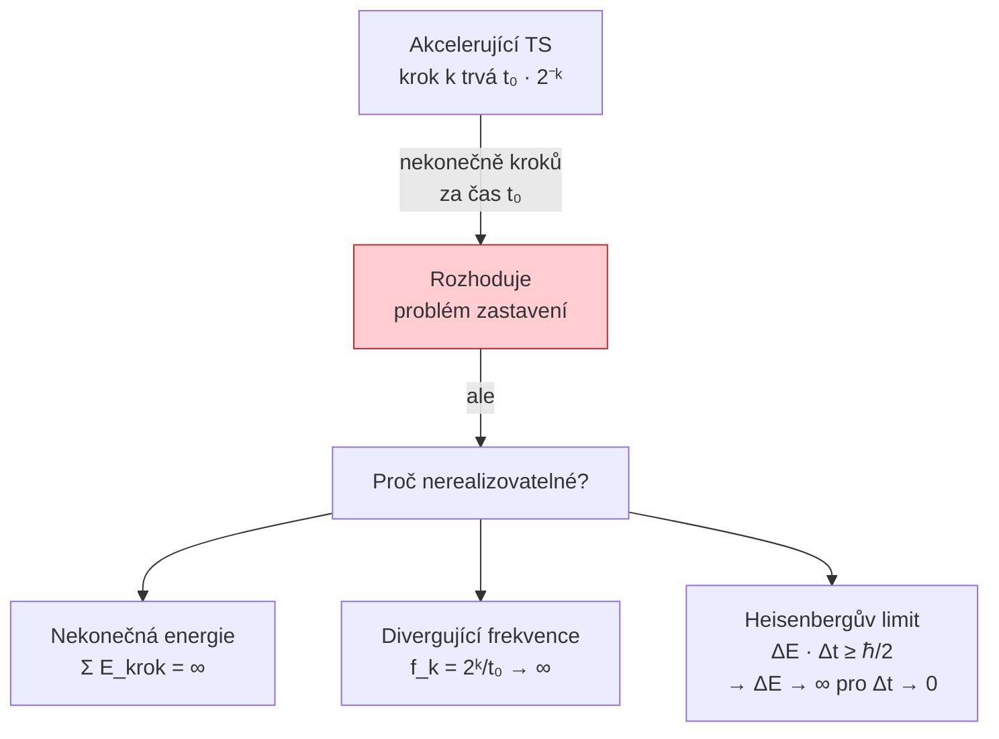

**TM s orákulem — hierarchie:**

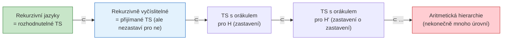

---

## Shrnutí a důsledky pro nekonvenční počítače

> [!info] Shrňte, proč systémy, které interagují s prostředím nebo přijímají informace zvnějšku, nemění platnost Church‑Turingovy teze, ale stavějí na jiném modelu výpočtu (interaktivní model).

**Klíčový rozdíl paradigmat:**

Church-Turingova teze hovoří o **výpočtu funkce** — deterministickém zobrazení vstupního řetězce na výstupní řetězec. Interaktivní systémy tuto podmínku nesplňují:

| Vlastnost | Klasický výpočet (TS) | Interaktivní výpočet |
|-----------|----------------------|---------------------|
| Vstup | Předem dán, konečný | Průběžný, možná nekonečný |
| Výstup | Konečný výsledek $f(w)$ | Proud odpovědí na události |
| Terminace | Ano (nebo smyčka = odmítnutí) | Obvykle neterminující |
| Vztah k okolí | Izolovaný během výpočtu | Kontinuální interakce |
| Příklady | Kompilátor, třídící algoritmus | OS, síťový server, buňka |

**Proč to není "porušení" CT teze:**

Interaktivní systémy **neřeší problém**, který CT teze popisuje — neodpovídají na otázku „je $w \in L$?". Proto CT teze jejich chování ani nepokrývá — nemůže být porušena, pouze je **mimo její záběr**.

Je to jako říct, že plavání "porušuje" fyziku létání — obě se řídí fyzikou, ale různými aspekty. Interaktivní modely (CSP, pi-kalkul, actor model) jsou plnohodnotné výpočetní modely, jen popisují jiný fenomén.

> [!important] Klíčové rozlišení
> Interaktivní systémy **neporušují** Church-Turingovu tezi — ta se na ně prostě **nevztahuje**, protože řeší jiný typ problému. Teze říká: „co lze algoritmicky vypočítat z daného vstupu" — interaktivní systém nevypočítává funkci, ale **udržuje chování** v reakci na prostředí.

---

> [!info] Diskutujte praktické implikace Landauerova limitu a fyzikálních limitů pro návrh energeticky efektivních výpočtových systémů.

**Energetická hierarchie moderního výpočtu:**

| Operace | Typická energie | Násobek $E_{SNL}$ |
|---------|:-----------:|:---:|
| Landauerův limit (vymazání bitu, 300 K) | $\approx 3 \times 10^{-21}$ J | $1\times$ |
| Přepnutí moderního CMOS tranzistoru (5nm, 2024) | $\approx 10^{-16}$ J | $\sim 3 \times 10^{4}\times$ |
| Přesun dat L1 cache → registr | $\approx 10^{-14}$ J | $\sim 3 \times 10^{6}\times$ |
| Přesun dat L3 cache → CPU | $\approx 10^{-12}$ J | $\sim 3 \times 10^{8}\times$ |
| Přesun dat RAM → CPU | $\approx 10^{-11}$ J | $\sim 3 \times 10^{9}\times$ |
| Přesun dat přes síť (1 packet) | $\approx 10^{-6}$ J | $\sim 3 \times 10^{14}\times$ |

**Klíčový poznatek z tabulky:** Komunikace a přesun dat jsou řádově dražší než samotný výpočet. Toto je "memory wall" nebo "communication wall" — dominantní energetická brzda moderních systémů.

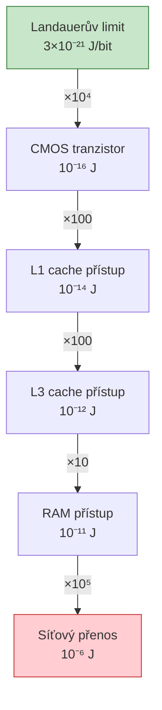

**Implikace a směry vývoje:**

**1. Reverzibilní výpočty:**
Nahrazení ireverzibilních hradel (AND, OR) reverzibilními (Toffoli, Fredkin) eliminuje nutnou disipaci za každý ztracený bit. V praxi jsou reverzibilní obvody větší a pomalejší — kompromis. Hlavní výzkumné zaměření: adiabatické CMOS obvody, které operují kvazistaticky a recyklují energii z kondenzátorů.

**2. Neuromorfní výpočet:**
Lidský mozek pracuje s $\sim 20\ \text{W}$ a provádí $\sim 10^{15}$ synaptických operací za sekundu → $\sim 2 \times 10^{-14}\ \text{J/operaci}$. Klíčem je **event-driven** paradigma — neurony spotřebovávají energii pouze při vysílání spike (akčního potenciálu), ne průběžně. Čipy jako Intel Loihi nebo IBM TrueNorth tuto architekturu implementují.

**3. Processing-in-Memory (PIM):**
Výpočet se přesouvá přímo do paměťových buněk, aby se eliminovaly drahé přesuny dat. Příklady: Resistive RAM (ReRAM) pro in-memory maticové operace, DRAM s integrovanou logikou (Samsung HBM-PIM).

**4. Kvantové počítače:**
Pro specifické problémy (faktorizace — Shorův algoritmus, prohledávání — Groverův algoritmus) nabízejí exponenciální nebo kvadratické zrychlení. Energetická efektivita závisí na overhead kryogenního chlazení (supravodivé qubity potřebují $\sim 15\ \text{mK}$), ale pro správné problémy je celková energetická bilance příznivá.

**5. Aproximativní výpočet (Approximate Computing):**
Pro aplikace tolerující chyby (zpracování obrazu, ML inference) lze záměrně zjednodušit výpočty a ušetřit energii. Například 8-bitová místo 32-bitové aritmetiky v neuronových sítích.

> [!tip] Praktické pravidlo
> Největší energetické úspory v moderních systémech nepocházejí z lepší logiky, ale z **redukce datových přesunů** — komunikace je energeticky dominantní složka. Proto architektury jako GPU (vysoká propustnost lokální paměti) a TPU (speciálně optimalizované datové toky) dominují energeticky efektivnímu výpočtu dnes.

---

*Rozšířené studijní materiály pro přednášku 04 — Limity abstraktního a fyzického počítání*