# 05 Evoluční návrh číslicových obvodů

---

## Evoluční hardware (EHW) a historie

> [!info] Co je EHW (Evoluční hardware) a jaké jsou hlavní výhody kombinace EA s rekonfigurovatelnými zařízeními (FPGA, PLA)?

**Evoluční hardware (EHW)** je paradigma, kde evoluční algoritmus (EA) přímo navrhuje nebo adaptuje konfiguraci **rekonfigurovatelného zařízení (RZ)** — nejčastěji FPGA nebo PLA. Místo ručního návrhu inženýrem obvod "vyrostl" automaticky optimalizací přes generace kandidátních konfigurací.

**Klíčová myšlenka:** Chromozom v EA přímo kóduje konfigurační bitstream RZ. Fitness se měří změřením chování nakonfigurovaného čipu.

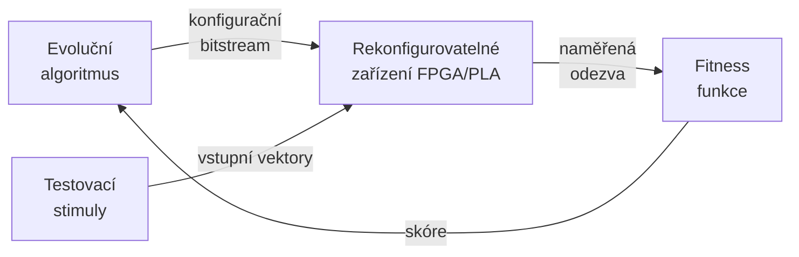

**Hlavní výhody kombinace EA + RZ:**

| Výhoda | Popis |
|--------|-------|
| Přímá evoluce v HW | Konfigurace se nahrají přímo do čipu — evaluace probíhá v reálném hardwaru |
| Rychlé vyhodnocení | Obvod v FPGA běží na MHz/GHz — miliony testovacích vektorů za sekundy |
| Využití fyzikálních vlastností | Evoluce může najít řešení, která využívají netradiční chování křemíku (analogové efekty, parazitní kapacity) |
| Adaptace za provozu | Systém se může rekonfigurovat a přizpůsobovat měnícím se podmínkám za provozu (fault recovery, teplotní kompenzace) |
| Bez výrobního kroku | FPGA lze přeprogramovat tisíckrát — žádné náklady na výrobu ASIC prototypů |

**Historický kontext:** EHW se rozvíjí od 90. let. Klíčové osobnosti: Adrian Thompson (1996, FPGA), Hugo de Garis (evolvabilní mozky), Julian Miller (CGP — Cartesian Genetic Programming).

---

> [!info] Popište Thompsonův experiment: co bylo vylepšeno/objeveno evolucí na FPGA a jaké důsledky to má pro přenositelnost a vysvětlitelnost vyevoluovaných řešení?

**Thompsonův experiment (1996)** je jeden z nejvýznamnějších experimentů v historii EHW. Adrian Thompson na University of Sussex nechal EA evolvovat na Xilinx XC6216 FPGA obvod, který rozlišuje dva audio tóny: **1 kHz vs. 10 kHz**.

**Parametry experimentu:**
- Populace: 50 jedinců, 5000 generací
- Chromozom: konfigurace 10×10 bloků FPGA (~1000 bitů)
- Evaluace: **intrinsic** — přímé měření na čipu
- Fitness: správná klasifikace tónů na výstupu

**Co evoluce objevila:**

Výsledný obvod byl **překvapivě malý** (32 hradel místo stovek dle konvenčního návrhu) a fungoval spolehlivě — ale způsobem, který nikdo nečekal:

- Využíval **analogové přechodové jevy** v digitálních hradlech (FPGA není čistě digitální na fyzikální úrovni)
- Část použitých buněk nebyla **vůbec propojená** se vstupem/výstupem, přesto jejich odstranění způsobilo selhání — ovlivňovaly elektromagnetické pole okolních buněk
- Obvod byl **asynchronní** — nepoužíval hodinový signál
- Závisel na specifickém **rozložení tepla** a napájení konkrétního kusu křemíku

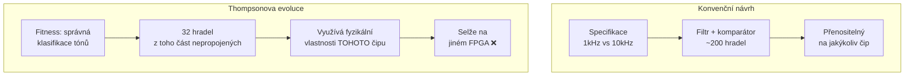

**Důsledky pro přenositelnost a vysvětlitelnost:**

- **Přenositelnost = nulová:** Obvod fungoval pouze na konkrétním kusu FPGA, při konkrétní teplotě a napájení. Na identickém čipu jiného sériového čísla selhal.
- **Vysvětlitelnost = téměř nulová:** Inženýři nedokázali vysvětlit, proč nepropojené buňky jsou nutné — obvod byl "black box"
- **Obecný závěr:** Intrinsic evoluce může najít vynikající řešení, ale za cenu ztráty přenositelnosti a srozumitelnosti. To je zásadní problém pro průmyslové nasazení.

---

## Reprezentace a úrovně návrhu

> [!info] Úrovně reprezentace obvodu: uveďte rozdíly mezi reprezentací na úrovni materiálu, tranzistorů, hradel, funkčních bloků a programů pro konstrukci.

Návrh digitálních obvodů může probíhat na více úrovních abstrakce. Volba úrovně reprezentace **přímo určuje** velikost prohledávaného prostoru, výpočetní náročnost evaluace a škálovatelnost EA.

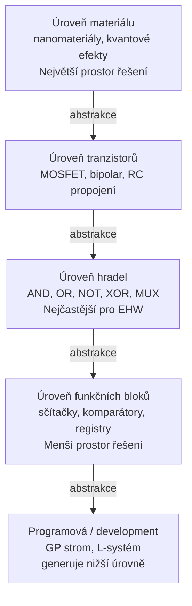

**Detailní srovnání:**

| Úroveň | Co se evolvuje | Prostor řešení | Typické použití |
|--------|---------------|----------------|----------------|
| Materiál | Fyzikální struktury, dopování | Astronomicky velký | Výzkum nanomateriálů |
| Tranzistory | Zapojení MOSFETů, hodnoty R/C | Velmi velký | Analogové EHW (FPTA) |
| Hradla | Topologie sítě hradel, typ hradla | Velký, ale zvládnutelný | CGP, klasický EHW |
| Funkční bloky | Propojení ALU, MUX, registrů | Střední | Vyšší EHW, architektura |
| Programová | Instrukce konstruující obvod | Malý (genotyp), velký (fenotyp) | GP pro obvody (Koza) |

**Cartesian Genetic Programming (CGP)** je dnes nejrozšířenější reprezentace na úrovni hradel:
- Mřížka `r × c` hradel, každé hradlo má typ a dva vstupy z předchozích sloupců
- Chromozom = pro každé hradlo: `(typ, vstup1, vstup2)` + výběr výstupních uzlů
- Relativně kompaktní, ale dostatečně expresivní pro kombinační logiku

---

> [!info] Jak volba reprezentace ovlivňuje velikost prostoru řešení a škálovatelnost EA pro obvody (proč je praktické omezení ~15 vstupů)?

**Problém exponenciálního růstu evaluace:**

Pro kombinační obvod s `n` vstupy existuje `2ⁿ` různých vstupních kombinací. Úplné otestování vyžaduje aplikovat všechny kombinace a ověřit výstup:

| Vstupy n | Kombinací 2ⁿ | Čas při 1 μs/kombinace |
|----------|-------------|----------------------|
| 8 | 256 | 0.25 ms |
| 10 | 1 024 | 1 ms |
| 15 | 32 768 | 33 ms |
| 20 | 1 048 576 | 1 s |
| 32 | ~4 miliardy | >1 hodina |

Při 1000 generacích × 100 kandidátech × evaluaci 20-vstupého obvodu = **10⁸ evaluací** → prakticky neproveditelné.

**Proč je limit ~15 vstupů:**

Při ~15 vstupech (32 768 kombinací) a rychlé evaluaci na FPGA (~ns na kombinaci) je celková doba evoluce ještě zvládnutelná. Nad 20 vstupů je nutné sáhnout po alternativách.

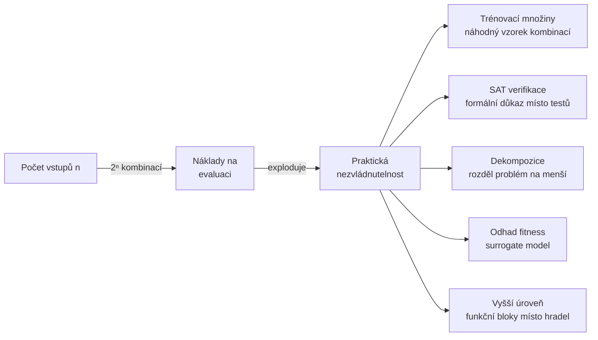

**Škálovatelnost různých reprezentací:**

- **Tranzistorová/hradlová úroveň:** Prostor roste s `n` hradly jako `(typy × vstupy)ⁿ` — exponenciálně
- **Funkční bloky:** Menší počet komponent, každá s omezenou sadou propojení — zvládnutelnější
- **Programová (GP):** Délka programu nekoresponduje lineárně s délkou fenotypu — lze generovat velké obvody z krátkých programů

---

## Hodnocení kandidátů a typy evaluace

> [!info] Extrinsic vs. intrinsic vs. mixtrinsic evaluace — definujte a uveďte výhody a nevýhody každého přístupu.

Způsob hodnocení kandidátů je **kritickým rozhodnutím** v EHW — ovlivňuje rychlost, realističnost a přenositelnost výsledků.

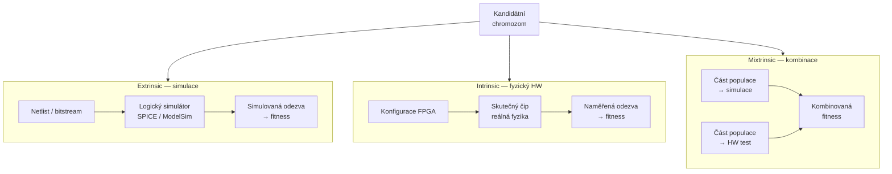

**Podrobné srovnání:**

| Vlastnost | Extrinsic | Intrinsic | Mixtrinsic |
|-----------|-----------|-----------|-----------|
| Rychlost evaluace | Střední (simulátor) | Vysoká (fyzický HW) | Závisí na poměru |
| Realističnost | Nízká (ideální modely) | Vysoká (reálná fyzika) | Střední až vysoká |
| Přenositelnost výsledků | Vysoká | Nízká (specifické pro čip) | Střední |
| Finanční náklady | Nízké (jen SW) | Vyšší (HW setup) | Střední |
| Zachycuje parazity, šum | Ne | Ano | Částečně |
| Vhodné pro | Počáteční návrh, ladění | Finální optimalizaci, adaptaci | Robustní návrh |

**Mixtrinsic v praxi:**
- Typický přístup: 80 % populace hodnoceno simulací (rychlé filtrování), 20 % nejlepších ověřeno na HW
- Nebo: simulace pro všechny, ale každých N generací "reality check" na fyzickém čipu
- Výrazně zvyšuje **robustnost** a snižuje riziko Thompsonova efektu (přetunování na konkrétní křemík)

---

> [!info] Popište proces evaluace chromozómu v EHW: transformace na konfigurační řetězec, konfigurace RZ, aplikace stimulů a měření odezvy pro výpočet fitness.

Evaluace je **nejkritičtější a nejdražší** část EHW smyčky. Přesný postup:

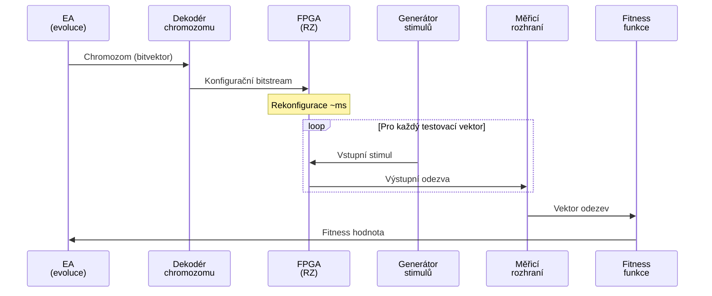

**Krok 1 — Chromozom → Konfigurační bitstream:**
- CGP chromozom: seznam trojic `(typ_hradla, vstup1, vstup2)` pro každou buňku mřížky
- Bitstream: binární soubor popisující nastavení všech LUT, propojů a I/O v FPGA
- Transformace musí respektovat formát konkrétního FPGA (Xilinx, Intel/Altera mají různé formáty)

**Krok 2 — Konfigurace RZ:**
- FPGA se nakonfiguruje nahráním bitstrea přes JTAG, SPI nebo partial reconfiguration port
- Typická doba: milisekundy pro celé FPGA, mikrosekundy pro parciální rekonfiguraci rámce

**Krok 3 — Aplikace stimulů:**
- Testovací vektory (vstupní kombinace) se aplikují na vstupy FPGA
- Pro `n` vstupů: buď všechny `2ⁿ` kombinace (úplné testování) nebo vybraná podmnožina (trénovací množina)
- Každý vektor → jeden cyklus: nastavit vstupy, počkat na stabilizaci, přečíst výstupy

**Krok 4 — Výpočet fitness:**
- Jednoduchá fitness: počet správně zodpovězených testovacích vektorů (Hammingova vzdálenost od referenčního výstupu)
- Sofistikovaná fitness: penalizace za počet hradel, zpoždění, spotřebu energie
- Příklad pro kombinační obvod: `fitness = (počet správných výstupů) / (celkový počet testů)`

---

## Formální verifikace ve fitness (SAT solver)

> [!info] Použití SAT solveru pro porovnání obvodů: jak se využije Tseitinova transformace pro formální ověření ekvivalence dvou obvodů?

Namísto testování vzorku vstupů lze použít **formální verifikaci** — matematicky dokázat, zda jsou dva obvody ekvivalentní pro **všechny možné vstupy**. To eliminuje problém neúplného testování.

**Miter obvod:**

Klíčovým nástrojem je tzv. **miter** — kombinační obvod, který na výstupu vydá `1`, pokud se výstupy dvou porovnávaných obvodů liší pro stejné vstupy:

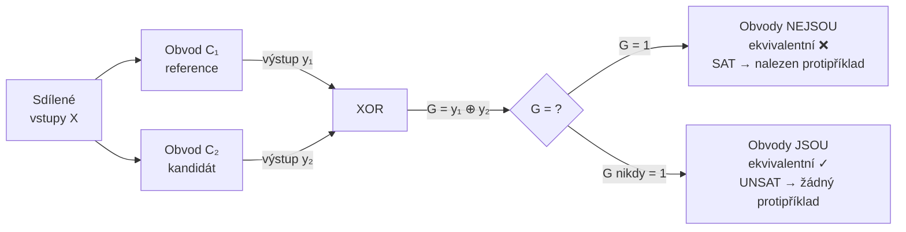

**Tseitinova transformace:**

Miter obvod G je booleovská funkce. SAT solver pracuje s formou **CNF (Conjunctive Normal Form)** — konjunkcí klauzulí. Tseitinova transformace převede libovolný booleovský obvod do CNF **lineárně** (bez exponenciálního nárůstu):

1. Každé hradlo `g` dostane svou pomocnou proměnnou `x_g`
2. Pro každé hradlo se zapíší CNF klauzule vyjadřující jeho funkci:
   - Pro `AND`: `x_g = x_a AND x_b` → klauzule `(¬x_a ∨ ¬x_b ∨ x_g) ∧ (x_a ∨ ¬x_g) ∧ (x_b ∨ ¬x_g)`
   - Pro `OR`, `XOR`, `NOT` analogicky
3. Přidá se klauzule `(x_out = 1)` — ptáme se, zda může výstup miteru být `1`
4. SAT solver hledá ohodnocení proměnných splňující **všechny** klauzule

**Příklad CNF pro jedno AND hradlo:**

```
Hradlo: g = a AND b

Tseitin klauzule:
(¬a ∨ ¬b ∨ g)    ← pokud a=1 a b=1, pak g musí být 1
(a ∨ ¬g)          ← pokud g=1, pak a musí být 1
(b ∨ ¬g)          ← pokud g=1, pak b musí být 1
```

---

> [!info] Pokud transformace vrátí `YES` (SAT), co to znamená v kontextu testu ekvivalence obvodů A a B?

**Interpretace výsledku SAT solveru v kontextu EHW:**

SAT solver dostane CNF popis miteru s podmínkou `G = 1` (výstup miteru je `1` = obvody se liší). Hledá ohodnocení vstupů, které tuto podmínku splní:

| Výsledek SAT solveru | Znamená | Důsledek pro EHW |
|---------------------|---------|-----------------|
| **SAT** (splnitelné) | Existuje vstupní kombinace, pro kterou C₁ ≠ C₂ | Kandidát je **nesprávný** — nedostane dobrou fitness |
| **UNSAT** (nesplnitelné) | Žádná taková kombinace neexistuje → C₁ ≡ C₂ | Kandidát je **funkčně ekvivalentní** referenci ✓ |

**Klíčová výhoda oproti testování vzorkem:**

Testování vzorkem (trénovací množina) může přehlédnout hraniční případ. SAT solver provede **vyčerpávající prohledání** implicitně — pro obvod se 100 vstupy (2¹⁰⁰ kombinací) SAT solver stále funguje v praxi, protože prohledává prostor strukturovaně, ne hrubou silou.

**Bonus — SAT solver jako "generátor protipříkladů":**

Pokud SAT vrátí SAT, zároveň vrátí konkrétní ohodnocení vstupů, pro které obvody dávají různý výstup. Toto ohodnocení lze **přidat do trénovací množiny** — evoluce dostane těžší příklad, kde selhala, a příště se mu vyhne. Tato technika se nazývá **counterexample-guided refinement**.

---

> [!info] Jak byste navrhli fitness funkci pro minimalizaci počtu hradel s využitím SAT verifikace?

Cíl: najít **nejmenší** funkčně správný obvod (minimalizace počtu hradel). Fitness musí:
1. Silně penalizovat nesprávné obvody
2. U správných obvodů preferovat menší

**Formální definice:**

$$F(C_i) = \begin{cases} |gates(C_i)| & \text{pokud } C_i \equiv C_{ref} \text{ (UNSAT)} \\ \text{WORST\_FITNESS} & \text{pokud } C_i \not\equiv C_{ref} \text{ (SAT)} \end{cases}$$

kde `WORST_FITNESS` je větší než jakýkoliv možný počet hradel v prostoru řešení.

**Rozšíření fitness pro vícekriteriální optimalizaci:**

```
F(Cᵢ) = w₁ · |gates(Cᵢ)|          // počet hradel (menší = lepší)
       + w₂ · depth(Cᵢ)            // hloubka obvodu = zpoždění
       + w₃ · power_estimate(Cᵢ)   // odhad spotřeby
       pokud Cᵢ ≡ C_ref, jinak WORST
```

**Praktická implementace pipeline:**

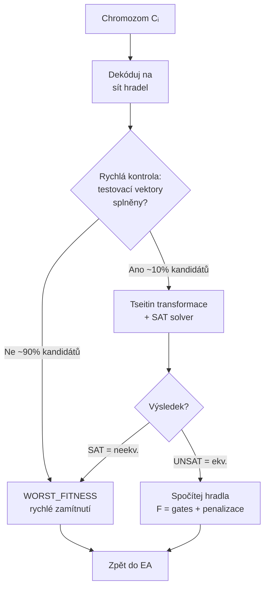

Dvoustupňová pipeline je důležitá z výkonnostních důvodů: **rychlá heuristická kontrola** nejprve eliminuje zjevně špatné kandidáty (bez drahého volání SAT solveru). SAT se volá jen pro slibné kandidáty.

---

## Evoluce na úrovni funkčních bloků — příklady a problémy

> [!info] Kozaova metoda pro evoluční návrh filtru (3×3): definujte pojmy embryo, kandidátní program, fenotyp, netlist a fitness funkce.

John Koza (tvůrce Genetic Programming) aplikoval GP na návrh analogových i digitálních obvodů. Základní koncepty:

**Embryo:**
Jednoduchý, minimální platný obvod — "zárodek", ze kterého development vychází. Pro jednoduchý filtr to může být samotný napájecí obvod se vstupními a výstupními terminály, bez jakékoliv logiky. Embryo garantuje, že i ten nejjednodušší fenotyp je syntakticky platný obvod.

**Kandidátní program (GP strom):**
Strom funkcí, jehož vyhodnocením vznikne obvod. Každý uzel stromu je instrukce modifikující aktuální stav obvodu:
- `C(e)` — nahraď aktuální hranu kondenzátorem, rekurzivně zpracuj podstrom `e`
- `R(e)` — nahraď hranu rezistorem
- `SERIES(e1, e2)` — rozděl hranu na dvě v sérii
- `PARALLEL(e1, e2)` — přidej paralelní větev
- `NOP` — zachovej hranu beze změny

**Fenotyp:**
Výsledný obvod po "spuštění" (vyhodnocení) kandidátního programu na embryu. Fenotyp je konkrétní topologie se součástkami a jejich hodnotami.

**Netlist:**
Textová reprezentace fenotypu ve formátu čitelném pro SPICE simulátor. Obsahuje seznam uzlů, součástek a jejich parametrů.


**Fitness funkce pro filtr:**
Porovnává frekvenční charakteristiku kandidáta s požadovanou referencí v sadě vzorkovacích bodů:

$$F = \sum_{i=1}^{N} W(f_i) \cdot |H_{cand}(f_i) - H_{ref}(f_i)|$$

Pro 3×3 filtr (2D prostorový filtr obrazu) se vyhodnocuje přenosová funkce v prostorové frekvenční doméně — fitness měří, jak dobře filtr odstraňuje šum nebo detekuje hrany oproti referenčnímu filtru.

---

> [!info] Porovnání extrinsic/intrinsic evaluace při návrhu obvodů: jaké problémy řeší mixtrinsic hodnocení při robustnosti vůči reálnému HW?

**Problém "simulačního optimismu":**

Obvod optimalizovaný čistě v simulaci (extrinsic) může v simulátoru dosahovat fitness = 100 %, ale na reálném HW selhat, protože simulátor:
- Ignoruje parazitní kapacity a odpory propojů
- Předpokládá ideální napájení (bez šumu)
- Neuvažuje teplotní závislosti parametrů tranzistorů
- Zanedbává crosstalk mezi sousedními signály

**Problém "HW přetunování" (Thompsonův efekt):**

Čistě intrinsic evoluce může najít řešení využívající unikátní fyzikální vlastnosti konkrétního čipu — přenositelnost je pak nulová.

**Jak mixtrinsic řeší oba problémy:**

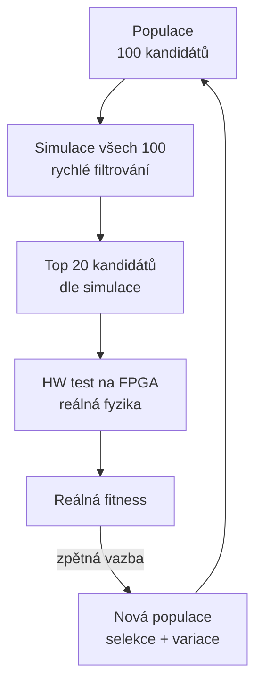

**Konkrétní strategie mixtrinsic:**

1. **Hierarchická evaluace:** Simulace eliminuje 90 % populace, HW test zbývajících 10 %
2. **Rotující HW test:** Každých N generací se provede HW validace celé populace
3. **Multi-chip evoluce:** Test na více různých FPGA čipech současně — kandidát musí fungovat na všech → robustnost vůči výrobní variabilitě
4. **Teplotní sweep:** HW test při různých teplotách (−10 °C, +25 °C, +70 °C)

---

## Škálovatelnost a praktické problémy

> [!info] Proč je evaluace náročná (exponenciální nárůst s počtem vstupů) a jaké metody snižují náklady?

Jak bylo ukázáno výše, počet testovacích vektorů roste jako `2ⁿ`. Metody pro snížení nákladů:

**1. Trénovací množiny (training sets):**
Místo všech `2ⁿ` kombinací použij náhodný vzorek `k << 2ⁿ` vektorů. Nevýhoda: může přehlédnout hraniční případy. Kombinovat s občasnou úplnou verifikací nejlepšího kandidáta.

**2. Odhad fitness (surrogate modely):**
Natrénovat ML model (regressor), který predikuje fitness bez spuštění plné evaluace. Surrogate model se periodicky aktualizuje skutečnými evaluacemi. Vhodné pro drahé simulace.

**3. Formální verifikace (SAT/BDD):**
Jak popsáno výše — matematicky dokáže správnost pro všechny vstupy najednou. Efektivní pro kombinační obvody se stovkami vstupů, kde testování je zcela nemožné.

**4. Dekompozice:**
Rozděl velký obvod na menší podsystémy, evoluj každý zvlášť a spoj. Přístup "divide and conquer". Příklad: 32bitová sčítačka = 4 × 8bitové sčítačky.

**5. Inkrementální evoluce:**
Začni s jednoduchým problémem (málo vstupů, malý prostor), postupně zvyšuj složitost. Populace z předchozí fáze slouží jako základ pro fázi složitější.

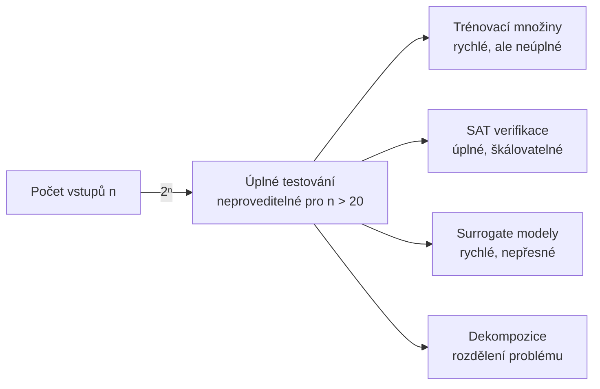

---

> [!info] Diskutujte problémy přenositelnosti vyevoluovaných řešení mezi různými platformami a navrhněte strategie na zlepšení přenositelnosti.

**Proč vyevolvovaná řešení nejsou přenositelná:**

Intrinsic evoluce optimalizuje na **konkrétní fyzikální instanci** — konkrétní čip, teplotu, napájení. Výsledek může záviset na:
- Výrobních variabilitách křemíku (threshold voltage Vt se liší ±50 mV i na stejném wafer)
- Teplotě (mění odpory, kapacity, prahová napětí)
- Napájení (parazitní šum na VCC lince)
- Konkrétním rozmístění propojů (různé FPGA "places and routes" různě)

**Strategie pro zlepšení přenositelnosti:**

| Strategie | Popis | Nevýhoda |
|-----------|-------|----------|
| Mixtrinsic evoluce | Test na více čipech, fitness = minimum přes všechny čipy | Pomalejší evaluace |
| Testování v podmínkách | Sweep teploty, napájení při evaluaci | Pomalejší evaluace |
| Extrinsic jako baseline | Primárně simulace, HW jen pro finální validaci | Simulační optimismus |
| Omezení prostoru řešení | Zakázat konfigurační bity citlivé na variabilitu | Menší prostor, horší řešení |
| Formální verifikace | Ověřit logickou správnost (nezávisí na fyzice) | Nepomůže s analogovými efekty |
| Robustnostní fitness | `F = Σ fitness přes N čipů` místo fitness na jednom čipu | Nutný přístup k více čipům |

---

## Rekonfigurovatelné platformy a FPGA

> [!info] Zhrňte typy RZ (LUT, PLA, FPGA) a vysvětlete, které typy pamětí se běžně používají v FPGA (např. SRAM konfigurační paměť).

**Přehled rekonfigurovatelných zařízení:**

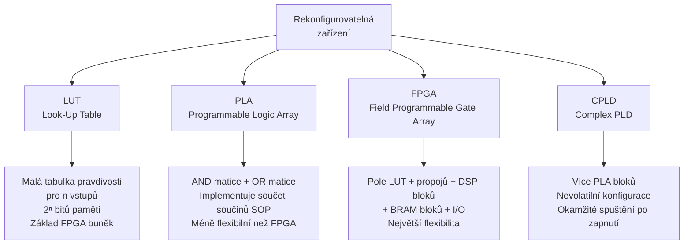

**Typy konfigurační paměti v FPGA:**

| Typ paměti | Volatilita | Rychlost rekonfigurace | Typické FPGA | Poznámka |
|-----------|-----------|----------------------|-------------|----------|
| **SRAM** | Volatilní (ztratí po vypnutí) | Velmi rychlá (ms) | Xilinx, Intel/Altera | Nejrozšířenější, nutný konfigurační PROM |
| **Flash** | Nevolatilní | Střední | Microsemi (Actel) | Okamžité spuštění, omezený počet zápisů |
| **Antifuse** | Nevolatilní, jednorázová | Nelze rekonfigurovat | Microsemi AXCELERATOR | Maximální odolnost, nelze kopírovat |
| **EEPROM** | Nevolatilní | Pomalá | CPLD (Lattice, Altera) | Méně buněk, jednoduché struktury |

**Proč SRAM dominuje v EHW:**

SRAM je **volatilní ale rychlá** — ideální pro EHW, kde se konfigurace mění při každé evaluaci. Konfigurace se nahraje za milisekundy (nebo mikrosekundy pro parciální rekonfiguraci), čip okamžitě funguje, po skončení evaluace se přepíše novou konfigurací.

---

> [!info] Co znamená pojem „rámec" v FPGA kontextu a proč je relevantní při evolučním návrhu a dynamické rekonfiguraci?

**Konfigurační rámec (configuration frame):**

SRAM konfigurace FPGA není monolitická — je rozdělena do **rámců (frames)**, což jsou nejmenší adresovatelné bloky konfigurační paměti. Každý rámec typicky obsahuje bity pro jeden "sloupec" konfigurovatelných bloků.

**Typické parametry (Xilinx 7-series):**
- Délka rámce: 101 32-bitových slov = 3 232 bitů
- Jeden rámec odpovídá vertikálnímu sloupci logických buněk v jednom clock regionu
- Celé FPGA: tisíce až desítky tisíc rámců

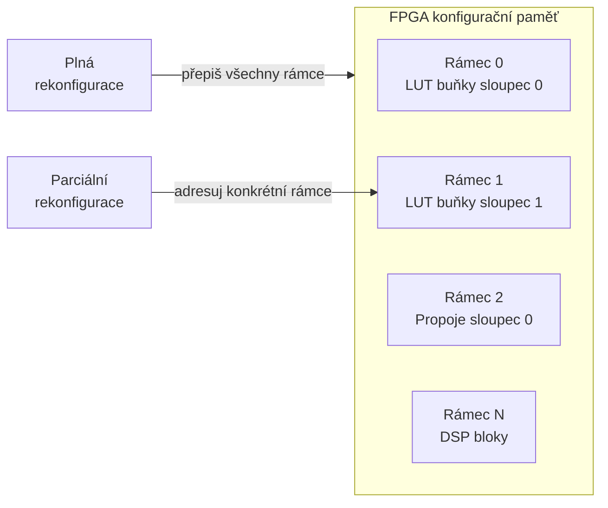

**Relevance pro evoluční návrh:**

1. **Parciální rekonfigurace:** Místo přepsání celého bitstrea lze přepsat jen relevantní rámce — dramaticky zkrátí dobu rekonfigurace. Pro evoluci, kde se mění jen část obvodu (mutace), je to klíčová optimalizace.

2. **Mapování chromozomu na rámce:** Při návrhu EHW systému je nutné vědět, které bity rámce odpovídají kterým logickým buňkám. Chromozom lze pak přímo mapovat na konkrétní rámce.

3. **Ochrana kritických rámců:** Při parciální rekonfiguraci za provozu (runtime evolution) nesmí evoluce přepsat rámce obsahující konfigurační kontrolér nebo jiné kritické části systému. Evoluční algoritmus musí respektovat tato omezení.

4. **Stabilita experimentů:** Přepsání celého FPGA každou evaluaci způsobuje zbytečné opotřebení a prodlužuje čas. Parciální rekonfigurace po rámcích je efektivnější a umožňuje rychlejší smyčku evoluce.

**Praktický příklad:** Pokud chromozom kóduje konfiguraci 10×10 oblasti CLB buněk, stačí přepsat ~20 rámců z tisíců — rekonfigurace trvá mikrosekundy místo milisekund.

---

*Rozšířené studijní materiály pro přednášku 05 — Evoluční návrh číslicových obvodů*