# 06 Výpočetní development

---

## Biologický development a motivace

> [!info] Definujte rozdíl mezi fylogenezí a ontogenezí. Uveďte příklad metody vhodné pro fylogenezi (např. EA) a příklad metody vhodné pro ontogenezi (např. CA).

**Fylogeneze** (z řec. *phylon* = rod, *genesis* = vznik) popisuje evoluční historii a vývoj druhů v čase — jak organismy vznikaly, větvily se a přizpůsobovaly přes miliony generací. Jde o proces selekce, mutace a driftu na úrovni **populací**.

**Ontogeneze** (z řec. *ontos* = bytí) popisuje vývoj **jednoho individua** od oplodněného vajíčka (zygoty) až po dospělý organismus. Zahrnuje buněčné dělení, diferenciaci, morfogenezi a smrt buněk — vše řízeno genetickým programem a signály z prostředí.

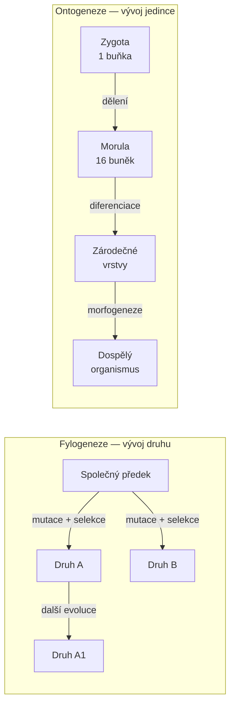

**Metody a jejich přiřazení:**

| Proces | Vhodná metoda | Důvod |
|--------|---------------|-------|
| Fylogeneze | Evoluční algoritmy (EA), genetické algoritmy | Modelují selekci, variaci a fitness přes generace populace |
| Ontogeneze | Celulární automaty (CA), L-systémy, GRN | Modelují lokální pravidla růstu, dělení a diferenciace |

Klíčový rozdíl v modelování: fylogeneze pracuje s **populací řešení** a hledá nejlepší přes generace. Ontogeneze pracuje s **jedním genotypem**, který se rozvinuje do fenotypu prostřednictvím výpočetního procesu inspirovaného biologickým vývojem.

---

> [!info] Kde v biologickém systému probíhá výpočet podle principů syntetické biologie? (uveďte fyzické místo a typ signálu).

Biologický „výpočet" neprobíhá v jednom místě — je **distribuovaný** přes celou buňku i tkáně. Syntetická biologie studuje, jak buňka implementuje logické operace (AND, OR, NOT) pomocí molekulárních komponent.

**Fyzická místa výpočtu:**

- **Jádro buňky (nucleus):** DNA jako paměťové medium, transkripce jako „čtení" programu
- **Cytoplazma:** Ribozomy provádějí translaci (syntézu proteinů), signální kaskády přenášejí informaci
- **Buněčná membrána:** Receptory přijímají vnější signály (morfogeny, hormony, kontakt s sousední buňkou)
- **Mitochondrie:** Energetický metabolismus ovlivňuje dostupnost zdrojů pro výpočet

**Typ signálů:**

Signály jsou primárně **chemické koncentrace** molekul:
- Transkripční faktory (proteiny aktivující/inhibující geny)
- Morfogeny — difundující molekuly vytvářející gradient přes tkáň (např. Bicoid v Drosophile)
- Hormony a cytokiny pro mezibuněčnou komunikaci
- Druhí poslové (cAMP, Ca²⁺) uvnitř buňky

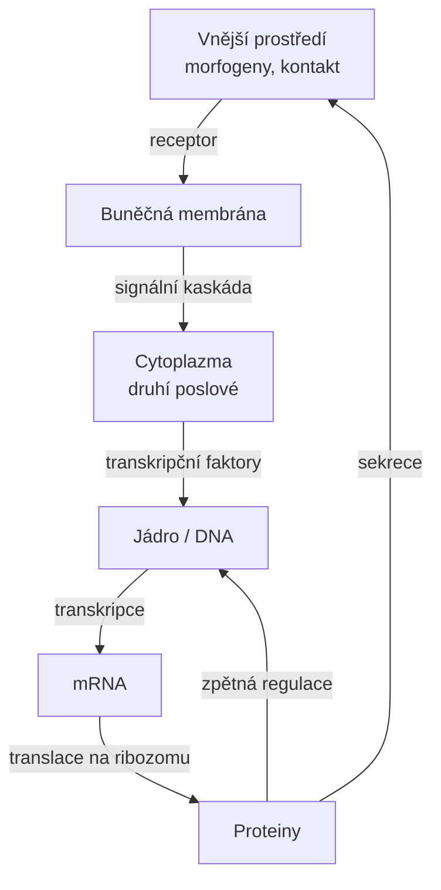

---

## Buněčné základy developmentu

> [!info] Popište základní kroky transkripce a translace — jak DNA kóduje proteiny a jaká je role proteinů při diferenciaci buněk.

**Centrální dogma molekulární biologie:** DNA → RNA → Protein

**Transkripce** probíhá v jádře:
1. RNA polymeráza se naváže na promotor genu
2. Přepisuje kódující vlákno DNA do pre-mRNA
3. Pre-mRNA prochází sestřihem (splicing) — odstraní se introny, exony zůstanou
4. Vzniká zralá mRNA, která opustí jádro

**Translace** probíhá v cytoplazmě na ribozomech:
1. Ribozom čte kodony mRNA (trojice nukleotidů)
2. tRNA přináší příslušné aminokyseliny
3. Aminokyseliny se spojují peptidovými vazbami
4. Vzniká polypeptidový řetězec → protein

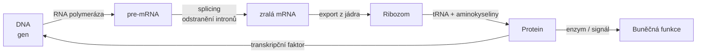

**Role proteinů v diferenciaci:**

Proteiny nejsou jen strukturální složky buňky — fungují jako **přepínače genové exprese**:
- **Transkripční faktory** se váží na promotory a buď aktivují, nebo reprimují transkripci dalších genů
- **Kaskády signalizace** přenášejí vnější signál (morfogen) na změnu genové exprese uvnitř
- **Homeodomain proteiny** (Hox geny) určují osovou identitu buněk — kde je hlava, kde je zadek

Klíčový princip: **všechny buňky těla mají stejné DNA**, ale diferenciace nastane proto, že různé sady genů jsou aktivní v různých buňkách — řízeno proteiny a epigenetickými modifikacemi.

---

> [!info] Vysvětlete, jak mitóza a diferenciace vedou k tvorbě specializovaných buněčných typů během ontogeneze.

**Mitóza** je buněčné dělení, při němž vznikají **dvě geneticky identické dceřiné buňky** (na rozdíl od meiózy, která tvoří gamety). Z jedné zygoty se tak může vydělit bilióny identických kopií genomu.

**Diferenciace** je proces, při němž buňky získávají specializovanou identitu a funkci. I přesto, že mají stejné DNA, exprimují různé geny — výsledkem jsou neurony, svalové buňky, erytrocyty atd.

**Co řídí diferenciaci?**
- **Poloha v zárodku** — buňka "ví", kde je, díky gradientům morfogenů
- **Čas** — geny se zapínají a vypínají v přesném časovém pořadí
- **Kontakt se sousedy** — juxtakrinní signalizace (přímý kontakt membrán)
- **Asymetrické dělení** — dceřiné buňky mohou dostat různé množství regulačních faktorů

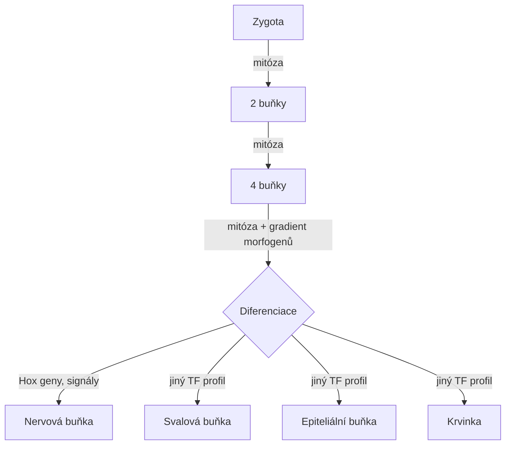

Mitóza tedy zajistí **množení buněk**, zatímco diferenciace zajistí jejich **specializaci**. Oba procesy jsou nutné — bez mitózy by tělo nemělo dostatek buněk, bez diferenciace by všechny buňky byly totipotentní kmenové buňky bez funkce.

---

## Výpočetní development — modely a reprezentace

> [!info] Co je výpočetní development (Kumar, 2004)? Popište rozdíl mezi přímým kódováním genotyp→fenotyp a nepřímým (developmentálním) kódováním a uveďte výhody/nevýhody.

**Výpočetní development** (Kumar & Bentley, 2004) je paradigma, kde fenotyp nevzniká přímým dekódováním genotypu, ale **simulovaným vývojovým procesem** inspirovaným biologickou ontogenezí. Genotyp obsahuje "vývojový program" — pravidla, která opakovaně aplikována produkují fenotyp.

**Přímé kódování (direct encoding):**
- Každý gen mapuje přímo na jeden prvek fenotypu (neuron, spoj, component)
- Příklady: CGP (Cartesian GP), přímé váhové matice v NN
- Délka genotypu je **lineárně úměrná** složitosti fenotypu

**Nepřímé/developmentální kódování (indirect encoding):**
- Genotyp obsahuje pravidla nebo program, fenotyp vzniká jejich "spuštěním"
- Příklady: L-systémy, CA pravidla, GRN, HyperNEAT
- Krátký genotyp může generovat **exponenciálně velký** fenotyp

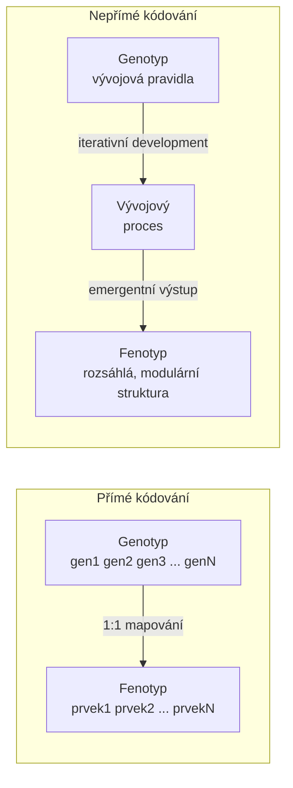

**Srovnání:**

| Vlastnost | Přímé kódování | Nepřímé kódování |
|-----------|----------------|-----------------|
| Délka genotypu | Roste s fenotypem | Může být konstantní |
| Škálovatelnost | Špatná | Dobrá |
| Modularita | Žádná automatická | Přirozená (opakování pravidel) |
| Regularita | Nutno explicitně vynutit | Emergentní |
| Evolvabilita | Nízká pro složité struktury | Vysoká |
| Interpretovatelnost | Snadná | Složitá |
| Výpočetní náročnost evaluace | Nízká | Vyšší (nutno simulovat vývoj) |

**Klíčová výhoda nepřímého kódování:** Jedno pravidlo aplikované opakovaně generuje **regulární, symetrické a modulární** struktury — podobně jako jediný gen pro tvorbu prstů generuje 5 prstů, ne 5 různých genů.

---

> [!info] L‑systémy: v čem spočívá hlavní odlišnost L‑systémů oproti klasické gramatice (paralelní provádění pravidel)? Uveďte příklad jednoduchého L‑systému (abeceda, axiom, pravidla).

**L-systémy** (Lindenmayerovy systémy, 1968) jsou formální gramatiky původně navržené k modelování růstu rostlin. Jejich klíčová odlišnost od klasických (Chomského) gramatik:

**Klasická gramatika:** V každém kroku se přepíše **jedno** neterminální písmeno (levá derivace nebo jiná strategie, ale vždy sekvenční).

**L-systém:** V každém kroku se **paralelně** přepíší **všechna** písmena řetězce současně. Tato paralelnost modeluje biologický fakt, že buňky v organismu se dělí a diferencují **současně**, ne sekvenčně.

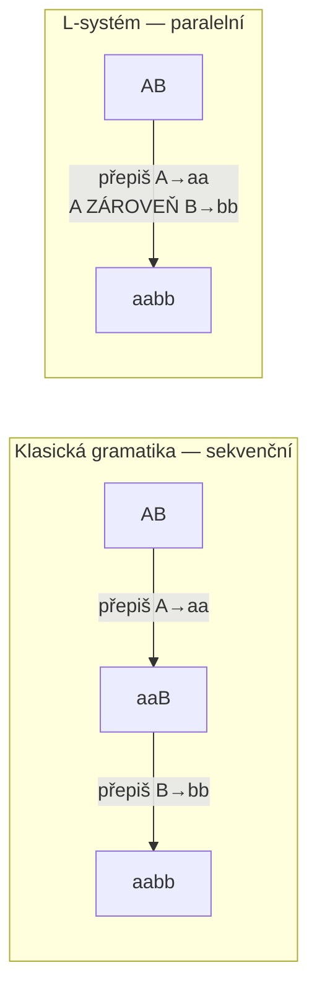

**Formální definice L-systému:**
- **Abeceda (Σ):** Množina symbolů, např. `{A, B}`
- **Axiom (ω):** Počáteční řetězec, výchozí stav, např. `A`
- **Pravidla přepisu (P):** Funkce přiřazující každému symbolu nástupce

**Příklad — Fibonacci L-systém:**
```
Abeceda: {A, B}
Axiom:   A
Pravidla: A → AB
          B → A
```

| Generace | Řetězec | Délka |
|----------|---------|-------|
| 0 | `A` | 1 |
| 1 | `AB` | 2 |
| 2 | `ABA` | 3 |
| 3 | `ABAAB` | 5 |
| 4 | `ABAABABA` | 8 |

Délky jsou Fibonacciho čísla — L-systém přirozeně generuje tuto sekvenci. Délka roste exponenciálně s počtem generací při krátkém, neměnném genotypu (pravidlech) — to je síla developmentálního kódování.

---

> [!info] Navrhněte úlohu: odvodit gramatiku z ukázky derivačních kroků a nakreslit výsledný tvar podle pravidel.

**Postup odvození gramatiky z derivačních kroků:**

Předpokládejme, že máme tuto sekvenci derivačních kroků:
```
Krok 0: F
Krok 1: F+F−F−F+F
Krok 2: F+F−F−F+F+F+F−F−F+F−F+F−F−F+F−F+F−F−F+F+F+F−F−F+F
```

**Odvození:**
1. Axiom = první řetězec = `F`
2. Hledám, čím se nahradilo `F` v kroku 1 → `F+F−F−F+F`
3. Symboly `+` a `−` jsou terminály (nezměnily se)
4. Pravidlo: `F → F+F−F−F+F`

**Turtle interpretace symbolů:**

| Symbol | Akce turtle grafiky |
|--------|-------------------|
| `F` | Krok vpřed + nakresli úsečku |
| `+` | Otoč doleva o δ (např. 90°) |
| `−` | Otoč doprava o δ |
| `[` | Ulož pozici a úhel na zásobník |
| `]` | Obnov pozici a úhel ze zásobníku |

Pro `δ = 90°` a pravidlo `F → F+F−F−F+F` vznikne **Kochova vločka** — fraktální křivka. Každá generace čtyřnásobí počet segmentů, ale délka každého segmentu se zkrátí na třetinu.

**Další příklad — keř se větvením:**
```
Abeceda: {F, +, −, [, ]}
Axiom:   F
Pravidla: F → F[+F]F[−F]F
δ = 25.7°
```

Závorky `[` a `]` umožňují větvení — turtle si pamatuje pozici a vrátí se k ní. Výsledek připomíná větvení rostliny.

---

## Celulární automaty (CA) jako nástroj pro development

> [!info] Definujte CA: co je buňka, co je lokální přechodová funkce a jaký je rozdíl mezi 1D a 2D CA?

**Celulární automat (CA)** je diskrétní výpočetní model složený ze čtyř prvků:

1. **Mřížka buněk** — pravidelné uspořádání v prostoru (1D řada, 2D mřížka, 3D mřížka)
2. **Konečná sada stavů** — každá buňka je v jednom z `k` stavů (např. 0/1 pro binární CA)
3. **Sousedství** — definice, které buňky jsou "sousedy" dané buňky
4. **Lokální přechodová funkce** — pravidlo `f: stavy sousedů → nový stav buňky`

**Lokální přechodová funkce** je klíčová: nový stav buňky závisí **pouze na aktuálních stavech buňky a jejích sousedů**, ne na vzdálených buňkách. Tím se liší CA od globálních pravidel — veškerá "inteligence" systému emerge z lokálních interakcí.

**1D vs. 2D CA:**

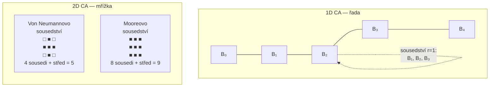

| Vlastnost | 1D CA | 2D CA |
|-----------|-------|-------|
| Topologie | Řada buněk | Mřížka buněk |
| Typické sousedství | r=1: 3 buňky, r=2: 5 buněk | Von Neumann (5), Moore (9) |
| Vizualizace vývoje | Čas jde dolů, 1D prostor doprava | Animace 2D mřížky |
| Příklady | Wolfram Elementary CA | Game of Life, Langtonova smyčka |
| Přechodová tabulka | 2³=8 řádků (pro k=2, r=1) | 2⁵=32 řádků (Von Neumann, k=2) |

**Aktualizace je synchronní** — všechny buňky se aktualizují **najednou** v každém časovém kroku, používajíce stavy z předchozího kroku. To modeluje paralelnost biologického vývoje.

---

> [!info] Langtonova smyčka a podobné replikátory: proč se studují takové smyčky? Je zadaný CA 1D, 2D nebo 3D? Kolik stavů může buňka v 1D CA nabývat?

**Langtonova smyčka** (1984) je struktura v 2D CA, která se dokáže **sama replikovat** — kopírovat svou konfiguraci do okolí. Je to jeden z prvních uměle zkonstruovaných samo-replikátorů.

**Proč se studují samo-replikující struktury:**
- Pochopení **minimálních podmínek** nutných pro život a replikaci
- Spojení s von Neumannovou teorií samo-replikujících automatů (1940s)
- Základ pro studium **emergence** — jak lokální pravidla generují globálně složité chování
- Inspirace pro evolvable hardware, buněčné EA a fault-tolerantní systémy
- Model pro studium přenosu informace v biologickém kontextu

**Jak poznat dimenzi CA:**

- **Topologie sousedství:** pokud je sousedství definováno v řadě (vlevo/vpravo) → 1D; pokud v mřížce (nahoře/dole/vlevo/vpravo + diagonály) → 2D; pokud v prostoru → 3D
- **Visualizace vývoje:** 1D CA se vizualizuje jako 2D obrázek (prostor × čas); 2D CA jako animovaná mřížka
- Langtonova smyčka je **2D CA** — buňky jsou uspořádané v mřížce, smyčka je tvořena strukturou v této mřížce

**Langtonova smyčka — klíčové parametry:**
- 2D CA s **8 stavy** (0–7) a Von Neumannovým sousedstvím (5 buněk)
- Přechodová tabulka má 8⁵ = 32 768 možných vstupů (ale jen malá část pravidel je definovaná)
- Smyčka tvoří uzavřený kruh s "signálním ramenem" přenášejícím genetickou informaci

**Počet stavů v 1D CA:**

Pro 2-stavový 1D CA (k=2):
- Každá buňka nabývá stavů `{0, 1}`
- To jsou binární CA — nejjednodušší a nejvíce studované (Wolfram Elementary CA)
- Wolfram katalogizoval všech 2^(2³) = 256 různých pravidel pro r=1 1D binární CA

---

> [!info] Sousedství v CA: vysvětlete, co znamená 5‑sousedství a vyjasněte rozdíl mezi popisem sousedů i−2..i+2 vs. širším indexováním (správná interpretace).

**5-sousedství v 1D CA** znamená, že přechodová funkce buňky `i` závisí na stavech buněk `i-2, i-1, i, i+1, i+2` — tedy na **dvou sousedech po každé straně plus samotné buňce**. Říkáme, že rádius sousedství je `r = 2`.

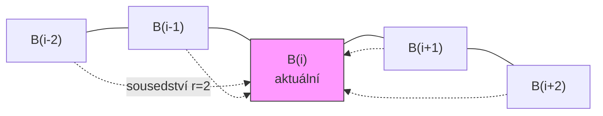

**Klíčový bod — indexy vs. šířka:**

`i-2..i+2` **není "širší" indexování** — je to přesné a standardní vyjádření 5-sousedství s rádiusem `r=2`. Jde prostě o označení, které buňky tvoří vstup přechodové funkce.

**Porovnání rádiusů pro 1D CA:**

| Rádius r | Sousedství | Počet buněk ve vstupu | Řádků v tabulce (k=2) |
|----------|-----------|----------------------|----------------------|
| 0 | jen `i` | 1 | 2¹ = 2 |
| 1 | `i-1, i, i+1` | 3 | 2³ = 8 |
| 2 | `i-2, i-1, i, i+1, i+2` | 5 | 2⁵ = 32 |
| 3 | `i-3..i+3` | 7 | 2⁷ = 128 |

Wolfram Elementary CA používá `r=1` → 8 vstupních kombinací → 2⁸ = 256 různých pravidel. Pro `r=2` by bylo 2³² ≈ 4 miliardy různých pravidel — prostor dramaticky roste.

---

> [!info] Lokální přechodová funkce: kolik řádků bude mít tabulka přechodů v nejhorším případě pro CA s k stavy a n‑členným sousedstvím? (vypočítejte vzorec).

**Odvození vzorce:**

Přechodová funkce `f` zobrazuje `n`-tici stavů sousedství na nový stav buňky:
```
f: {0, 1, ..., k-1}ⁿ → {0, 1, ..., k-1}
```

Každý ze `n` vstupních slotů může nabývat `k` různých hodnot. Počet unikátních vstupních kombinací (= počet řádků tabulky) je:

$$\text{Počet řádků} = k^n$$

**Příklady:**

| k (stavů) | n (sousedů) | Řádků = kⁿ |
|-----------|-------------|------------|
| 2 | 3 | 2³ = 8 |
| 2 | 5 | 2⁵ = 32 |
| 3 | 3 | 3³ = 27 |
| 8 | 5 | 8⁵ = 32 768 |
| k | n | kⁿ |

**Počet různých CA pravidel** (různých přechodových funkcí) je pak `k^(kⁿ)` — počet způsobů, jak přiřadit výstupní stav každému řádku tabulky. Pro Elementary CA (k=2, n=3): 2^8 = 256 různých pravidel.

**Praktický dopad:** Prohledávání prostoru CA pravidel je pro větší `k` a `n` zcela nezvládnutelné hrubou silou → nutno použít EA nebo jiné heuristiky.

---

> [!info] Příklad: buňka je ve stavu `0`, všichni její sousedé jsou `0`. Pokud je F = XOR, jaký bude nový stav? (vysvětlete).

**XOR (exclusive OR)** je binární operace vracející `1`, pokud je lichý počet vstupů rovnen `1`, jinak `0`.

**Výpočet:**

Předpokládejme sousedství r=1, tedy 3 buňky: `(i-1, i, i+1) = (0, 0, 0)`.

```
F = XOR(0, 0, 0)
  = 0 XOR 0 XOR 0
  = 0 XOR 0
  = 0
```

**Nový stav buňky = 0** — buňka zůstane ve stavu `0`.

**Pravdivostní tabulka XOR pro 3 vstupy:**

| i-1 | i | i+1 | XOR výstup |
|-----|---|-----|-----------|
| 0 | 0 | 0 | **0** ← náš případ |
| 0 | 0 | 1 | 1 |
| 0 | 1 | 0 | 1 |
| 0 | 1 | 1 | 0 |
| 1 | 0 | 0 | 1 |
| 1 | 0 | 1 | 0 |
| 1 | 1 | 0 | 0 |
| 1 | 1 | 1 | 1 |

**Zajímavá vlastnost XOR CA:** Vyvíjí se jako **Sierpińského trojúhelník** — fraktální vzor. Jedna aktivní buňka (stav `1`) uprostřed nulového pole generuje tento fraktální vzor. XOR CA patří do Wolframovy třídy II/III a ukazuje, jak z jednoduché lokální funkce vznikají složité globální struktury.

---

## Genetické regulační sítě (GRN) a další modely

> [!info] Co jsou genetické regulační sítě (GRN)? Jak modelují interakce mezi geny a proteiny při diferenciaci?

**Genetické regulační sítě (GRN)** jsou formální modely zachycující, jak geny vzájemně ovlivňují svou expresi prostřednictvím proteinů — zejména **transkripčních faktorů**. GRN jsou orientované sítě (grafy), kde:

- **Uzly** reprezentují geny (nebo jejich expresní produkty — proteiny)
- **Hrany** representují regulační interakce:
  - **Aktivace** (→) — protein A zvyšuje expresi genu B
  - **Represe** (⊣) — protein A snižuje/blokuje expresi genu B

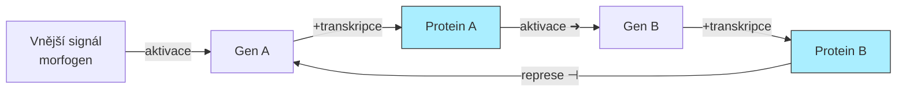

**Jak GRN řídí diferenciaci:**

GRN implementují logické obvody na molekulární úrovni:
- **AND logika:** Gen se exprimuje pouze pokud jsou přítomny dva různé transkripční faktory
- **OR logika:** Gen se exprimuje při přítomnosti alespoň jednoho ze dvou faktorů
- **Zpětná vazba:** Pozitivní zpětná vazba vytváří bistabilní přepínače (buňka se "zaváže" k jednomu ze dvou stavů)

**Příklad — diferenciace na dva typy buněk:**

V embryu jsou geny A a B vzájemně se reprimující. Gradient morfogenu zvýhodní expresi A v jedné části embrya a B ve druhé. Díky pozitivní zpětné vazbě (A aktivuje A, B aktivuje B) a vzájemné represi se systém ustálí ve dvou stabilních stavech — dvou buněčných typech.

**Modelování GRN v počítači:**

- **Booleovské GRN:** Každý gen je ON/OFF, aktualizace synchronní nebo asynchronní
- **Diferenciální rovnice (ODE):** Spojitá koncentrace proteinu, realistické dynamiky
- **Stochastické modely:** Zachycují náhodnost nízko-počtových molekul v buňce

---

> [!info] Diskutujte, kdy je vhodné použít nepřímé (developmentální) kódování pro evoluční návrh (výhody: modularita, evolvabilita, škálovatelnost).

**Nepřímé kódování je vhodné, když:**

1. **Fenotyp je rozsáhlý a regulární** — neuronová síť s tisíci neurony, anténa se symetrickými prvky, modulární robotický systém
2. **Předpokládáme modularitu** — podstruktury fenotypu se opakují nebo jsou podobné (např. prsty na ruce)
3. **Chceme evolvabilitu** — malá změna genotypu by měla produkovat smysluplnou malou změnu fenotypu, ne náhodný chaos
4. **Škálovatelnost je důležitá** — chceme mít možnost evolve network se 100 neurony i síť s 10 000 neurony se stejnou délkou genotypu

**Proč nepřímé kódování zvyšuje evolvabilitu:**

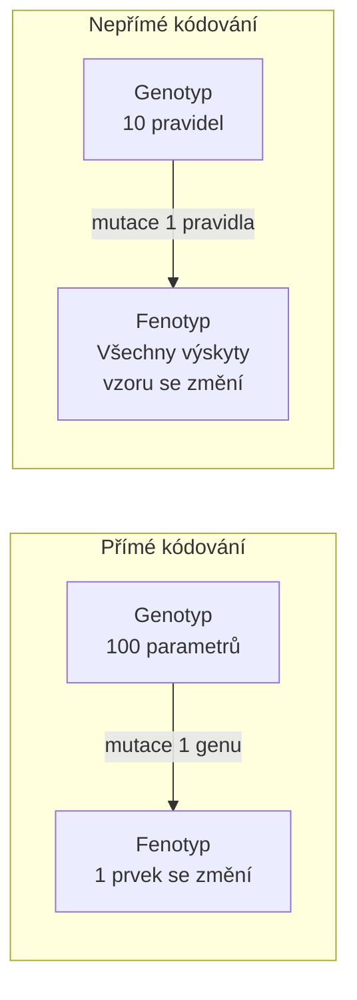

Mutace pravidla v L-systému změní **všechny větve**, které z toho pravidla vychází — koordinovaná změna celé struktury. To odpovídá biologickým makromutacím (Hox geny) a umožňuje rychlejší evoluci.

**Nevýhody — kdy nepoužívat:**
- Fenotyp je malý a nepravidelný (přímé kódování je jednoduší a rychlejší)
- Výpočetní náklady na simulaci vývoje jsou příliš vysoké
- Potřebujeme přesnou kontrolu nad každým prvkem fenotypu (designerský přístup)

---

## Aplikace a praktické poznatky

> [!info] Kdy použít CA nebo L‑systémy při navrhování generativních tvarů (antény, architektura)? Uveďte silné a slabé stránky každého přístupu.

**CA pro generativní design:**

CA jsou vhodné, když tvar vzniká z **lokálních interakcí** bez centrálního řízení — emergentní vzory, textury, distribuované struktury. Příklady:
- Generování terénů a textur (Game of Life-like pro vegetaci)
- Fault-tolerantní systémy (každá buňka/modul je samostatná)
- Distribuované antény — každý prvek reaguje na lokální elektromagnetické pole

**L-systémy pro generativní design:**

L-systémy jsou vhodné pro **hierarchické, větví se tvary** s jasnou strukturou. Příklady:
- Antény ve tvaru fraktálu (Kochova anténa — wideband díky fraktální délce)
- Architektonické struktury (sloupy, opakující se fasády)
- Procedurální vegetace ve hrách a vizualizacích

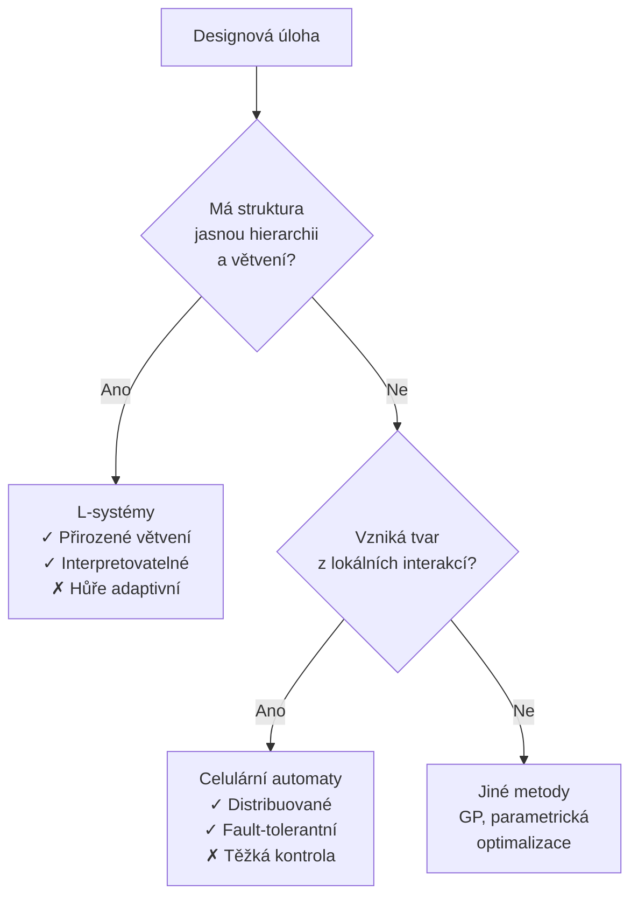

**Srovnávací tabulka:**

| Kritérium | CA | L-systémy |
|-----------|----|-----------| 
| Typ tvaru | Distribuovaný, emergentní | Hierarchický, větvící se |
| Kontrolovatelnost | Nízká (nepřímá) | Střední (pravidla jsou čitelná) |
| Škálovatelnost | Velmi dobrá | Dobrá |
| Vhodné pro | Textury, sítě, fault-tolerance | Antény, stromy, konstrukce |
| Citlivost na změnu pravidla | Velká (chaos) | Předvídatelnější |
| Evoluovatelnost | Střední | Dobrá |

---

> [!info] Popište postup evolučního návrhu pomocí developmentu: jak byste navrhli pipeline (genotyp → development → fenotyp → evaluace → selekce)?

Evoluční návrh s developmentálním kódováním kombinuje sílu EA (globální prohledávání) s výhodami nepřímého kódování (modularita, škálovatelnost). Pipeline:

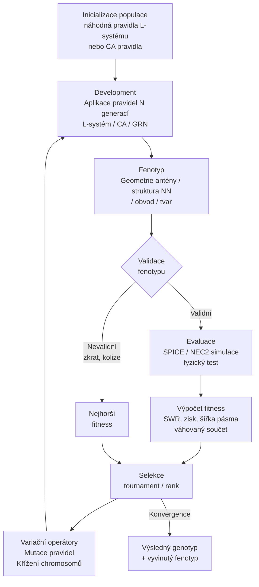

**Detaily jednotlivých kroků:**

**1. Genotyp** — chromozom kóduje:
- Pro L-systém: axiom + sada pravidel přepisu (+ parametry jako `δ` pro turtle)
- Pro CA: přechodová tabulka (vektor bitů nebo pravdivostní tabulka)
- Pro GRN: matice regulačních interakcí + počáteční podmínky

**2. Development** — spuštění vývojového procesu:
- Aplikace N iterací (generací L-systému nebo kroků CA)
- N je hyperparametr — více iterací = složitější fenotyp, ale pomalejší evaluace
- Nutno ošetřit divergenci (explozivní růst) nebo konvergenci (trivální výsledek)

**3. Validace fenotypu** — před drahou simulací rychlá kontrola:
- Má fenotyp smysluplnou geometrii? (pro antény: je spojitý, nezasahuje sám do sebe?)
- Pro obvody: jsou přítomny uzly VCC a GND? Nejsou zkraty?

**4. Evaluace** — nejdražší krok, paralelizovat kde možno:
- Simulace (SPICE, NEC2, FEM) nebo fyzický test (FPTA)
- Vrací vektor metrik → vážená fitness

**5. Selekce a variace** — standardní EA operátory:
- Mutace pravidla: změna jednoho symbolu v pravidle L-systému
- Křížení: výměna pravidel mezi dvěma rodiči
- Pozor: křížení CA tabulek je ošemetné (pravidla jsou na sobě závislá)

**Praktické tipy:**
- Použít **elitismus** — nejlepší jedinci přežívají beze změny (zabraňuje ztrátě dobrých řešení)
- Omezit délku L-systémového řetězce (explozivní růst zabije evaluaci)
- Pro CA: inicializovat populaci blízko zajímavých pravidel (Wolfram Klasse III/IV)
- Logovat genotyp i fenotyp nejlepšího jedince v každé generaci

---

*Rozšířené studijní materiály pro přednášku 06 — Výpočetní development*