# 07 Evoluční návrh a adaptace analogových obvodů a antén

## 1. Reprezentace a konstrukce obvodů

---

### Přímé vs. nepřímé kódování obvodů

**Přímá (direct) reprezentace** mapuje každý gen přímo na konkrétní komponentu nebo její parametr. Genotyp tak obsahuje seznam součástek a jejich hodnoty — například `[R1=1kΩ, C1=100nF, topologie=sériová]`. Celá topologie i parametry jsou „viděny" přímo v chromosomu.

**Výhody přímé reprezentace:**
- Snadná dekódovatelnost (genotyp → fenotyp je triviální)
- Intuitivní interpretace výsledků
- Vhodná pro ladění konkrétní, předem dané topologie

**Nevýhody přímé reprezentace:**
- Prostor prohledávání roste exponenciálně s počtem komponent
- Každá topologická změna vyžaduje jinou délku/strukturu chromosomu
- Slabá škálovatelnost — při přidání nového uzlu je potřeba přeprojektovat reprezentaci
- Obtížné sdílení stavebních bloků (building blocks) mezi kandidáty

**Nepřímá (indirect) reprezentace** genotyp neobsahuje přímo obvod, ale **program nebo pravidla**, jejichž interpretací/spuštěním obvod teprve vznikne. Příkladem je Genetic Programming (GP strom), L-systémy, nebo gramatiky.

**Výhody nepřímé reprezentace:**
- Kompaktní genotyp může enkódovat složité, opakující se struktury
- Přirozená modularita a znovupoužitelnost subprogramů (ADF — Automatically Defined Functions)
- Může generovat obvodové topologie, které by přímé kódování těžko pokrylo
- Lepší škálovatelnost na složitější obvody

**Nevýhody nepřímé reprezentace:**
- Složitější mapování genotyp → fenotyp
- Těžší ladění a interpretace výsledků
- Vyšší výpočetní nároky na interpretaci programu před každou evaluací
- Může generovat nefunkční obvody (nutná robustní kontrola)

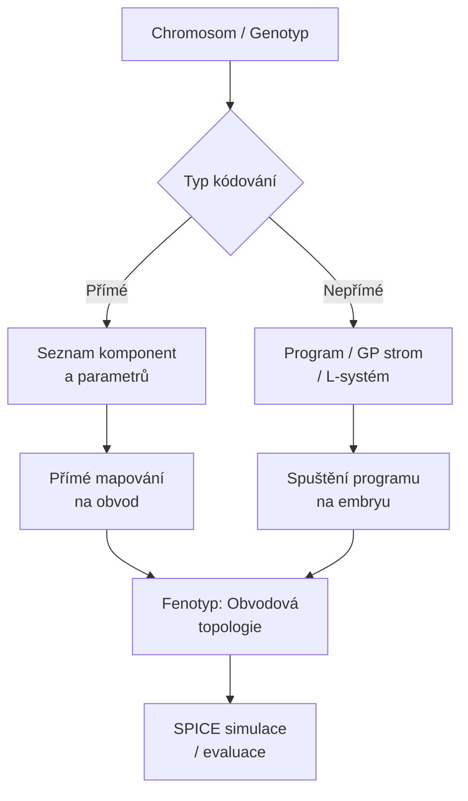

---

### Programová reprezentace (GP) a netlisty

**Genetic Programming (GP)** reprezentuje kandidátní řešení jako **strom instrukcí**. Každý uzel stromu je operace (funkce) a listy jsou terminály (hodnoty, komponenty). Při návrhu analogových obvodů podle Kozy strom popisuje, jak postupně stavět obvod z tzv. **embrya** — minimálního výchozího zapojení (typicky jeden vodič nebo jednoduchá smyčka).

**Embryo** je počáteční, minimální platný obvod (např. výstupní terminál připojený přes „prázdný" vodič). GP program iterativně **modifikuje toto embryo** přidáváním komponent a přepojováním uzlů. Každý uzel stromu aplikuje jednu z konstrukčních instrukcí.

**Typické instrukce v GP pro obvody:**

| Instrukce | Popis |
|-----------|-------|
| `C(e)` | Nahradí aktuální hranu kondenzátorem, pokračuje podstromem `e` |
| `R(e)` | Nahradí aktuální hranu rezistorem |
| `L(e)` | Nahradí hranu cívkou (induktorem) |
| `SERIES(e1, e2)` | Rozdělí hranu do série — dva sériové prvky |
| `PARALLEL(e1, e2)` | Přidá paralelní větev |
| `FLIP` | Obrátí orientaci aktuální hrany |
| `NOP` | Žádná operace (zachová stav) |

**Postup GP → Netlist → SPICE:**


**Netlist** je textový soubor popisující propojení uzlů a hodnoty součástek. Příklad netlistu pro RC dolní propust:

```
* RC Low-pass filter
Vin 1 0 AC 1
R1 1 2 1k
C1 2 0 100n
.AC DEC 100 1 1MEG
.PRINT AC V(2)
.END
```

---

### Příklad genotypu konstruujícího RC filtr

Uvažujme jednoduchý **lineární genotyp** (přímá reprezentace s fixní topologií, ale evolvovanými parametry) vs. **GP strom** (nepřímá reprezentace, která topologii generuje).

**Přímá reprezentace (příklad chromosomu):**
```
[R1=1kΩ, C1=100nF, topologie=LP-RC, Vout=uzel_2]
```

**Nepřímá reprezentace — sekvence instrukcí (pseudo-assembler):**
```
add_resistor R1
set_value R1 1k
add_capacitor C1
set_value C1 100nF
connect Vin R1.in
connect R1.out C1.top
connect C1.bot GND
label R1.out Vout
```

Tato sekvence instrukcí, spuštěna na embryu (prázdný obvod s uzly Vin a GND), vytvoří sériový rezistor R1 s kondenzátorem C1 zapojeným na zem — klasická **RC dolní propust (low-pass filter)**.

**Jak to vypadá jako GP strom:**

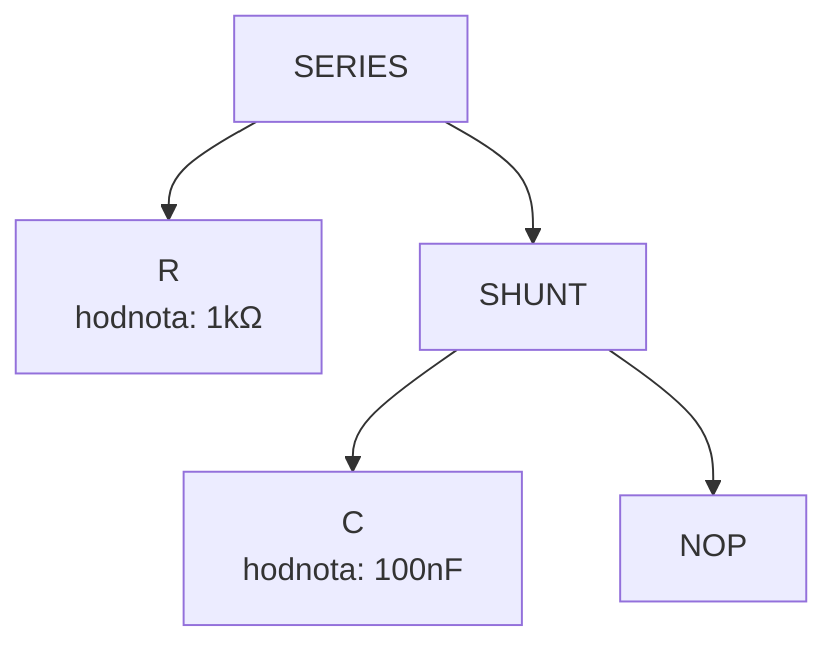

**Výsledná topologie:**

```
Vin ──[R1=1kΩ]──┬── Vout
                │
              [C1=100nF]
                │
               GND
```

Mezní frekvence: `f_c = 1 / (2π·R·C) = 1 / (2π·1000·100e-9) ≈ 1591 Hz`

---

## 2. Evaluace a fitness (analogové obvody)

---

### Hodnocení analogového obvodu pomocí SPICE simulace

SPICE (Simulation Program with Integrated Circuit Emphasis) je průmyslový standard pro simulaci analogových obvodů. Nabízí více typů analýz, přičemž pro evoluci je klíčové zvolit správnou kombinaci:

```mermaid
graph LR
    SPICE[SPICE simulátor] --> DC[DC analýza<br/>klidový bod]
    SPICE --> TR[Transient analýza<br/>časové chování]
    SPICE --> AC[AC/frekvenční analýza<br/>přenosová fce H&#40;f&#41;]
    SPICE --> NOISE[Noise analýza<br/>šumová hustota]
    DC --> M1[Metriky:<br/>pracovní bod Q,<br/>saturace/řez]
    TR --> M2[Metriky:<br/>náběžná hrana,<br/>překmit, zpoždění]
    AC --> M3[Metriky:<br/>zisk, šířka pásma,<br/>fázová rezerva]
    NOISE --> M4[Metriky:<br/>SNR, NF,<br/>šumová teplota]
```

**Přehled metrik podle typu obvodu:**

| Obvod | Klíčové metriky |
|-------|----------------|
| Dolní/horní propust | Mezní frekvence f_c, útlum v stop-band, zvlnění v pass-band |
| Pásmová propust | Střední frekvence f_0, Q-faktor, šířka pásma BW |
| Zesilovač | Zisk A_v, šířka pásma GBW, fázová rezerva PM, THD |
| Napájecí zdroj | Power Supply Rejection Ratio (PSRR), výstupní impedance |
| Anténa | SWR (Voltage Standing Wave Ratio), impedanční přizpůsobení, zisk |
| LNA (nízkošumový zesilovač) | Noise Figure (NF), IIP3, zisk |

**Workflow evaluace:**

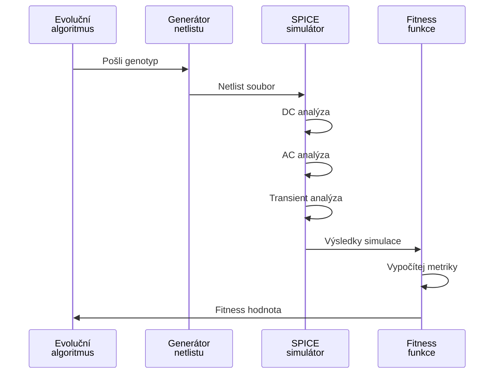

**Problémy při evaluaci:**
- Konvergence SPICE pro nestandardní topologie (obvod nemusí konvergovat)
- Nutnost detekce nevalidních obvodů (zkraty, plovoucí uzly) **před** simulací
- Jedna SPICE simulace může trvat milisekundy až sekundy — klíčový bottleneck evoluce

---

### Váhové funkce a vzorkovací body

Při hodnocení filtru nebo zesilovače nestačí změřit jeden bod — je třeba posoudit chování přes celý frekvenční rozsah. Způsob rozmístění vzorkovacích bodů a jejich vah **zásadně ovlivňuje směr evoluce**.

**Logaritmické vs. lineární rozložení:**

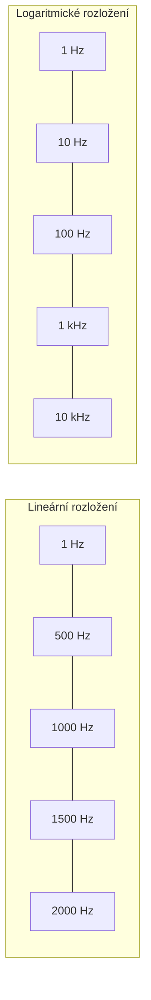

Logaritmické rozložení pokrývá **dekády** rovnoměrně. Při rozsahu 1 Hz – 1 MHz dává lineární rozložení 99.9 % bodů v horní dekádě — nízkofrekvenční chování je prakticky nehodnoceno. Logaritmické rozložení zajistí rovnoměrné pokrytí každé dekády.

**Návrh váhové funkce pro dolní propust:**

```
W(f) = {
    W_pass   pro f < f_c        // pass-band: chceme co nejmenší odchylku
    W_edge   pro f ≈ f_c        // přechodové pásmo: střední váha
    W_stop   pro f >> f_c       // stop-band: penalizace za nedostatečný útlum
}
```

Typicky `W_stop > W_pass`, protože útlum mimo pásmo je kritičtější než mírné zvlnění uvnitř.

**Příklad vzorkovacích bodů pro LP filtr s f_c = 1 kHz:**

| Oblast | Frekvence | Váha |
|--------|-----------|------|
| Pass-band | 10, 50, 100, 300, 700 Hz | 1.0 |
| Přechod | 800, 1000, 1200 Hz | 2.0 |
| Stop-band | 2k, 5k, 10k, 50k, 100k Hz | 3.0 |

---

### Koza-style GP pro analog: fitness funkce

John Koza ve své práci na evolučním návrhu analogových obvodů definoval fitness jako **vážený součet odchylek** mezi referenční a kandidátovou frekvenční charakteristikou:

$$F = \sum_{i=1}^{N} W(f_i) \cdot |H_{cand}(f_i) - H_{ref}(f_i)|$$

kde:
- `H_cand(f_i)` — přenosová funkce kandidáta v bodě f_i (v dB)
- `H_ref(f_i)` — požadovaná (referenční) přenosová funkce
- `W(f_i)` — váha bodu (vyšší v kritických oblastech)

**Rozšíření pro robustnější hodnocení:**

```
F_total = F_magnitude          // odchylka modulu
        + α · F_phase          // odchylka fáze (důležité pro stabilitu)
        + β · F_penalty        // penalizace za porušení omezení
        + γ · F_complexity     // penalizace za zbytečnou složitost
```

**Příklad penalty:**
- Počet komponent překračuje maximum → `+P_max_comp`
- Obvod nekonverguje ve SPICE → `→ nejhorší fitness`
- Impedanční nesoulad → proporcionální penalizace

```mermaid
flowchart TD
    A[Frekvenční body<br/>f_1 ... f_N] --> B[SPICE: H_cand&#40;f_i&#41;]
    REF[Referenční<br/>charakteristika H_ref&#40;f_i&#41;] --> C
    B --> C[Odchylky:<br/>|H_cand - H_ref| pro každé f_i]
    C --> D[Vynásobit vahami<br/>W&#40;f_i&#41;]
    D --> E[Suma → Fitness F]
    PENALTY[Penalizace:<br/>složitost, konvergence,<br/>omezení] --> E
```

---

## 3. Evoluční návrh antén

---

### Parametrické vs. generativní přístupy

**Parametrický přístup** předpokládá **fixní topologii** antény (např. dipól, Yagi, patch anténa) a EA optimalizuje pouze **geometrické parametry** — délky elementů, vzdálenosti, průměry vodičů.

**Příklad:** Pro dipólovou anténu chromosom = `[L_arm1, L_arm2, feeding_point]`

**Generativní (topologický) přístup** nechává EA **volně vytvořit topologii** — počet elementů, jejich rozmístění, tvar. Genotyp je program nebo L-systém generující drátový model antény.

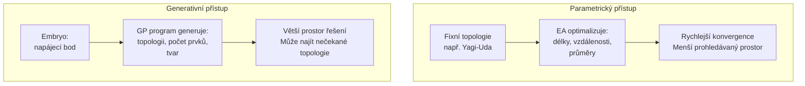

**Omezení zahrnovaná do fitness:**

| Omezení | Typ | Způsob zahrnutí |
|---------|-----|-----------------|
| SWR < 2.0 na pracovní frekvenci | Tvrdé | Penalizace nebo odmítnutí |
| Hmotnost < M_max | Tvrdé | Penalizace proporcionální k překročení |
| Rozměry do bounding boxu | Tvrdé | Penalizace |
| Maximální zisk | Měkké (cíl) | Přímo do fitness |
| Šířka pásma | Měkké (cíl) | Přímo do fitness |
| Impedance 50Ω | Měkké | Penalizace za odchylku |

**Historický příklad:** NASA/JPL 2006 — evolvovaná anténa pro průzkum vesmíru měla netradiční tvar (připomínající zmačkaný drát), ale dosahovala výborné všesměrové charakteristiky.

---

### Embryonální konstrukce antény

Při generativním GP přístupu začíná evoluce z **embrya** — minimální platné struktury. Pro drátovou anténu je embryem typicky **napájecí bod** (feed point) v počátku souřadnic s krátkým iniciálním segmentem.

**Konstrukční hlava (turtle graphics přístup):**
Existuje imaginární „kreslící hlava" s polohou `(x,y,z)` a orientací. Instrukce ji posouvají a přidávají vodičové segmenty:

| Instrukce | Popis |
|-----------|-------|
| `FORWARD(L, R)` | Přidej segment délky L s odporem R, posuň hlavu |
| `ROTATE(θ, φ)` | Otoč hlavu o úhly θ (azimut) a φ (elevace) |
| `BRANCH` | Rozděl — spusť dva podstromy ze stejného bodu |
| `END` | Ukonči tuto větev (otevřený konec vodiče) |
| `GROUND` | Připoj aktuální bod na zem |
| `NOP` | Žádná operace |

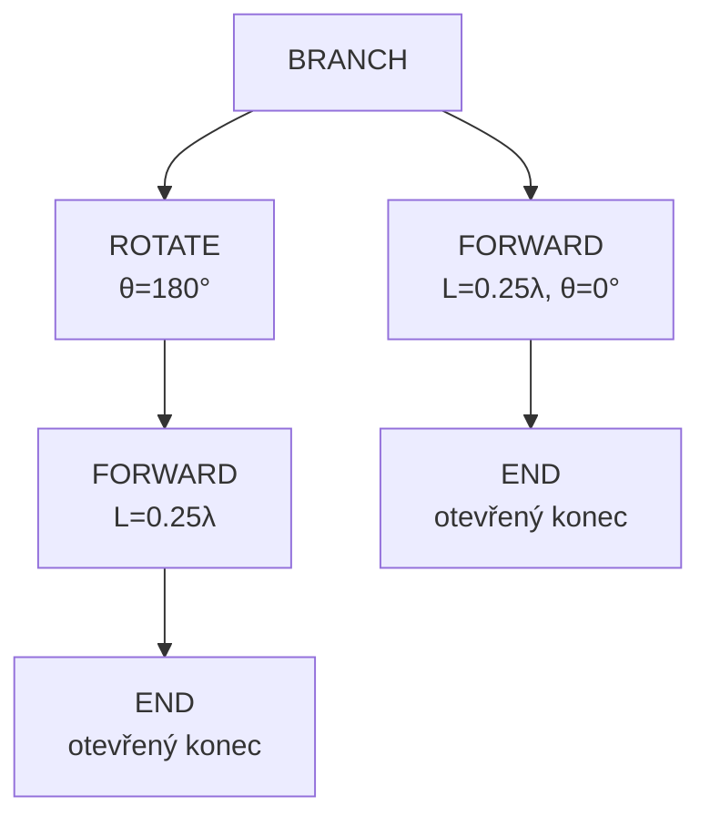

Tento GP strom vygeneruje **půlvlnný dipól** — dva ramena délky λ/4 v opačných směrech.

**Výsledek evaluace:** 3D model vodiče → NEC2 nebo FEKO simulátor → výpočet SWR, zisku, vyzařovacího diagramu → fitness.

**Fitness pro anténu (příklad):**
```
F = W1 · (1 - 1/SWR)²        // přiblížení k SWR=1
  + W2 · Gain_dBi             // maximální zisk
  + W3 · BW_penalty           // penalizace za úzké pásmo
  - W4 · Length_total         // penalizace za délku/hmotnost
```

---

## 4. Rekonfigurovatelné platformy: FPTA a SABLES

---

### FPTA — Field Programmable Transistor Array

FPTA je analogový ekvivalent FPGA. Místo logických buněk obsahuje **matici tranzistorů** (MOS, bipolární), jejichž propojení a operační bod je konfigurovatelný přes programovací bity. Na rozdíl od FPGA umožňuje implementovat libovolnou **analogovou funkci** — zesilovač, filtr, oscilátor, AD převodník.

**Klíčové vlastnosti FPTA:**
- Rekonfigurovatelná propojovací matice tranzistorů
- Nastavitelné bias proudy a napětí
- Možnost intrinsic (přímé hardwarové) evaluace

**Intrinsic evaluace vs. SPICE simulace:**

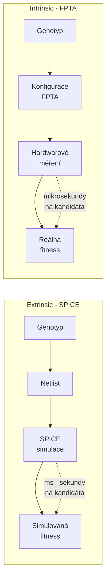

**Výhody intrinsic evaluace na FPTA:**
1. **Rychlost:** Fyzická evaluace je 100×–1000× rychlejší než SPICE
2. **Fyzikální efekty:** Zahrnuje parazitní kapacity, šum, teplotní závislosti — SPICE model je vždy zjednodušením
3. **Paralelizace:** Více FPTA čipů může evaluovat více kandidátů současně
4. **Adaptace za provozu:** Systém se může rekonfigurovat a přizpůsobovat měnícím se podmínkám **v reálném čase**

**Nevýhody:**
- Omezená granularita konfigurace (diskrétní kroky, ne spojité hodnoty)
- Výsledky jsou závislé na konkrétním čipu (variabilita výroby)
- Obtížnější debug a interpretace

---

### SABLES — Stand Alone Board-Level Evolvable System

SABLES je kompletní autonomní systém pro evoluci hardwaru přímo na desce bez nutnosti připojeného PC. Řídícím procesorem je typicky **DSP (Digital Signal Processor)**, který zvládá jak řízení EA, tak generování testovacích signálů a měření odezev.

```mermaid
sequenceDiagram
    participant DSP as DSP<br/>&#40;řídí EA&#41;
    participant CONF as Konfigurační<br/>rozhraní
    participant FPTA as FPTA čip<br/>&#40;DUT&#41;
    participant MEAS as Měřicí<br/>rozhraní

    DSP->>DSP: Inicializuj populaci
    loop Generace EA
        DSP->>CONF: Pošli konfiguraci kandidáta
        CONF->>FPTA: Rekonfiguruj tranzistorovou matici
        DSP->>FPTA: Generuj testovací signál
        FPTA->>MEAS: Odezva obvodu
        MEAS->>DSP: Naměřená data
        DSP->>DSP: Vypočítej fitness
        DSP->>DSP: Selekce + variace
    end
    DSP->>DSP: Výsledná konfigurace
```

**Co SABLES řeší:**

| Problém | Řešení v SABLES |
|---------|----------------|
| Pomalost SPICE simulace | Přímé HW měření v mikrosekundách |
| Závislost na PC | Autonomní DSP běží EA samostatně |
| Nereálné simulační modely | Reálné fyzikální chování čipu |
| Statické prostředí | DSP může měnit testovací podmínky za běhu |

**Typický workflow evoluce na SABLES:**
1. DSP inicializuje náhodnou populaci (bitové vektory konfigurace FPTA)
2. Každý kandidát se nahraje do FPTA přes SPI/I²C rozhraní
3. DSP vygeneruje testovací signál (sinusoidy, pulzy, noise)
4. ADC změří výstup FPTA
5. DSP vypočítá fitness (korelace, FFT, RMS chyba)
6. EA operátory vyberou a zkříží nejlepší kandidáty
7. Po N generacích je výsledná konfigurace uložena do flash

---

## 5. Robustnost a overfitting

---

### Proč vyevolvovaná řešení nebývají robustní

Evoluce optimalizuje na **trénovací sadě** podmínek a vstupů. Pokud je tato sada omezená, EA najde řešení, které je perfektní **pro trénovací podmínky**, ale selhává mimo ně — analogie s overfittingem v ML.

**Příklady selhání:**
- Filtr vyevolvovaný při 25 °C přestane fungovat při 70 °C (teplotní drift součástek)
- Anténa optimalizovaná pro ideální impedanci selže se skutečným napájecím kabelem
- Obvod funguje na konkrétním FPTA čipu, ale ne na jiném exempláři (výrobní variabilita)

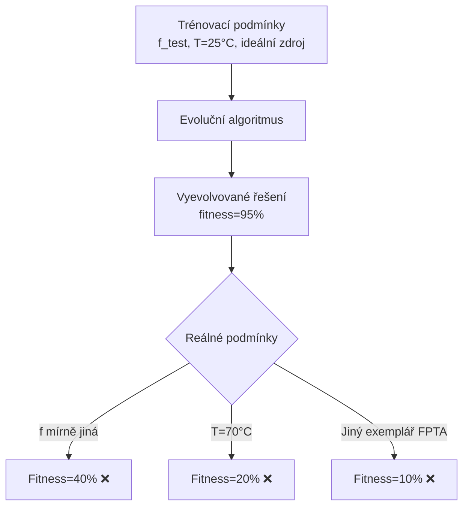

**Strategie pro zlepšení robustnosti:**

**1. Mixtrinsic evaluace** — kombinace simulace (extrinsic) a fyzického měření (intrinsic). Simulace pokryje rozsáhlý prostor podmínek rychle, fyzické měření ověří reálnost.

**2. Variabilní testovací sady:**
- Testovat při více frekvencích (ne jen f_0)
- Testovat při více teplotách (simulace corner analysis: -40°C, +25°C, +85°C)
- Testovat s různými zdrojovými impedancemi
- Rotovat testovací sadu každou generaci (dynamic test sets)

**3. Formální verifikace (pro digitální obvody):**
- Místo vzorkování vstupů použít formální důkaz správnosti pro všechny možné vstupy
- Nástoje: model checking, SAT solvers, SMT solvers

**4. Worst-case/Monte Carlo evaluace:**
- Ohodnotit každého kandidáta v N náhodných scénářích
- Fitness = průměr nebo minimum přes scénáře
- Preferuje kandidáty stabilní přes celý rozsah

---

### Dopad šumu, teploty a výrobních tolerancí

**Šum** v analogových obvodech pochází z více zdrojů: tepelný šum (Johnson-Nyquist), výstřelový šum (shot noise), 1/f (flicker) šum. Každý ovlivňuje obvod jinak — 1/f šum dominuje při nízkých frekvencích, tepelný šum je konstantní přes frekvenční spektrum.

**Teplotní závislost:** Většina parametrů tranzistorů je silně závislá na teplotě — prahové napětí MOS tranzistoru klesá přibližně o 2 mV/°C, β bipolárního tranzistoru roste s teplotou. Vyevolvovaný zesilovač navržený při 25 °C se může při 85 °C přesaturovat nebo vypnout.

**Výrobní tolerance:** V reálné výrobě mají rezistory typicky ±1–5% toleranci, kondenzátory ±10–20%, parametry tranzistorů variují ±30% i více. SPICE simulace s nominálními hodnotami toto nezachytí.

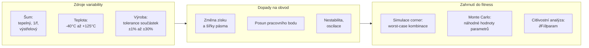

**Praktický přístup:**
- **Corner analysis:** Simulovat 8 kombinací (min/max pro klíčové parametry) — zvýší dobu evaluace 8× ale dramaticky zlepší robustnost
- **Monte Carlo:** 100–500 běhů s náhodnou variací parametrů — statisticky zachytí celý rozsah
- **Citlivostní penalizace:** Přidat do fitness člen `γ · Σ |∂F/∂p_i|` — penalizuje obvody citlivé na parametrické změny

---

## 6. Praktické poznatky a limity

---

### Hlavní omezení evolučního návrhu analogových systémů

**1. Výpočetní náročnost SPICE simulace:**
- Jedna AC simulace s 100 body trvá typicky 10–500 ms
- Populace 500 jedinců × 1000 generací = 500 000 evaluací
- Celková doba: 500 000 × 100 ms = 50 000 sekund ≈ **14 hodin**
- Nutné: paralelizace (cluster), GPU akcelerace, nebo surrogate modely (ML aproximace fitness)

**2. Problém konvergence SPICE:**
- Nestandardní topologie mohou způsobit numerické problémy v SPICE
- Nutná robustní kontrola netlistu před simulací (detekce zkratů, plovoucích uzlů)
- Nekonvergentní obvody musí dostat penalizaci, ne crash

**3. Reálné testy:**
- FPTA/FPGA setup vyžaduje specifický HW
- Opakovatelnost měření (EMI, teplota laboratoře)
- Fyzické opotřebení FPTA při masivním přeprogramování

**4. Nepředvídatelné platformní efekty:**
- Parazitní kapacity a odpory propojovací matice FPTA
- Řešení fungující v SPICE selže na FPTA kvůli parazitkám
- Proto je potřeba **hierarchická validace:** SPICE → FPTA → SABLES

---

### Kompletní pipeline pro evoluční návrh analogového obvodu

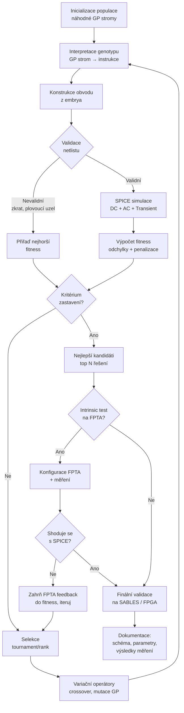

**Shrnutí kroků pipeline:**

| Krok | Nástroj | Čas | Výstup |
|------|---------|-----|--------|
| 1. Genotyp → GP program | Vlastní interpretátor | μs | Sekvence instrukcí |
| 2. Embryo + instrukce → obvod | Vlastní engine | μs | Topologie + hodnoty |
| 3. Obvod → netlist | Textový generátor | μs | `.cir` soubor |
| 4. Netlist → simulace | SPICE (ngspice/LTspice) | ms – s | Výsledky analýzy |
| 5. Výsledky → fitness | Vlastní funkce | μs | Skalární hodnota |
| 6. Selekce + variace | EA framework | μs | Nová populace |
| 7. (volitelně) FPTA test | FPTA + DSP | μs | Reálná fitness |
| 8. Finální validace | SABLES / FPGA | min – hod | Potvrzená funkčnost |

**Klíčové poučení:** Návrh **fitness funkce a testovací sady** je nejdůležitější — a nejtěžší — část celého procesu. Špatná fitness vede k řešením, která sice maximalizují skóre, ale nesplňují skutečné požadavky (Goodhartův zákon v evoluci HW).

---

*Rozšířené studijní materiály pro přednášku 07 — Evoluční návrh analogových obvodů a antén*