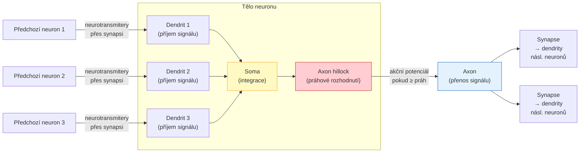
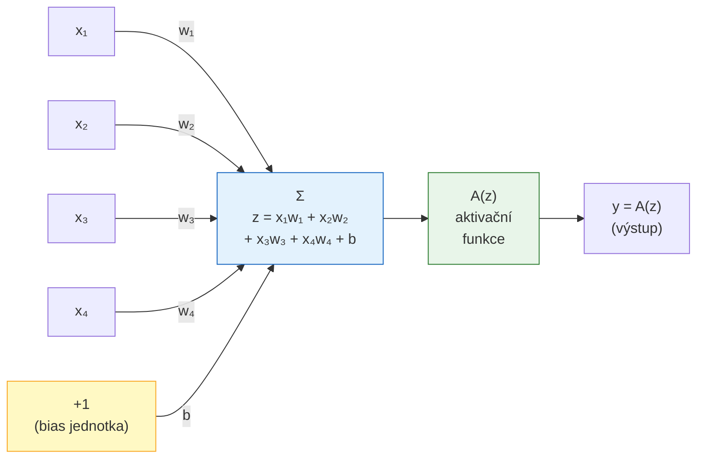
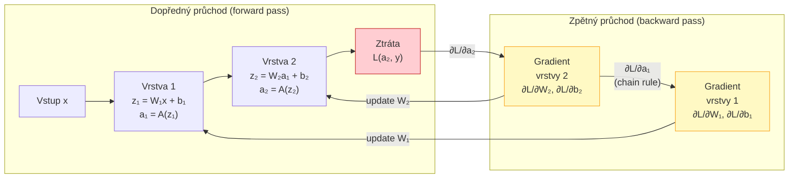
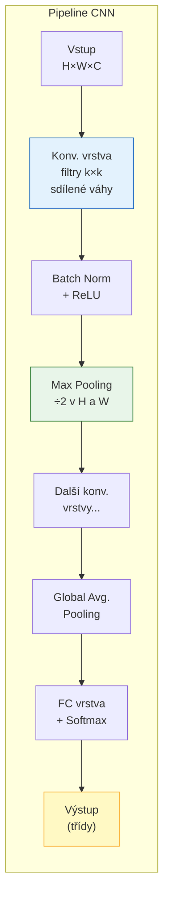
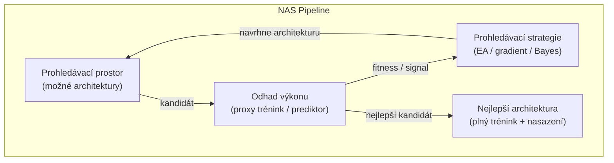
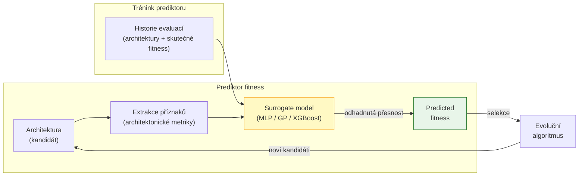
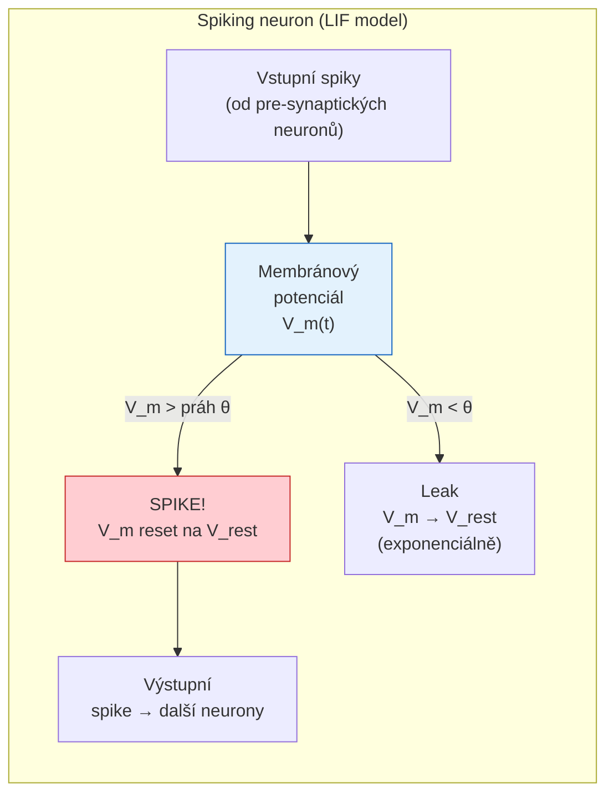

# 08 Neuronové sítě a neuroevoluce

## Biologická inspirace a struktura neuronu

> [!info] Nakreslete schéma biologického neuronu a popište úlohy dendritů, somy a axonu.

Biologický neuron je základní stavební prvek nervové soustavy. Jeho základní části tvoří funkčně specializovaný celek:



**Funkce jednotlivých částí:**

- **Dendrity** — větvené výběžky přijímající vstupní signály od jiných neuronů prostřednictvím synapsí. Každý neuron může mít tisíce dendritů.
- **Soma (tělo buňky)** — integruje všechny přicházející signály (excitační i inhibiční). Sčítá jejich příspěvky v čase a prostoru.
- **Axon hillock** — místo kde se rozhoduje, zda byl dosažen práh depolarizace. Pokud celková stimulace překročí práh ($\approx -55\ \text{mV}$), vygeneruje se **akční potenciál**.
- **Axon** — dlouhý výběžek přenášející akční potenciál (binární elektrický impuls) k synapsi. Může být myelinizovaný pro rychlejší přenos.
- **Synapse** — rozhraní mezi axonem a dendrity dalšího neuronu. Převádí elektrický signál na chemický (neurotransmitery) a zpět.

> [!tip] Analogie s umělým neuronem
> Dendrity = vstupy $x_i$; synaptické váhy = $w_i$; soma = vážený součet $\sum x_i w_i + b$; axon hillock = aktivační funkce; axon = výstup $y$.

---

## Umělé neuronové sítě (ANN)

> [!info] Napište vztah pro výpočet výstupního signálu n‑vstupového neuronu se vstupy `x`, váhami `w`, biasem `b` a aktivační funkcí `A`: y = A(∑ x_i * w_i + b).

Výpočet umělého neuronu probíhá ve dvou krocích:

**Krok 1 — lineární kombinace (preaktivace):**
$$z = \sum_{i=1}^{n} x_i \cdot w_i + b = \mathbf{w}^T \mathbf{x} + b$$

**Krok 2 — nelineární transformace (aktivace):**
$$y = A(z)$$

**Nejběžnější aktivační funkce:**

| Funkce | Vzorec | Rozsah | Typické použití |
|--------|--------|:------:|-----------------|
| Sigmoid | $\sigma(z) = \frac{1}{1+e^{-z}}$ | $(0, 1)$ | výstup binární klasifikace |
| Tanh | $\tanh(z) = \frac{e^z - e^{-z}}{e^z + e^{-z}}$ | $(-1, 1)$ | skryté vrstvy (RNN) |
| ReLU | $\max(0, z)$ | $[0, \infty)$ | skryté vrstvy CNN/DNN |
| Leaky ReLU | $\max(0{,}01z, z)$ | $(-\infty, \infty)$ | skryté vrstvy (řeší dying ReLU) |
| Softmax | $\frac{e^{z_i}}{\sum_j e^{z_j}}$ | $(0, 1)$, součet=1 | výstup vícetřídní klasifikace |

> [!important] Proč nelinearita?
> Pokud by $A$ byla lineární funkce (nebo žádná), libovolně hluboká síť by byla ekvivalentní **jediné** lineární vrstvě: $W_3(W_2(W_1 x)) = (W_3 W_2 W_1)x = W x$. Nelinearita je podmínkou pro schopnost sítě aproximovat složité funkce (universální aproximační teorém).

---

> [!info] Nakreslete schéma neuronu se 4 vstupy a spočítejte počet trénovatelných parametrů (váhy + bias).



**Počet trénovatelných parametrů:**
- 4 váhy: $w_1, w_2, w_3, w_4$
- 1 bias: $b$
- **Celkem: 5 parametrů**

Obecně: neuron s $n$ vstupy má $n + 1$ trénovatelných parametrů.

> [!tip] Role biasu
> Bias $b$ umožňuje posunout aktivační funkci doleva/doprava po ose $z$. Bez biasu by $z = 0$ vždy odpovídalo vstupu samých nul — neuron by nemohl naučit se konstantní offset.

---

> [!info] Proč se v praxi nepoužívají pouze jedno‑neurónové sítě? (vysvětlete omezení lineární separability).

Jeden neuron s libovolnou hladkou aktivační funkcí implementuje **lineárně separovatelný klasifikátor** — jeho rozhodovací hranice je vždy **nadrovinou** $\mathbf{w}^T \mathbf{x} + b = 0$.

**Příklad — proč XOR nelze realizovat jedním neuronem:**

| $x_1$ | $x_2$ | XOR | Správná třída |
|:-----:|:-----:|:---:|:---:|
| 0 | 0 | 0 | ○ |
| 0 | 1 | 1 | ● |
| 1 | 0 | 1 | ● |
| 1 | 1 | 0 | ○ |

```
x₂
 1 │  ○   ●       Nelze nakreslit jednu přímku,
   │              která oddělí ● od ○.
 0 │  ●   ○       Třídy jsou „šachovnicově" rozmístěné.
   └──────────
      0   1  x₁
```

Žádná přímka (v 2D) ani nadrovina (v $n$D) nedokáže oddělit $\{(0,1),(1,0)\}$ od $\{(0,0),(1,1)\}$.

**Řešení — vícevrstvá síť (MLP):**
Přidáme skrytou vrstvu s nelineární aktivací. Síť s jednou skrytou vrstvou a dostatečným počtem neuronů může aproximovat **libovolnou spojitou funkci** (universální aproximační teorém, Cybenko 1989). Každá skrytá vrstva vytváří novou, nelineární reprezentaci dat.

---

## Učení a optimalizace

> [!info] Popište ztrátovou funkci a základní princip gradientního sestupu a backpropagation.

### Ztrátová funkce

Ztrátová funkce $\mathcal{L}(\hat{y}, y)$ kvantifikuje, jak moc se předpověď $\hat{y}$ liší od správného výstupu $y$:

| Úloha | Funkce | Vzorec |
|-------|--------|--------|
| Regrese | MSE | $\frac{1}{N}\sum_i(\hat{y}_i - y_i)^2$ |
| Bin. klasifikace | Binary Cross-Entropy | $-[y\log\hat{y} + (1-y)\log(1-\hat{y})]$ |
| Vícetrídní klasif. | Categorical Cross-Entropy | $-\sum_c y_c \log \hat{y}_c$ |

### Gradientní sestup

Cílem tréninku je minimalizovat $\mathcal{L}$ úpravou vah $\mathbf{w}$. Gradientní sestup aktualizuje váhy v opačném směru gradientu:

$$\mathbf{w} \leftarrow \mathbf{w} - \eta \cdot \nabla_\mathbf{w} \mathcal{L}$$

kde $\eta$ je **learning rate** (velikost kroku). Příliš velké $\eta$ → nestabilita, příliš malé → pomalá konvergence.

### Backpropagation

Algoritmus efektivně počítá $\nabla_\mathbf{w} \mathcal{L}$ pomocí **řetízkového pravidla derivace** (chain rule):



**Klíčový vzorec (chain rule pro vrstvu $l$):**
$$\frac{\partial \mathcal{L}}{\partial W^{(l)}} = \frac{\partial \mathcal{L}}{\partial z^{(l)}} \cdot \frac{\partial z^{(l)}}{\partial W^{(l)}} = \delta^{(l)} \cdot (a^{(l-1)})^T$$

kde $\delta^{(l)}$ je „chybový signál" vrstvy $l$, který se šíří zpět: $\delta^{(l)} = ((W^{(l+1)})^T \delta^{(l+1)}) \odot A'(z^{(l)})$.

---

> [!info] Vysvětlete běžné regularizační techniky (dropout, weight decay, normalizace) a jejich vliv na generalizaci.

Regularizace zabraňuje **overfittingu** — situaci, kdy síť memoruje trénovací data místo generalizace.

**Dropout:**
Během každého trénovacího kroku se každý neuron s pravděpodobností $p$ (typicky 0,2–0,5) dočasně „vypne" (výstup nastaven na 0). Zbývající neurony musí kompenzovat výpadek ostatních.
- Nutí síť učit se redundantní, robustní reprezentace.
- Při inferenci jsou všechny neurony aktivní, ale jejich výstupy jsou škálovány faktorem $(1-p)$.
- Efekt podobný trénování ensemble mnoha různých podarchitektur.

**Weight Decay (L2 regularizace):**
K ztrátové funkci se přidá penalizační člen:
$$\mathcal{L}_{reg} = \mathcal{L} + \lambda \sum_{i,j} w_{ij}^2$$
Velké váhy jsou penalizovány → síť preferuje jednodušší (hladší) řešení. Gradient aktualizace se přidá $-2\lambda w$ → váhy „decay" k nule.

**Batch Normalization:**
Po každé vrstvě se aktivace normalizují na nulovou střední hodnotu a jednotkový rozptyl přes mini-batch, pak se škálují naučenými parametry $\gamma, \beta$:
$$\hat{z} = \frac{z - \mu_{batch}}{\sqrt{\sigma^2_{batch} + \epsilon}}, \quad y = \gamma\hat{z} + \beta$$
- Stabilizuje rozložení aktivací → vyšší learning rate, rychlejší konvergence.
- Lehký regularizační efekt (šum z mini-batch statistik).

> [!tip] Kdy použít co?
> Dropout — hlubší FC sítě, transformery. Weight decay — téměř vždy jako výchozí regularizace. Batch Norm — CNN, hluboké sítě kde gradientní průchod přes mnoho vrstev způsobuje nestabilitu (vanishing/exploding gradients).

---

## Hluboké neuronové sítě a konvoluční sítě (CNN)

> [!info] Vysvětlete, co dělá konvoluční vrstva a pooling; proč CNN snižují počet trénovatelných parametrů oproti plně propojeným vrstvám.

### Konvoluční vrstva

Konvoluce aplikuje **sdílený filtr** (kernel) na lokální oblasti vstupu klouzavým oknem:

$$Y[i,j,c_{out}] = \sum_{di}\sum_{dj}\sum_{c_{in}} X[i{+}di,\,j{+}dj,\,c_{in}] \cdot K[di,\,dj,\,c_{in},\,c_{out}] + b[c_{out}]$$

**Klíčové vlastnosti:**
- **Sdílení vah:** stejný filtr $K$ se aplikuje na každou pozici vstupu → drastická redukce parametrů.
- **Lokální konektivita:** každý výstupní neuron závisí jen na malém lokálním regionu (receptive field), ne na celém vstupu.
- **Translační ekvivariace:** pokud se objekt posune ve vstupu, aktivace se posunou odpovídajícím způsobem ve výstupu.



### Pooling

Pooling vrstva redukuje prostorové rozměry feature mapy:
- **Max Pooling** — bere maximum z okna (typicky 2×2 s stride 2) → invariance vůči malým posunům
- **Average Pooling** — průměr z okna → hladší downsampling
- **Global Average Pooling** — průměr přes celou feature mapu → redukce na skalár (náhrada FC vrstvy)

> [!tip] Proč méně parametrů?
> FC vrstva s 100×100 vstupem a 256 výstupy: $100\times100\times256 = 2{,}56M$ vah.
> Conv vrstva s 256 filtry 3×3: $256\times3\times3 = 2{,}304$ vah — **1000× méně** — a přitom se aplikuje na každou pozici vstupu.

---

> [!info] Úloha: porovnejte počet vah v plně propojené vrstvě a konvoluční vrstvě (vstup 20×20, 6 filtrů 3×3).

**Zadání:** vstup $20 \times 20$ pixelů (1 kanál), výstupní vrstva s 6 neurony/filtry.

### Plně propojená vrstva (FC)

Každý výstupní neuron je spojen se **všemi** vstupními pixely:

$$\text{Počet vah} = 20 \times 20 \times 6 = 2\,400$$
$$\text{Počet biasů} = 6$$
$$\boxed{\text{FC parametry} = 2\,406}$$

### Konvoluční vrstva (Conv)

6 filtrů, každý o velikosti $3 \times 3 \times 1$ (pro 1 vstupní kanál):

$$\text{Počet vah} = 6 \times 3 \times 3 \times 1 = 54$$
$$\text{Počet biasů} = 6$$
$$\boxed{\text{Conv parametry} = 60}$$

**Poměr:** FC má $2406 / 60 \approx \mathbf{40\times}$ více parametrů.

### Vliv stride, padding a pooling na výstupní rozměr

| Parametr | Hodnota | Výstupní velikost |
|----------|:-------:|:-----------------:|
| Padding = 'valid', stride = 1 | — | $18 \times 18 \times 6$ |
| Padding = 'same', stride = 1 | — | $20 \times 20 \times 6$ |
| Padding = 'same', stride = 2 | — | $10 \times 10 \times 6$ |
| + Max Pooling 2×2 po konv. 'same' | — | $10 \times 10 \times 6$ |

**Obecný vzorec pro výstupní rozměr (výška/šířka):**
$$H_{out} = \left\lfloor \frac{H_{in} + 2P - k}{S} \right\rfloor + 1$$

kde $P$ je padding, $k$ je velikost kernelu, $S$ je stride.

> [!note] Poznámka k RGB vstupu
> Pro 3-kanálový RGB vstup má každý filtr tvar $3 \times 3 \times 3$ → celkem $6 \times 3 \times 3 \times 3 + 6 = 168$ parametrů. FC vrstva by měla stále $20 \times 20 \times 3 \times 6 = 7\,206$ parametrů → rozdíl ještě větší.

---

## Neural Architecture Search (NAS) a neuroevoluce

> [!info] Co je NAS a jaké přístupy (evoluční, gradientní, bayesovské) se používají k hledání architektur?

**Neural Architecture Search (NAS)** automatizuje návrh architektury neuronové sítě — hledá optimální konfiguraci (počet vrstev, typy vrstev, propojení, šířku) pro danou úlohu a hardwarové omezení.



**Přístupy k prohledávání:**

**1. Evoluční NAS:**
Populace architektur kódovaných jako chromozómy. Mutace mění vrstvy, filtry, propojení. Křížení kombinuje části dvou architektur. Hodnocení přes trénink na proxy datasetu nebo prediktorem.
- **Výhoda:** zvládá diskrétní, nekontinuální prostory; nevyžaduje derivovatelnost.
- **Příklady:** AmoebaNet, Real et al. 2017.

**2. Differentiable NAS (DARTS):**
Prohledávací prostor je relaxován — místo výběru jedné operace na hraně grafu se váhově kombinují všechny kandidátní operace. Váhy architekury $\alpha$ a váhy sítě $w$ se optimalizují gradientně (bi-level optimalizace).
$$\min_\alpha \mathcal{L}_{val}(w^*(\alpha), \alpha), \quad \text{kde } w^* = \arg\min_w \mathcal{L}_{train}(w, \alpha)$$
- **Výhoda:** velmi rychlé (hodiny místo dnů).
- **Nevýhoda:** může kolabovat k degenerate řešením (skip connections); optimalizuje spojitou relaxaci, ne diskrétní architekturu.

**3. Bayesovská optimalizace:**
Modeluje výkon architektury jako náhodný proces (Gaussian Process nebo jiný surrogate). Acquisition function (EI, UCB) rozhoduje, který kandidát trénovat dál.
- **Výhoda:** efektivní pro malý počet drahých evaluací.
- **Nevýhoda:** špatně škáluje na velmi velké prostory.

---

> [!info] Neuroevoluce: vysvětlete, které části sítě mohou být evolvovány (architektura vs. váhy) a kdy má evoluce výhodu.

**Co lze evolvovat:**

| Část sítě | Příklady parametrů | Typická kódování |
|-----------|-------------------|-----------------|
| **Váhy** | hodnoty $w_{ij}$, biasy $b_i$ | reálné číslo v chromozómu |
| **Architektura** | počet vrstev, šířka, typ aktivace, skip-connections | graf / seznam celých čísel |
| **Oboje (topologie + váhy)** | kompletní síť jako genotyp | NEAT, CGP-ANN |
| **Hyperparametry** | learning rate, batch size, regularizace | přímé číselné kódování |
| **Učební pravidla** | pravidla pro update vah (meta-learning) | symbolický výraz / program |

**Kdy má evoluce výhodu oproti gradientním metodám:**

- **Diskrétní prohledávací prostor** — architektura je diskrétní (počet vrstev = integer), nelze derivovat přes ni.
- **Neexistence gradientu** — fitness funkce je nederivovatelnás (přesnost na testovací množině, latence na HW).
- **Vícekriteriální optimalizace** — simultánní optimalizace přesnosti, velikosti modelu a latence přirozeně odpovídá Pareto-frontové evoluci.
- **Globální prohledávání** — gradientní metody uvíznou v lokálních minimech; evoluce je robustnější.
- **Neobvyklé topologie** — NEAT může vytvářet sítě s libovolnou strukturou propojení (ne jen vrstevnatou).

---

> [!info] Pseudokód evoluce CNN: navrhněte stručný pseudokód pro EA, který mutuje architekturu CNN a hodnotí ji na validační množině.

```
Algorithm 1 Neuroevolution
1: P = Create Initial Population of NNs (pop_size)
2: Training(P, D_train) for m epochs using NNSW
3: Evaluate(P, D_val) using NNSW; i = 0
4: while (termination condition fails) do
5:     Q = ∅                      // a set of offspring
6:     while (all offspring are not generated) do
7:         (a, b) = Selection(P)
8:         (a', b') = Crossover(a, b, p_cross)
9:         a'' = Mutation(a', p_mut); b'' = Mutation(b', p_mut)
10:        Q = Q ∪ {a''} ∪ {b''}
11:    end while
12:    Training(Q, D_train) for m epochs using NNSW
13:    Evaluate(Q, D_val) using NNSW
14:    P = Replacement(P, Q)
15:    i = i + 1
16: end while
17: Evaluate(P, D_test) using NNSW
18: Report the highest-scored NN on D_test
```

**Poznámky k implementaci:**
- Proxy trénink (5 epoch na podmnožině) je $\sim 50\times$ rychlejší než plný trénink.
- Pareto selekce zajišťuje prohledávání celé fronty přesnost/cena, ne jen jediného kompromisu.
- Prediktor se průběžně aktualizuje — čím více evaluací, tím přesnější odhady.

---

> [!info] Proč použít prediktor fitness při NAS/neuroevoluci a jaké jsou typické vstupy takového prediktoru?

**Problém:** Plné ohodnocení jedné architektury (trénink CNN do konvergence) trvá hodiny nebo dny. Evoluční algoritmus vyhodnocuje stovky až tisíce architektur → přímý přístup je výpočetně nemožný.

**Řešení — prediktor (surrogate model):**



**Typické vstupy prediktoru:**

| Kategorie | Příklady vstupních příznaků |
|-----------|----------------------------|
| **Architektonické metriky** | počet vrstev, hloubka, šířka, počet parametrů, typy operací |
| **Výpočetní metriky** | FLOPs, počet MAC operací, teoretická latence |
| **Proxy metriky** | přesnost po 1–5 epochách tréninku na malém datasetu |
| **Grafoví příznaky** | délka nejdelší cesty, průměrný stupeň uzlu v grafu architektury |
| **Zero-cost proxy** | gradientní norma při inicializaci, aktivační rozmanitost (bez tréninku) |

**Výstup prediktoru:** odhadnutá validační přesnost (nebo chyba) pro plný trénink.

> [!tip] Zero-cost proxy
> Nejmodernější prediktory nepotřebují ani krátký trénink — odhadují výkon architektury přímo z náhodně inicializované sítě na základě statistik gradientů nebo aktivací. Odhad trvá sekundy místo hodin.

---

## Aplikace, nástroje a hardware

> [!info] Proč jsou GPU/TPU výhodné pro DNN trénování? Uveďte několik metrik (FLOPs, params, memory footprint) a vliv na výběr HW.

**Proč GPU/TPU:**

Trénování DNN se redukuje na masivní maticové operace $Y = WX + b$. Tyto operace jsou přirozeně paralelní — každý výstupní prvek je nezávislý skalární součin. CPU má desítky jader, GPU/TPU mají tisíce.

| Zařízení | Jádra | Peak FP32 FLOPs | Paměť (HBM) | Typické použití |
|----------|:-----:|:---------------:|:-----------:|-----------------|
| CPU (moderní) | 8–64 | $\sim$ 1 TFLOP | 64–512 GB RAM | preprocessing, inference na CPU |
| GPU (H100) | 16 896 CUDA jader | $\sim$ 67 TFLOPS FP32 | 80 GB HBM3 | trénink, inferenece |
| TPU v4 | matice 128×128 MXU | $\sim$ 275 TFLOPS BF16 | 32 GB HBM | velké modely, Google Cloud |

**Klíčové metriky pro výběr HW:**

- **FLOPs modelu** — celkový počet floating-point operací pro jeden forward/backward pass; určuje výpočetní náročnost
- **Počet parametrů** — přímo určuje paměťový footprint vah; model s 70B parametry ve FP16 potřebuje $\approx 140\ \text{GB}$ VRAM → nutnost více GPU
- **Memory bandwidth** — propustnost paměti je často bottleneck, ne výpočetní výkon (zejména u inferenece)
- **Batch size** — větší batch → lepší využití GPU paralelismu, ale vyšší paměťové nároky

> [!tip] Pravidlo palce
> Pokud model nebo batch size nevejde do VRAM jednoho GPU, je nutná **model parallelism** (různé vrstvy na různých GPU) nebo **data parallelism** (různé mini-batche na různých GPU se synchronizací gradientů).

---

> [!info] Krátký přehled neuromorphic computing a spiking NN: kde mají výhodu (energetická efektivita, edge aplikace)?

**Konvenční ANN vs. Spiking Neural Network (SNN):**

| Vlastnost | Konvenční ANN | Spiking NN (SNN) |
|-----------|:-------------:|:----------------:|
| Komunikace | spojité hodnoty (float) | diskrétní spiky (0/1 impulzy) |
| Čas | bez časové dimenze | explicitní časová dynamika |
| Aktivita | husté (dense) výpočty | řídká (sparse) aktivita |
| Energetická efektivita | nízká | velmi vysoká |
| Trénovatelnost | snadná (backprop) | obtížná (nederivovatelnás spike funkce) |
| Typický HW | GPU/TPU | Intel Loihi, IBM TrueNorth |

**Principy neuromorfního výpočtu:**



**Leaky Integrate-and-Fire (LIF)** model neuronu — nejjednodušší biologicky inspirovaný model:
$$\tau_m \frac{dV_m}{dt} = -(V_m - V_{rest}) + R \cdot I(t)$$

Pokud $V_m \geq \theta$: generuje spike, $V_m$ se resetuje na $V_{rest}$.

**Kde mají SNN/neuromorfní systémy výhodu:**

- **Řídká aktivita** — neuron spotřebovává energii jen při generování spiku. Průměrná aktivita $\sim 1$–5 % neuronů v daném okamžiku → $10$–$100\times$ nižší spotřeba.
- **Edge computing** — zařízení s bateriovým napájením (IoT senzory, nositelná elektronika, robotika) profitují z minimální spotřeby.
- **Časové signály** — spiking dynamika přirozeně kóduje čas mezi událostmi; ideální pro audio, event-based kamery (DVS), biosignály (EEG).
- **Online učení** — STDP (Spike-Timing Dependent Plasticity) umožňuje učení přímo na HW bez potřeby plného tréninku.

> [!note] Praktický stav (2024–2025)
> SNN jsou zatím méně přesné než konvenční ANN na běžných benchmarcích (ImageNet, GLUE). Výzkum se zaměřuje na efektivní trénovací metody (surrogate gradient) a konverzi natrénovaných ANN na SNN s minimální ztrátou přesnosti.

---