# Neurální hardware

## 1. Náročnost DNN a energetika

### Proč jsou DNN tak náročné?

Moderní hluboké neuronové sítě (DNN) mají obrovské množství parametrů a vyžadují velký počet operací na jednu inferenci. Pojďme si to zasadit do kontextu:

**Příklady velikostí modelů:**

| Model | Počet parametrů | MACs na inferenci | Doména |
|---|---|---|---|
| ResNet-50 | ~25 M | ~4 G | Klasifikace obrazu |
| BERT-base | ~110 M | ~22 G | NLP |
| GPT-3 | ~175 B | ~350 T | Generativní text |
| VGG-16 | ~138 M | ~15 G | Klasifikace obrazu |
| MobileNetV2 | ~3,4 M | ~300 M | Edge inference |

**MAC operace** (Multiply-Accumulate) jsou základní stavební kámen DNN výpočtu:

$$\text{MAC}: \quad \text{akumulátor} \mathrel{+}= a \cdot w$$

Jedna konvoluční vrstva s filtry $K \times K$, $C_{in}$ vstupními kanály, $C_{out}$ výstupními kanály a výstupní mapou $H \times W$ vyžaduje:

$$\text{MACs} = K^2 \cdot C_{in} \cdot C_{out} \cdot H \cdot W$$

---

### Proč dominuje přesun dat, ne samotné výpočty?

Klíčový insight: **energeticky nejdražší operace není násobení, ale čtení dat z paměti.**

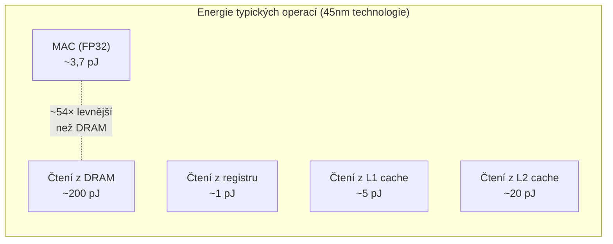

**Hierarchie paměti a cena přístupu:**

| Úroveň paměti | Typická energie/přístup | Relativní cena |
|---|---|---|
| Registrový soubor | ~1 pJ | 1× |
| L1 SRAM (on-chip) | ~5 pJ | 5× |
| L2 SRAM (on-chip) | ~20 pJ | 20× |
| DRAM (off-chip) | ~200 pJ | 200× |

Z toho plyne: pokud musíme každou váhu načítat z DRAM, zaplatíme 200 pJ za přístup, přičemž samotné násobení stojí ~3,7 pJ. **Pohyb dat dominuje energii > 50× oproti výpočtu.**

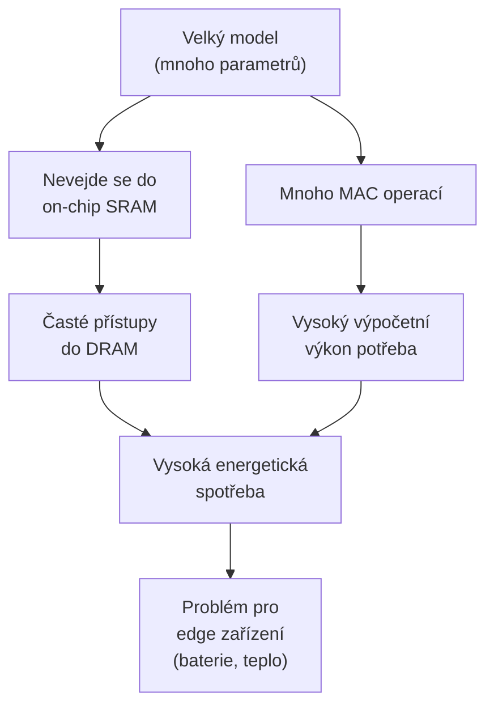

---

### Příklad výpočtu výdrže baterie

**Zadání:** kamera 20 fps, každý frame inference = $200 \times 10^9$ operací, energie/operaci = $0{,}2$ pJ, baterie 2 Wh.

**Krok za krokem:**

$$\text{Operací za sekundu} = 20\,\text{fps} \times 200 \times 10^9\,\frac{\text{ops}}{\text{frame}} = 4 \times 10^{12}\,\frac{\text{ops}}{\text{s}}$$

$$\text{Příkon} = 4 \times 10^{12}\,\frac{\text{ops}}{\text{s}} \times 0{,}2 \times 10^{-12}\,\frac{\text{J}}{\text{op}} = 0{,}8\,\text{W}$$

$$\text{Kapacita baterie} = 2\,\text{Wh} = 2 \times 3600\,\text{J} = 7200\,\text{J}$$

$$\text{Doba provozu} = \frac{7200\,\text{J}}{0{,}8\,\text{W}} = 9000\,\text{s} \approx 150\,\text{min} \approx \boxed{2{,}5\,\text{hodiny}}$$

**Co z toho plyne?** Zlepšení energie na operaci o 10× by prodloužilo výdrž na 25 hodin – proto je energetická efektivita hardware klíčová.

---

## 2. HW akcelerátory pro inferenci

### Srovnání typů akcelerátorů

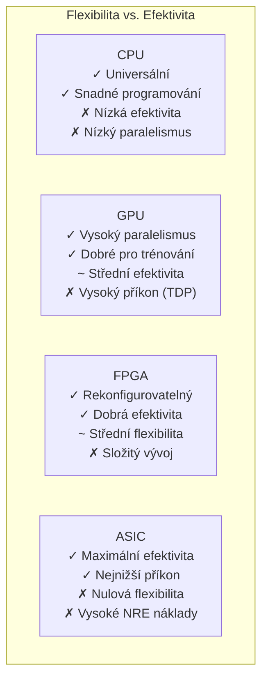

**Detailnější srovnání:**

| Vlastnost | CPU | GPU | FPGA | ASIC |
|---|---|---|---|---|
| Výkon (TOPS) | 0,1–10 | 10–1000 | 1–100 | 10–1000 |
| Efektivita (TOPS/W) | 0,1–1 | 1–10 | 5–50 | 10–100 |
| Flexibilita | ★★★★★ | ★★★★☆ | ★★★☆☆ | ★☆☆☆☆ |
| Vývojová náročnost | ★☆☆☆☆ | ★★☆☆☆ | ★★★★☆ | ★★★★★ |
| NRE náklady | Nízké | Střední | Střední | Velmi vysoké |
| Time-to-market | Dny | Dny | Týdny | Roky |

**NRE** = Non-Recurring Engineering – jednorázové náklady na vývoj čipu (desítky až stovky milionů USD pro 5nm ASIC).

---

### Systolické pole (Systolic Array)

Systolické pole je pravidelná mřížka **procesních elementů (PE)**, kde data „tečou" synchronizovaně z jednoho PE do druhého jako krev v cévách (odtud název – *systole* = srdeční stah).

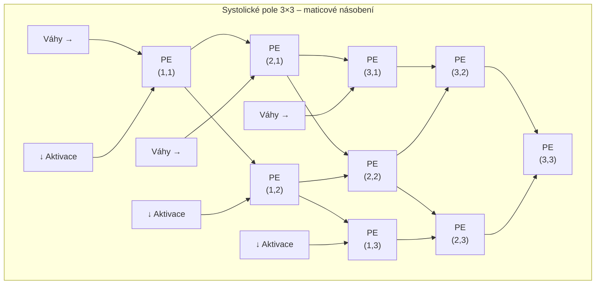

Každý PE provede jednu MAC operaci a předá výsledek sousedovi – **žádný PE nepotřebuje přístup do centrální paměti**, vše přichází od sousedů. To dramaticky snižuje energii.

---

### Datové toky (Dataflow) v akcelerátorech

Klíčová otázka: **Co se drží (stacionárně) v lokální paměti PE?**

```mermaid
flowchart TD
    subgraph WS["Weight-Stationary (WS)"]
        WS1["Váhy načteny</br>jednou do PE"] --> WS2["Aktivace proudí</br>skrz PE"] --> WS3["Váhy se</br>znova nenačítají"]
        WS3 -->|"Výhoda"| WS4["Minimalizuje</br>pohyb vah"]
    end
    subgraph OS["Output-Stationary (OS)"]
        OS1["Částečné součty</br>drží se v PE"] --> OS2["Váhy i aktivace</br>proudí skrz"] --> OS3["Akumulace</br>probíhá lokálně"]
        OS3 -->|"Výhoda"| OS4["Minimalizuje</br>pohyb partial sums"]
    end
    subgraph RS["Row-Stationary (Eyeriss)"]
        RS1["Celý řádek</br>konvoluce v PE"] --> RS2["Maximalizuje</br>reuse všeho"] --> RS3["Komplexnější</br>řízení"]
        RS3 -->|"Výhoda"| RS4["Nejlepší celkový</br>reuse"]
    end
```

**Proč záleží na výběru dataflow?** Každý přístup optimalizuje jiný typ pohybu dat:

| Dataflow | Minimalizuje | Vhodné pro |
|---|---|---|
| Weight-Stationary | Pohyb vah | Velké filtry, malé vstupy |
| Output-Stationary | Pohyb partial sums | Velké výstupní mapy |
| Activation-Stationary | Pohyb aktivací | Batch inference |
| Row-Stationary (RS) | Celkový pohyb dat | Obecné CNN (Eyeriss) |

---

### Příklady akcelerátorů

#### Google TPU (Tensor Processing Unit)

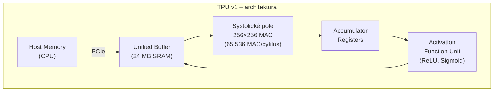

- **Systolické pole 256×256:** 65 536 MAC operací za jeden cyklus
- **Weight-stationary dataflow:** váhy se načtou jednou a zůstávají
- **Cíl:** velká propustnost pro batch inferenci v datovém centru
- **TPUv1:** 92 TOPS, 40 W → 2,3 TOPS/W

#### Eyeriss (MIT)

- **Row-Stationary dataflow:** každý PE zpracovává jeden řádek konvoluce
- Minimalizuje celkový pohyb dat (váhy + aktivace + partial sums)
- Prostorová architektura: 12×14 = 168 PE
- Navržen pro mobilní a edge aplikace

#### Cerebras WSE (Wafer Scale Engine)

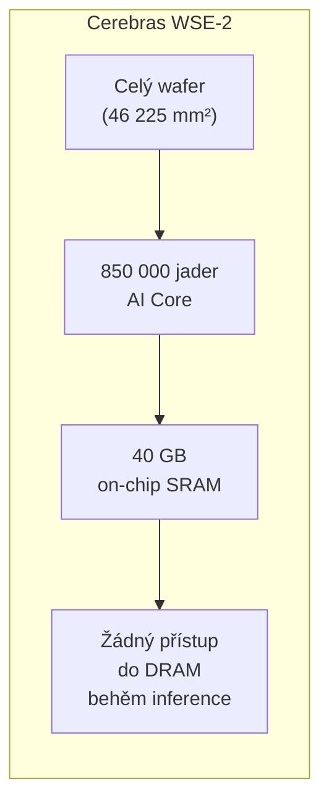

- **Wafer-scale integration:** celý křemíkový wafer jako jeden čip
- **On-chip SRAM:** 40 GB – celý model GPT-3 (175B parametrů v INT8 ≈ 175 GB) se nevejde, ale menší modely ano
- Eliminuje DRAM bottleneck
- Cena: extrémně vysoká

---

## 3. Modelové optimalizace pro nízkou spotřebu

### Kvantizace

Kvantizace redukuje přesnost číselné reprezentace parametrů z FP32 na menší datový typ.

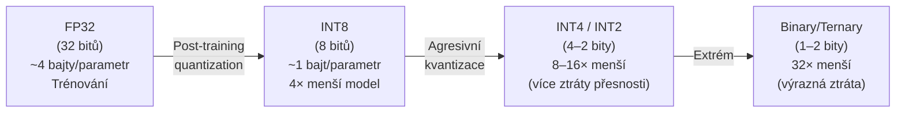

**Princip afinní kvantizace:**

Zobrazujeme reálnou hodnotu $x$ z FP32 v intervalu $\langle \beta, \alpha \rangle$ na číslo $Q$ v pevném bodě (např. FX8/INT8 se znaménkem), přičemž 0 se zobrazí obecně na $z$. Přesnost INT8 je $b = 8$ bitů.

Základem je afinní transformace:
$$f(x) = s \cdot x + z$$

Parametry transformace se vypočítají následovně:
* **Měřítko (Scale):** $$s = \frac{2^b - 1}{\alpha - \beta}$$
* **Posun nuly (Zero):** $$z = -\text{round}(\beta \cdot s) - 2^{b-1}$$

Výsledná kvantovaná hodnota se získá zaokrouhlením a oříznutím (clipping) do rozsahu cílového datového typu:
$$Q = \text{clip}(\text{round}(f(x)), -2^{b-1}, 2^{b-1} - 1)$$

Kde funkce oříznutí je definována jako:
$$\text{clip}(x, \beta, \alpha) = \begin{cases} \beta, & x < \beta \\ x, & \beta \le x \le \alpha \\ \alpha, & x > \alpha \end{cases}$$

**Příklad výpočtu:**

Mějme hodnotu $x = 1$, přesnost $b = 8$ bitů a rozsah původních hodnot $\beta = -3$, $\alpha = 4$.

1.  Výpočet měřítka:
    $$s = \frac{2^8 - 1}{4 - (-3)} = \frac{255}{7} = 36,43$$
2.  Výpočet posunu nuly:
    $$z = -\text{round}(-3 \cdot 36,43) - 128 = -\text{round}(-109,29) - 128 = 109 - 128 = -19$$
3.  Aplikace afinní transformace:
    $$f(1) = 36,43 \cdot 1 + (-19) = 17,43$$
4.  Získání finální hodnoty $Q$:
    $$Q(x = 1) = \text{clip}(\text{round}(17,43), -128, 127) = 17$$

**Výhody INT8 oproti FP32:**
- 4× menší paměťové nároky → více vah v cache
- 4× nižší šířka pásma paměti
- MAC v INT8 je ~4–8× energeticky levnější než FP32
- Ztráta přesnosti typicky < 1 % pro standardní CNN

---

### Pruning (prořezávání)

Pruning odstraňuje nadbytečné parametry nebo celé struktury modelu. Většina vah v trénovaných DNN je blízká nule – jsou redundantní.

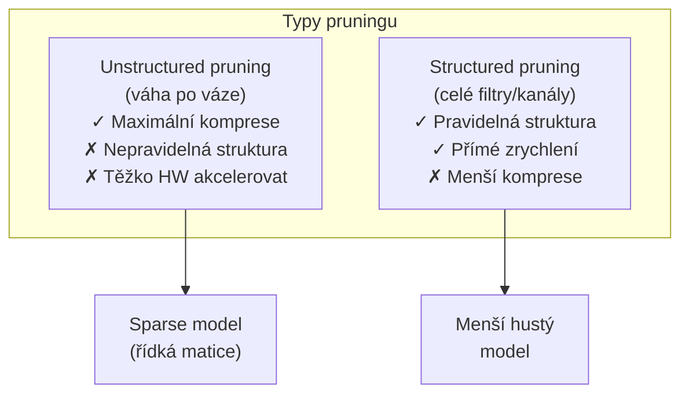

**Iterativní magnitude pruning:**
1. Trénovat model do konvergence
2. Odstranit váhy s nejmenší absolutní hodnotou (pod prahem)
3. Dotrénovat (fine-tune) zbývající váhy
4. Opakovat dokud přesnost neklesne pod limit

**Výsledky:** ResNet-50 lze pruningem zmenšit o 90 % vah se ztrátou < 1 % přesnosti (lottery ticket hypothesis).

---

### Sdílení vah (Weight Sharing)

Místo ukládání každé váhy zvlášť se používá **kodebook** (slovník) s omezeným počtem hodnot. Každá váha je pak jen index do kodebooku.

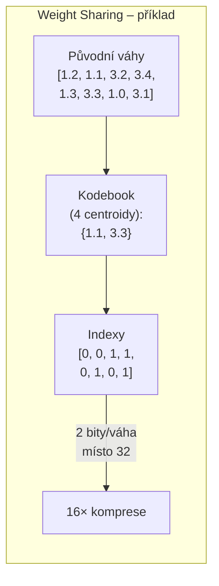

Kombinace **kvantizace + pruning + weight sharing** (Han et al., 2015 – „Deep Compression"):
- VGG-16: 552 MB → 11,3 MB (**49× komprese**) bez ztráty přesnosti
- Kombinace: pruning (9×) → kvantizace (4×) → Huffman kódování (1,4×)

---

### Aproximace aritmetiky

Místo přesného násobení se používají zjednodušené (approximate) obvody, které jsou rychlejší a méně energeticky náročné, ale produkují mírně nesprávné výsledky.

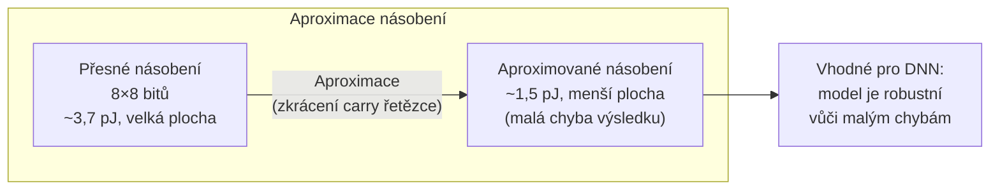

**Kdy je aproximace vhodná:**
- Inference (ne trénování) – gradient nemusí být přesný
- Modely s ReLU aktivací jsou přirozeně odolné vůči malým šumům
- Aplikace kde přesnost není kritická (detekce objektů, klasifikace)

**Kdy NENÍ vhodná:**
- Lékařská diagnostika (přesnost je kritická)
- Trénování modelu (chyby se akumulují)
- Kryptografie a bezpečnostní aplikace

---

### Plán optimalizace CNN pro edge zařízení

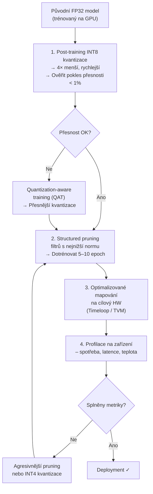

---

## 4. Nástroje a kompilátory / HW-SW codesign

### Timeloop a Accelergy

Tyto nástroje řeší klíčový problém: **jak nejlépe mapovat DNN vrstvu na konkrétní HW architekturu?**

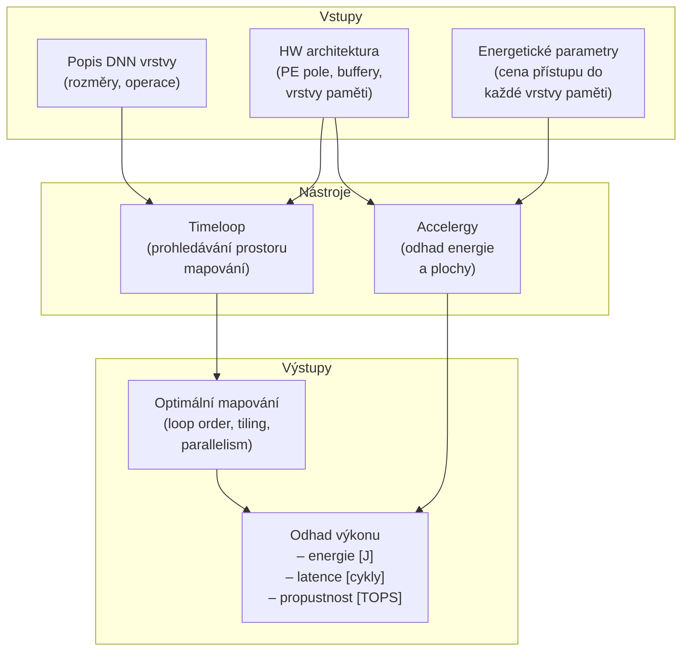

**Co je „mapování" (mapping)?**

Pro konvoluční vrstvu existuje 7 dimenzí (N, C, K, R, S, P, Q) – každou lze tileovat a přiřadit k jiné vrstvě paměti nebo PE. Prostor mapování má $> 10^{30}$ možností. Timeloop tento prostor prohledává heuristicky nebo exhaustivně pro malé případy.

**Příklad: vliv mapování na energii**

| Mapování | DRAM přístupy | Energie | Faktor |
|---|---|---|---|
| Náhodné (špatné) | 100× více | 1000 pJ | 10× horší |
| Optimalizované | Minimální | 100 pJ | 1× |

---

### Scheduling a jeho vliv na latenci

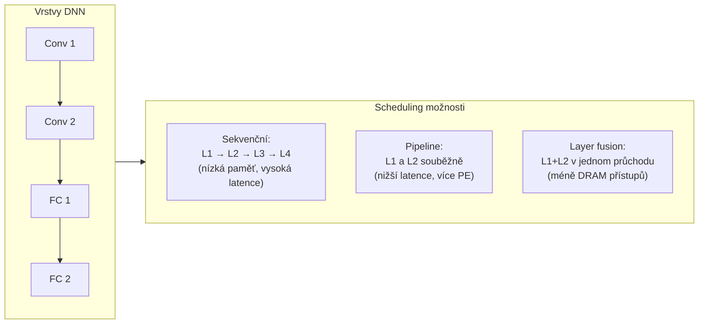

**Layer fusion** (slití vrstev) je zvlášť důležité: místo zápisu mezivýsledku Conv1 do DRAM a jeho opětovného čtení pro Conv2 se celý výpočet provede „in-flight" v on-chip bufferu. Úspora energie může být 10–50×.

---

## 5. Metriky a příklady nasazení

### Klíčové metriky

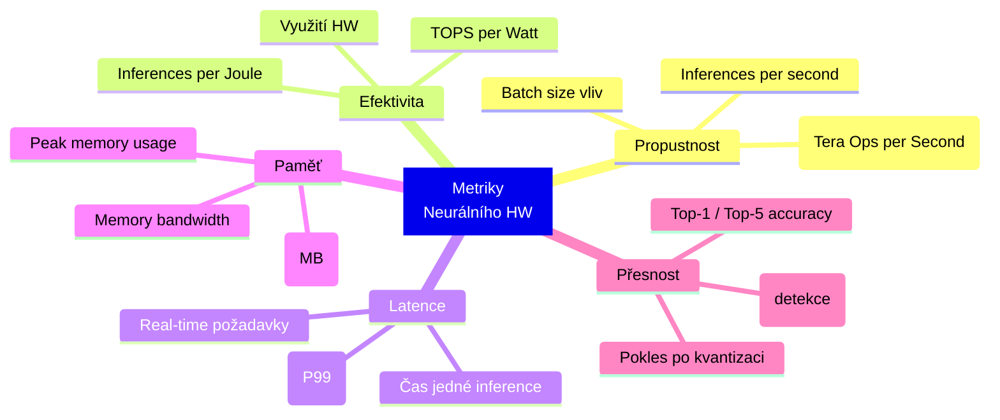

**Kdy je která metrika klíčová:**

| Scénář | Primární metrika | Sekundární |
|---|---|---|
| Cloudová inference (batch) | Inferences/sec (propustnost) | TOPS/W (cena energie) |
| Autonomní vozidlo | Latence (< 10 ms) | Inferences/sec |
| Chytré hodinky | Inferences/W (výdrž baterie) | Latence |
| Průmyslový senzor | Latence + spolehlivost | Paměťové nároky |
| Mobilní telefon | Inferences/W + latence | Model size |

**Vztahy mezi metrikami:**

$$\text{Inferences/W} = \frac{\text{Inferences/s}}{\text{Příkon [W]}}$$

$$\text{Efektivita} [\text{TOPS/W}] = \frac{\text{MACs/inference} \times \text{Inferences/s}}{10^{12} \times \text{Příkon [W]}}$$

---

### Návrh edge zařízení – příklad plánování

**Scénář:** chytrý termostat s kamerou – detekce přítomnosti osoby, výdrž baterie > 8 hodin.

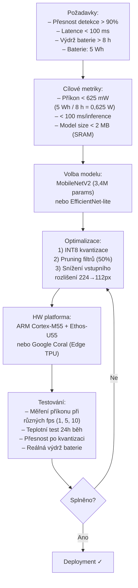

**Výpočet cílového příkonu:**

$$P_{max} = \frac{\text{kapacita baterie}}{\text{požadovaná výdrž}} = \frac{5\,\text{Wh}}{8\,\text{h}} = 0{,}625\,\text{W}$$

**Testovací plán:**

| Test | Co měříme | Postup |
|---|---|---|
| Funkční test | Přesnost po kvantizaci | Benchmark na validační sadě |
| Výkonnostní test | Latence při různém fps | Profilace na cílovém HW |
| Energetický test | Příkon při reálné zátěži | Měření proudu + napětí |
| Tepelný test | Stabilita při dlouhém běhu | 24h kontinuální inference |
| Bateriový test | Skutečná výdrž | Nabití → plný provoz → vybití |
| Regresní test | Přesnost vs. komprese | Porovnání FP32 vs. INT8 vs. INT4 |

---

## Shrnutí: Propojení konceptů

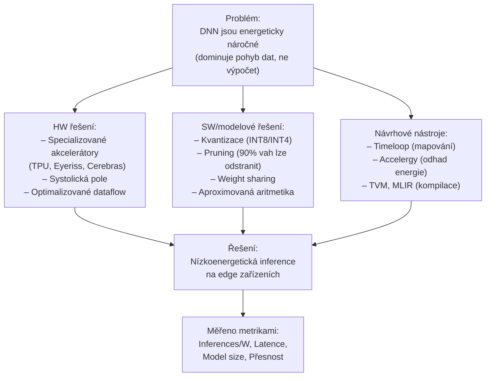

---

## Rychlý přehled – Cheatsheet

| Téma | Klíčová čísla / fakta |
|---|---|
| DRAM vs. MAC energie | DRAM: ~200 pJ, MAC FP32: ~3,7 pJ → DRAM je **54× dražší** |
| Výpočtová náročnost | 20 fps × 200G ops × 0,2 pJ = **0,8 W** |
| Kvantizace INT8 | 4× menší model, 4–8× levnější MAC, < 1% ztráta přesnosti |
| Deep Compression | VGG-16: 552 MB → 11,3 MB (**49× komprese**) |
| Systolické pole TPU | 256×256 MAC = **65 536 MAC/cyklus** |
| Weight-stationary | Minimalizuje pohyb **vah** (vhodné pro velké filtry) |
| Row-stationary (Eyeriss) | Minimalizuje **celkový** pohyb dat |
| Timeloop | Prohledávání prostoru mapování > $10^{30}$ možností |
| Edge vs. Cloud | Edge: priorita Inferences/W a latence; Cloud: propustnost |