# Nanotechnologie v kontextu bio-inspirovaných počítačů

## 1. Rozsah nanoškály a přístroje

### Co je nanoškála a proč záleží?

Nanotechnologie pracuje s objekty v rozsahu přibližně **1–100 nanometrů** (1 nm = 10⁻⁹ m). Pro srovnání: průměr lidského vlasu je ~80 000 nm, takže hovoříme o světě, kde se klasická fyzika začíná prolínat s kvantovou mechanikou.

Na této škále se mění fundamentální vlastnosti materiálů – elektrická vodivost, optické vlastnosti, mechanická pevnost. Proto nanosoučástky mohou nabízet vlastnosti, které jsou na makroúrovni nedosažitelné.

**Příklady přírodních nanosystémů:**

| Struktura | Přibližná velikost | Funkce |
|---|---|---|
| DNA (dvoušroubovice) | ~2 nm průměr | Uchovávání genetické informace |
| Protein (malý) | ~5–10 nm | Enzymatická katalýza, strukturální role |
| ATP syntáza | ~10 nm | Molekulární motor, syntéza ATP |
| Uhlíková nanotrubička (CNT) | průměr ~1–10 nm | Elektrická vodivost, mechanická pevnost |
| Ribozóm | ~25 nm | Syntéza proteinů |

Tyto příklady ukazují, že příroda zvládá vysoce funkční systémy na molekulární úrovni s obrovskou hustotou integrace a velmi nízkou spotřebou energie – právě to je inspirací pro nanotechnologický výzkum.

---

### STM – Rastrovací tunelová mikroskopie

**Princip:** STM (Scanning Tunneling Microscope) využívá kvantový jev **tunelování elektronů**. Velmi ostrý kovový hrot se přiblíží k povrchu na vzdálenost ~0,5–1 nm. Přestože hrot a povrch se fyzicky nedotýkají, elektrony mohou tunelovat přes vakuovou mezeru, pokud je přiloženo malé napětí.

Klíčová vlastnost: tunelový proud $I$ závisí **exponenciálně** na vzdálenosti $d$:

$$I \propto e^{-\kappa d}$$

kde $\kappa$ je konstanta závislá na výstupní práci elektronu. Změna vzdálenosti o pouhý 1 Å (0,1 nm) změní proud přibližně o řád. Díky tomu je STM extrémně citlivé na topografii povrchu – dosahuje **sub-atomárního rozlišení**.

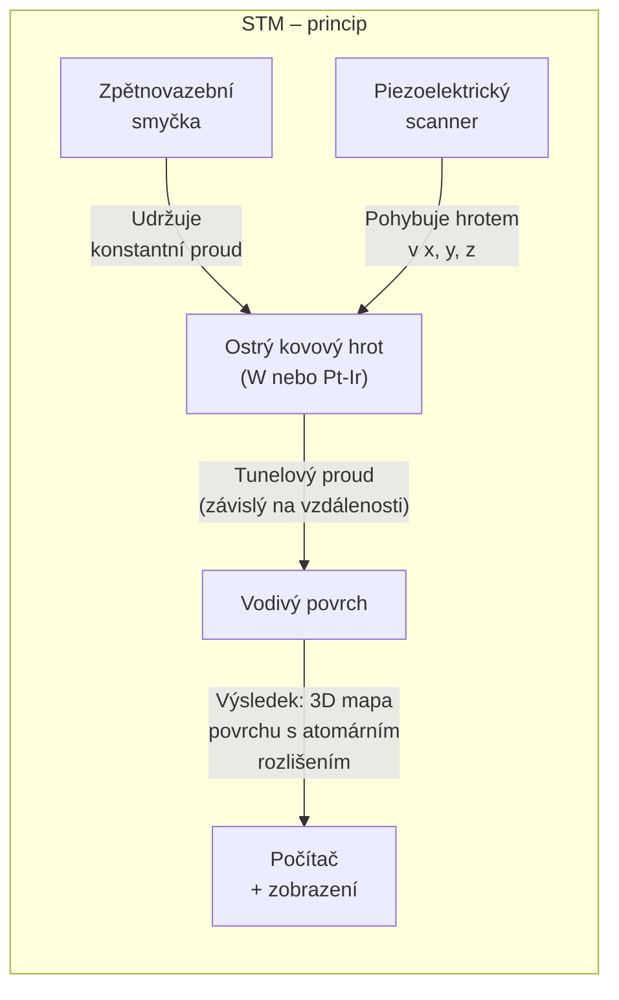

**Manipulace s atomy:** STM lze použít nejen ke zobrazení, ale i k manipulaci – přiložením silnějšího pulzu napětí lze atomy přemístit. Slavný příklad: IBM (1989) poskládal logo „IBM" z 35 atomů xenonu.

**Omezení:** STM funguje jen na **vodivých** površích (nutný tunelový proud).

---

### AFM – Mikroskopie atomových sil

**Princip:** AFM (Atomic Force Microscope) měří **síly** mezi hrotem a povrchem, nikoliv elektrický proud. Hrot je umístěn na konci pružného raménka (**cantilever**). Jak hrot skenuje povrch, síly (van der Waalsovy, elektrostatické, kapilární) způsobují ohýbání cantilevu. Toto ohýbání se měří laserovým paprskem odraženým do polohovacího detektoru.

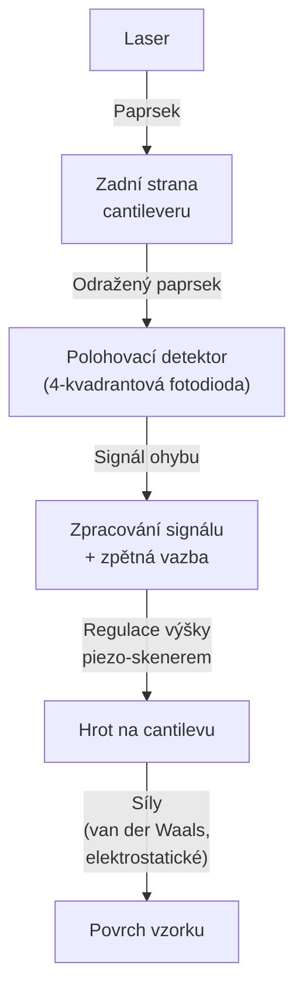

**Výhody AFM oproti STM:**
- Funguje na **nevodivých** površích (biologické vzorky, polymery, oxidy)
- Lze měřit v kapalném prostředí (biologické aplikace)
- Různé módy: kontaktní, bezkontaktní, poklepový (tapping)

**Srovnání STM vs. AFM:**

| Vlastnost | STM | AFM |
|---|---|---|
| Měřená veličina | Tunelový proud | Síla (ohyb cantilevu) |
| Požadavky na vzorek | Musí být vodivý | Libovolný materiál |
| Typické rozlišení | Sub-atomární | Atomární až nm |
| Manipulace s atomy | Ano (napěťový puls) | Omezeně (kontaktní mód) |
| Prostředí | Vakuum, vzduch | Vakuum, vzduch, kapalina |

---

## 2. Přístupy k výrobě: shora-dolů vs. zdola-nahoru

### Top-down (shora dolů)

**Filosofie:** Začínáme s kusem materiálu (obvykle křemíkový wafer) a postupně odstraňujeme/upravujeme materiál, dokud nezískáme požadovanou strukturu.

**Klíčové techniky:**
- **Fotolitografie** – UV světlo přes masku exponuje fotorezist, definuje vzory
- **Elektronová litografie (EBL)** – elektron-beam pro submikronové struktury
- **Leptání** (mokré/suché) – odstraňování materiálu podle masek
- **Depozice** (CVD, PVD, ALD) – přidávání vrstev materiálu

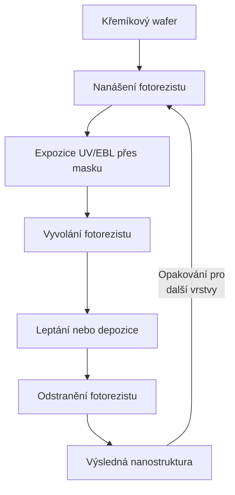

**Výhody:**
- Průmyslově ověřené, masová výroba
- Přesná kontrola polohy a rozměrů
- Kompatibilní s existující CMOS infrastrukturou

**Nevýhody:**
- Fyzikální limity miniaturizace (difrakce světla, atomová hrubost)
- Extrémně drahé vybavení (EUV litografie > 100 milionů USD/stroj)
- Rostoucí poměr plochy okrajů k objemu způsobuje nové efekty

---

### Bottom-up (zdola nahoru)

**Filosofie:** Stavíme nanostruktury „atom po atomu" nebo využíváme schopnost molekul **samoorganizace** (self-assembly) – spontánního uspořádání do cílených struktur.

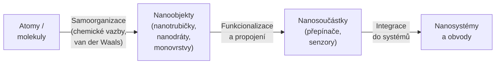

**Příklady samoorganizujících se systémů:**
- **Samousořádávající monovrstvy (SAM)** – thioly na zlatém povrchu
- **DNA origami** – skládání DNA do 2D/3D struktur jako scaffold
- **CNT růst katalytickými částicemi** – nanotrubičky rostou z Fe/Ni/Co katalyzátorů

**Výhody:**
- Extrémně malé rozměry (sub-nm)
- Masová paralelizace (miliony struktur najednou)
- Potenciálně velmi levné

**Nevýhody a výzvy:**
- **Přesné umístění** – těžko kontrolovat, kde přesně vznikne struktura
- **Orientace** – nanotrubičky rostou různými směry
- **Defekty a variabilita** – každá struktura je trochu jiná
- **Adresování** – jak se dostat ke konkrétní nanosoučástce z makrosvěta
- **Propojení** – rozhraní nano ↔ makro je fundamentální problém

---

## 3. Molekulární elektronika a CNFET

### Uhlíkové nanotrubičky (CNT) – základ CNFET

Uhlíkové nanotrubičky jsou válcové struktury z grafenu (hexagonální síť uhlíku) s průměrem ~1–10 nm a délkami až mikrometry. Mají výjimečné vlastnosti:

- **Elektrická pohyblivost nosičů** – až 100× vyšší než v křemíku
- **Mechanická pevnost** – jedno z nejpevnějších materiálů
- **Tepelná vodivost** – velmi vysoká

**Důležité:** CNT mohou být buď **kovové** (vedou jako vodič) nebo **polovodičové** (lze řídit gate elektrodou), v závislosti na způsobu stočení grafenové vrstvy (chiralita).

### CNFET – Carbon Nanotube Field Effect Transistor

CNFET je tranzistor, kde kanál mezi source a drain tvoří jedna nebo více uhlíkových nanotrubiček místo křemíkového kanálu.

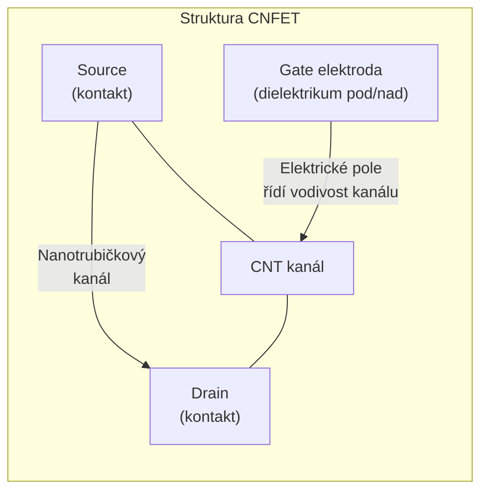

**Proč CNFET slibuje výhody oproti Si-MOSFET:**

| Vlastnost | Si-MOSFET | CNFET |
|---|---|---|
| Pohyblivost elektronů | ~1400 cm²/Vs | ~10 000+ cm²/Vs |
| Rozměry kanálu | ~5–10 nm (limity) | ~1–2 nm přirozeně |
| Spotřeba energie | Referenční | Potenciálně nižší |
| Subthreshold swing | ~60 mV/dec (klasický limit) | Blíže limitu |
| Kompatibilita s CMOS | — | Částečně kompatibilní |

**Praktické problémy výroby CNFET:**

1. **Kovové nanotrubičky** – ~30 % syntetizovaných CNT je kovových místo polovodičových; kovové CNT zkratují kanál a zničí funkci tranzistoru. Řešení: selektivní depozice, elektrické „vypalování" kovových CNT, třídění v roztoku.

2. **Přesné umístění** – CNT musí ležet přesně mezi source a drain. Řeší se: dielektroforéza, chemická funkcionalizace povrchu, litografické vzory jako „vodicí dráhy".

3. **Variabilita** – každý CNFET má trochu jiné parametry (chiralita, délka, přítomnost defektů). To komplikuje návrh velkých obvodů.

4. **Adresovatelnost ve velkém měřítku** – přechod od jednoho CNFET k obvodům s miliony tranzistorů je technologicky náročný.

---

## 4. Kvantové celulární automaty (QCA)

### Princip QCA

QCA (Quantum-dot Cellular Automata) je radikálně jiný přístup k výpočtům než tranzistorová logika. Místo proudu jako nosiče informace se používá **poloha elektronu** (polarizace buňky).

**Základní buňka QCA** obsahuje:
- 4 kvantové tečky (quantum dots) uspořádané do čtverce
- 2 elektrony, které obsadí 2 ze 4 teček
- Elektrony se odpuzují (Coulombova interakce) → zaujmou protilehlé rohy

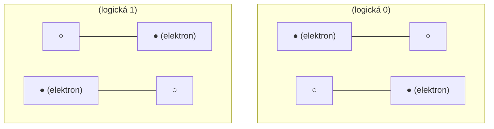

Sousední buňky se elektrostaticky ovlivňují – polarizace jedné buňky nutí sousední buňku přijmout stejnou polarizaci (paralelní uspořádání) nebo opačnou (invertující uspořádání). Takto se informace **šíří bez klasického proudu**.

---

### QCA vodič (Information Wire)

Řetězec buněk se stejnou orientací tvoří vodič – polarizace se propaguje podél řetězce:

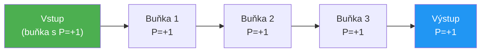

**Ohyb vodiče o 90°** se realizuje buňkou otočenou o 45° – tzv. „rohová buňka".

---

### QCA majoritní hradlo

Majoritní hradlo (Majority Gate) je základní logický prvek QCA. Má 3 vstupy (A, B, C) a jeden výstup:

$$Y = \text{majority}(A, B, C) = AB + BC + AC$$

Výstup je ten bit, který se vyskytuje mezi vstupy **nejčastěji**.

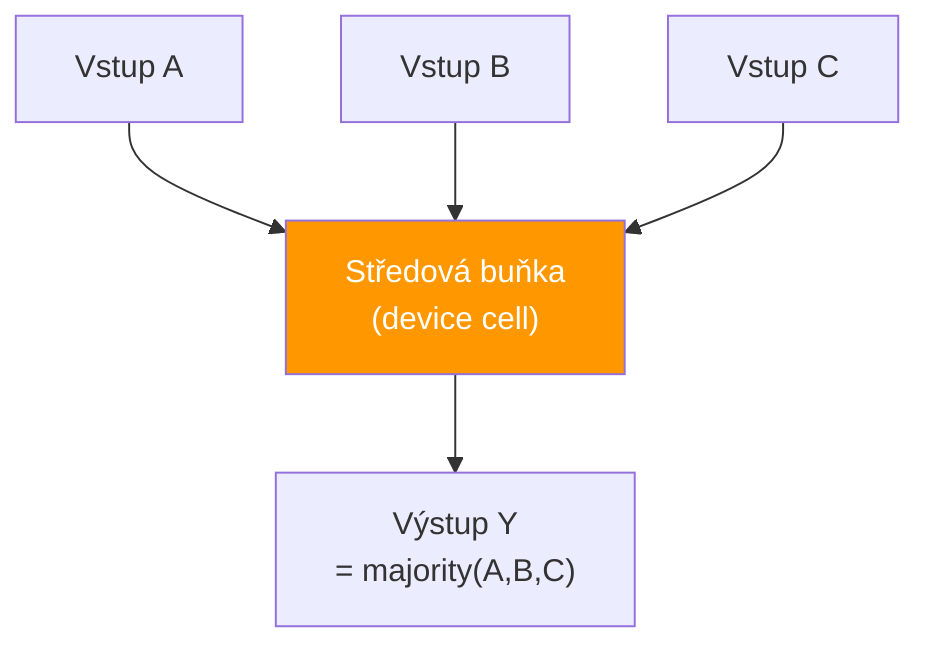

**Příklady:**

| A | B | C | Y = maj(A,B,C) | Zdůvodnění |
|---|---|---|---|---|
| 0 | 0 | 1 | **0** | dvě 0, jedna 1 → převládá 0 |
| 1 | 0 | 1 | **1** | dvě 1, jedna 0 → převládá 1 |
| 1 | 1 | 0 | **1** | dvě 1, jedna 0 → převládá 1 |
| 0 | 0 | 0 | **0** | všechna 0 |
| 1 | 1 | 1 | **1** | všechna 1 |

**Realizace AND a OR pomocí majoritního hradla:**

Jeden vstup lze „přibít" (fixovat) na konstantní hodnotu:
- Fixovat C = 0 → $Y = \text{maj}(A, B, 0) = AB$ = **AND**
- Fixovat C = 1 → $Y = \text{maj}(A, B, 1) = A + B$ = **OR**

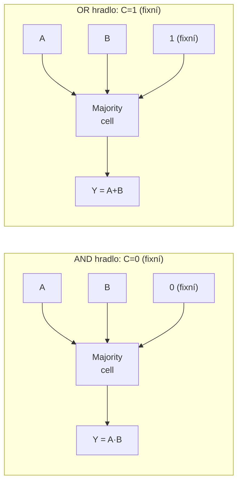

**Invertor (NOT):** Realizuje se pomocí buněk natočených o 45°, kde sousední buňka přebírá opačnou polarizaci.

---

### Výhody a výzvy QCA

**Výhody:**
- Extrémně vysoká hustota integrace (buňky ~20 nm)
- Výpočty bez klasického proudu → teoreticky velmi nízká disipace
- Rychlé šíření polarizace (blíží se rychlosti světla v materiálu)

**Výzvy:**
- Praktická realizace vyžaduje kryogenní teploty (molekulární QCA slibují pokojové teploty)
- Výroba s atomární přesností
- Propojení s klasickými obvody (I/O rozhraní)
- Variabilita a spolehlivost

---

## 5. Molekulární přepínače, in-memory a syntetická biologie

### Pole molekulárních přepínačů

Molekulární přepínač je molekula, která může přepínat mezi dvěma stabilními stavy (např. dvě konformace, dvě oxidační stadia) pod vlivem elektrického pole, světla nebo chemické reakce.

**Příklad – křížová mřížka (crossbar array):**

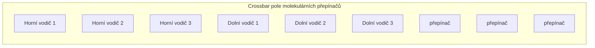

V každém průsečíku horního a dolního vodiče sedí molekulární přepínač. Přiložením napětí na zvolený horní + dolní vodič lze individuálně adresovat a přepínat konkrétní molekuly. Hustota integrace je extrémně vysoká.

**In-memory computing (výpočty v paměti):**

Tradiční architektury (von Neumann) mají **paměť oddělenou od procesoru** – přenos dat mezi nimi je energeticky nákladný a tvoří úzké hrdlo (memory wall). Molekulární přepínače a **memristory** umožňují kombinovat paměť a výpočet na jednom místě.

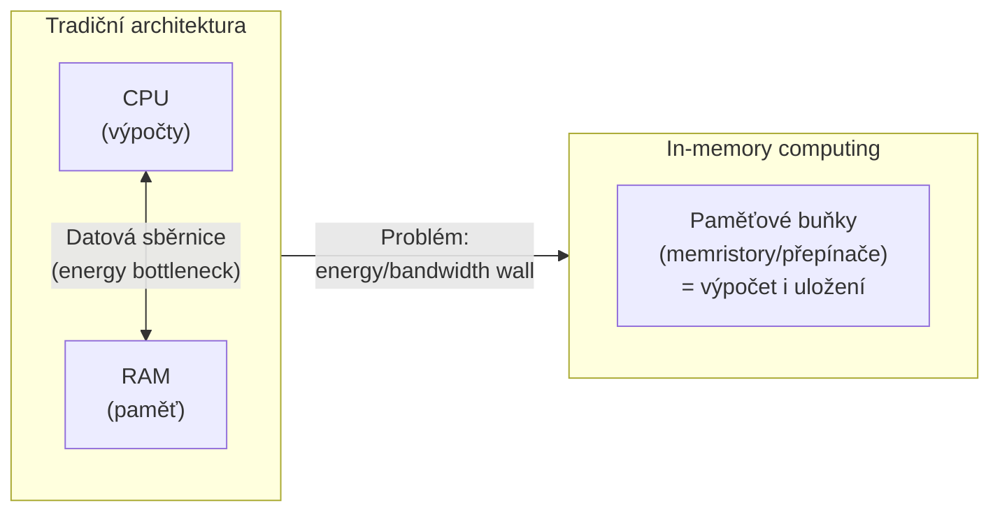

**Kdy dává smysl in-memory přístup:**
- Neuronové sítě (maticové násobení přímo v paměti)
- Zpracování velkých dat (genomika, databáze)
- Hraniční zařízení (edge AI) s nízkým příkonem

---

### Mikrofluidika a syntetická biologie

**Mikrofluidické biočipy** manipulují s extrémně malými objemy kapalin (nanolitry až pikolitry) v mikrokanálcích. Výhody: rychlé reakce, malá spotřeba reagentů, paralelizace.

**Syntetická biologie** navrhuje genetické obvody v živých buňkách pomocí standardizovaných genetických „součástek" (promotory, represory, reportéry). Buňka pak provádí výpočet prostřednictvím genové exprese.

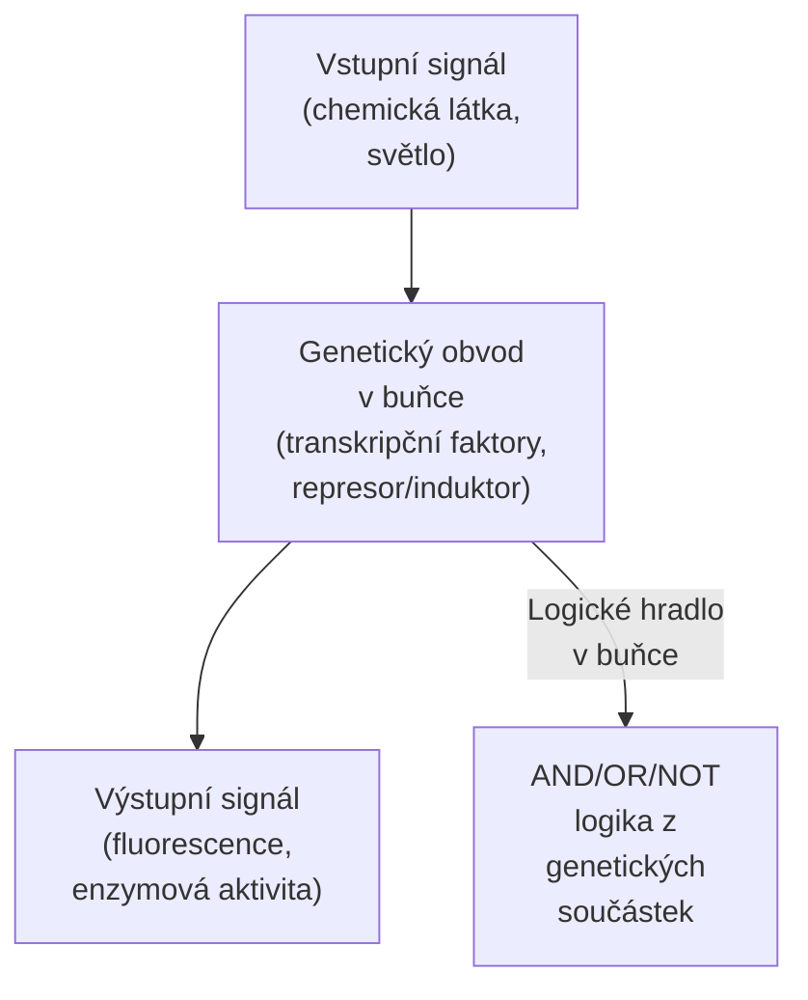

**Kombinace mikrofluidiky + syntetické biologie:**
- Automatizované molekulární protokoly (PCR, syntéza DNA, diagnostika)
- Biosenzory – buňky reagující na přítomnost toxinu/patogenu výstupním signálem
- DNA computing – výpočty s molekulami DNA v roztoku

---

## 6. Výzvy: spolehlivost, adresování a rozhraní

### Propojení nanosvěta s makrosvětem

Největší praktický problém nanotechnologií je **impedance měřítek** – jak komunikovat s objektem o rozměru 2 nm z makroskopického přístroje.

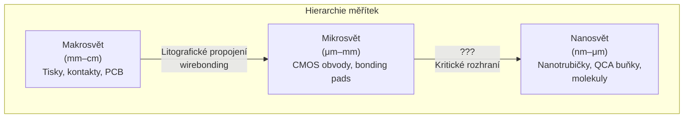

**Strategie adresování:**

| Strategie | Princip | Příklad |
|---|---|---|
| Hierarchické adresování | Makro → mikro → nano ve vrstvách | CMOS + nanodrátová mřížka |
| Multiplexing | 1 makrovodič adresuje N nanosoučástek | Crossbar s demultiplexerem |
| Samoorganizující se adresování | Molekuly se samy připojí na správné místo | DNA-directed assembly |
| Elektrické mapování | Přečtení funkčnosti po výrobě, obejití vadných | FPGA-like konfigurace |

---

### Výrobní tolerance a variabilita

Nanosoučástky trpí inherentní variabilitou – každá je trochu jiná kvůli atomistické povaze materiálů.

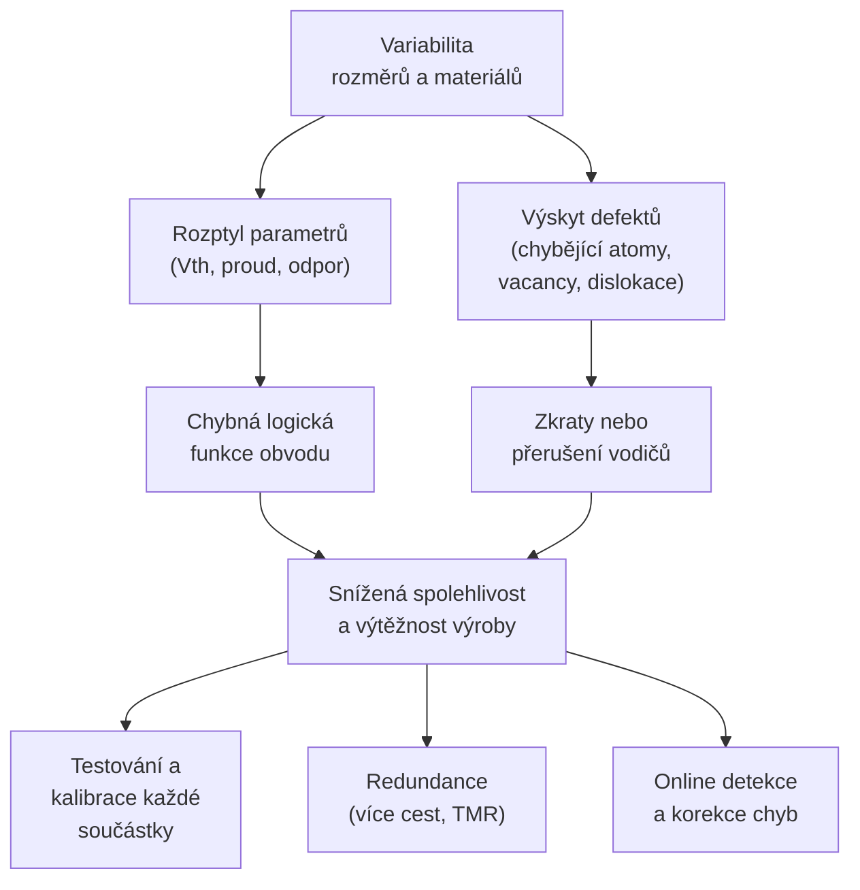

**Triple Modular Redundancy (TMR):** Tři identické obvody zpracují stejný vstup, výsledek se rozhodne majoritním hlasováním – i při výpadku jednoho obvodu je výsledek správný.

---

## 7. Reverzibilita a logické brány

### Co je logická reverzibilita?

Klasická logická hradla (AND, OR, NAND) jsou **ireverzibilní** – z výstupu nelze jednoznačně rekonstruovat vstupy. Například AND(0,1) = AND(1,0) = AND(0,0) = 0 → z výstupu 0 nevíme, jaké vstupy vstoupily.

**Logicky reverzibilní** hradlo má bijektivní mapování: každý výstup odpovídá přesně jedné kombinaci vstupů, tedy lze zpětně rekonstruovat vstupy z výstupů.

**Landauerův princip (1961):** Každá logická operace, která **maže informaci** (ireverzibilní), musí disipovat alespoň $k_B T \ln 2$ energie. Při pokojové teplotě je to ~$2.8 \times 10^{-21}$ J na bit – zdánlivě malé, ale při miliardách operací za sekundu to může být limitující.

Reverzibilní logika tento limit obchází – pokud informace nezanikne, nemusí být nutně disipována energie.

---

### Toffoliho hradlo (CCNOT)

**Controlled-Controlled-NOT** – třívstupové, třívýstupové hradlo.

| Vstupy (A, B, C) | Výstupy (A', B', C') |
|---|---|
| A, B, C | A, B, C XOR (A AND B) |

- Vstupy A, B se přenáší beze změny na výstupy A', B'
- Výstup C' = C XOR (A AND B) – pokud A=1 a B=1, C se invertuje; jinak se přenáší

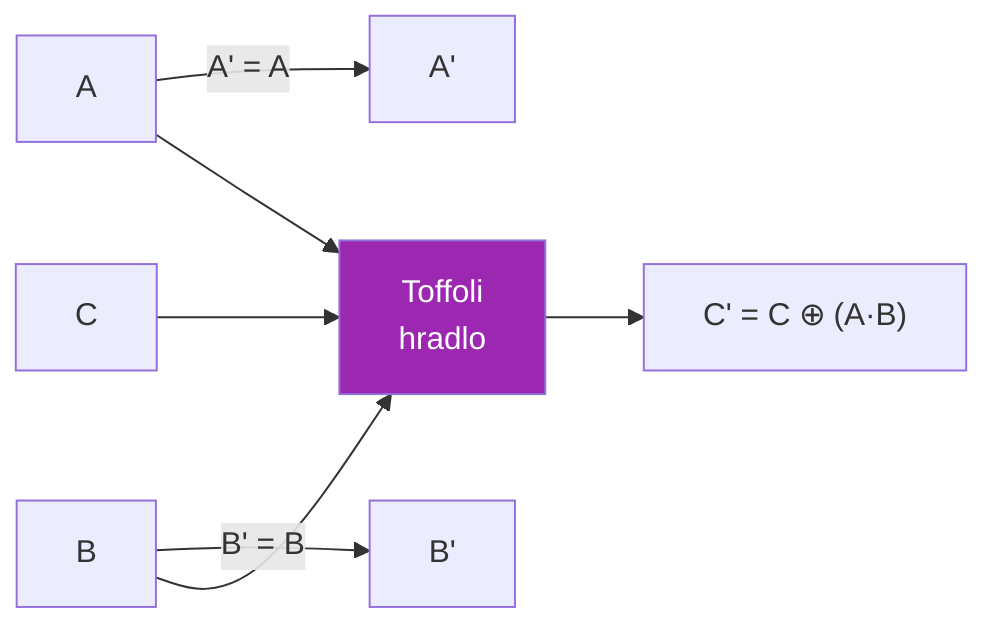

Toffoliho hradlo je **univerzální** pro reverzibilní výpočty – z něj lze sestavit libovolnou booleovskou funkci.

---

### Fredkinovo hradlo (CSWAP)

**Controlled-SWAP** – přepíná (swapuje) vstupy B a C pokud A=1.

| A | B | C | A' | B' | C' |
|---|---|---|---|---|---|
| 0 | B | C | 0 | B | C |
| 1 | B | C | 1 | C | B |

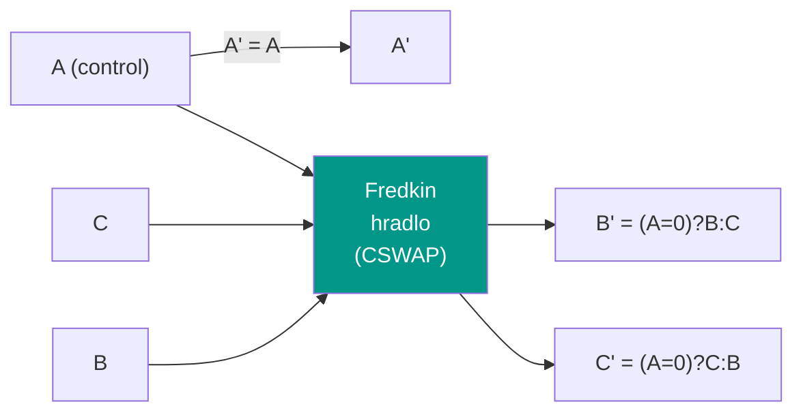

**Analogie:** Fredkinovo hradlo je jako přepínač – pokud je kontrolní vstup A=1, přepne B a C; jinak projdou beze změny.

---

### Propojení reverzibility s nanotechnologiemi

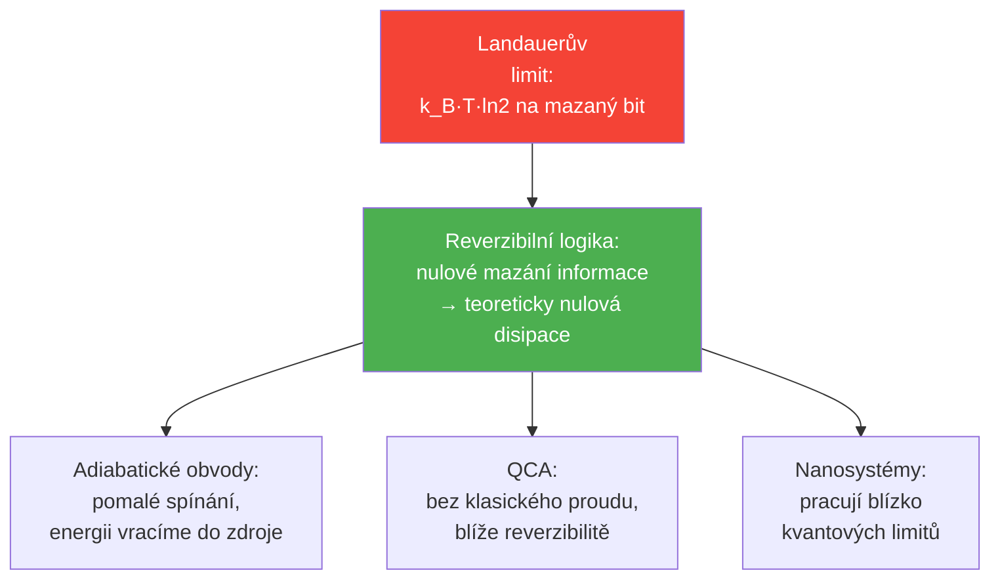

V nanosystémech pracují zařízení blízko fyzikálních limitů, kde každý elektron a každá tepelná fluktuace hraje roli. Reverzibilní a adiabatické koncepty proto nabývají na praktickém významu – nejde jen o teoretickou eleganci, ale o nutnost při extrémně nízkém příkonu.

---

## 8. Aplikace a perspektivy

### Krátkodobý potenciál nanosystémů

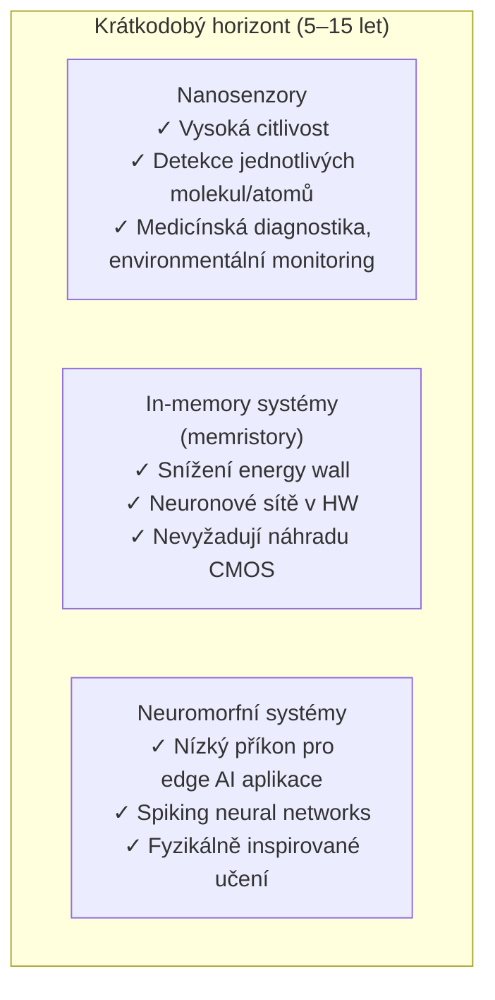

**Proč právě tyto oblasti:**
- **Senzory:** Nevyžadují složité integrované obvody; nanosoučástka plní jednoduchou funkci (vazba molekuly → změna odporu/kapacity). Jsou komerčně blíže.
- **In-memory:** Lze integrovat s existující CMOS technologií (hybridní přístup). Memristory jsou již ve výzkumné výrobě (HP, IBM).
- **Neuromorfní:** CMOS neuromorfy existují (Intel Loihi, IBM TrueNorth). Nanosystémy mohou dále snížit příkon.

---

### Dlouhodobé výzvy

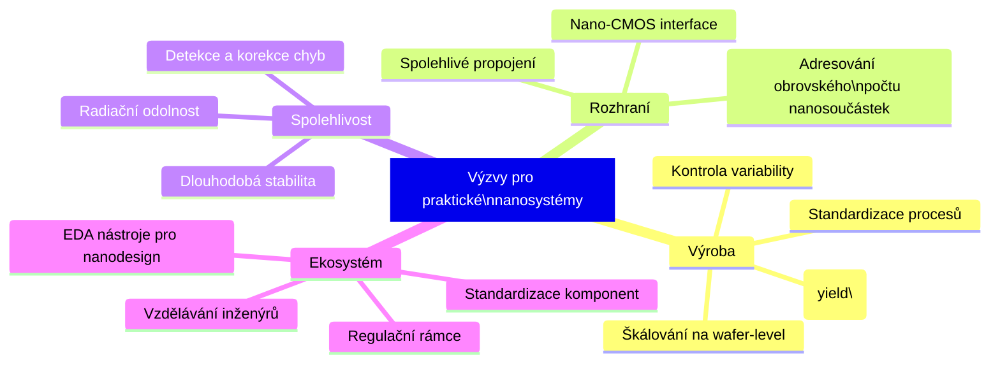

**Co je potřeba dosáhnout:**

1. **Kontrola výroby** – variabilita musí klesnout pod úroveň, kde ji lze kalibrovat nebo kompenzovat.
2. **Spolehlivé nano-makro rozhraní** – hierarchické adresování, multiplexing, CMOS-nano hybridní architektura.
3. **Standardizace** – podobně jako JEDEC standardy pro paměti nebo CMOS procesní uzly. Bez toho nelze budovat ekosystém návrhu a výroby.
4. **EDA nástroje** – návrhové nástroje musí rozumět statistické povaze nanosoučástek (Monte Carlo analýza variability, fault-tolerant design flow).

Bez těchto kroků zůstane nanotechnologie převážně v laboratorní fázi – slibná, ale nedostupná pro masové aplikace.

---

## Shrnutí: Přehled klíčových konceptů

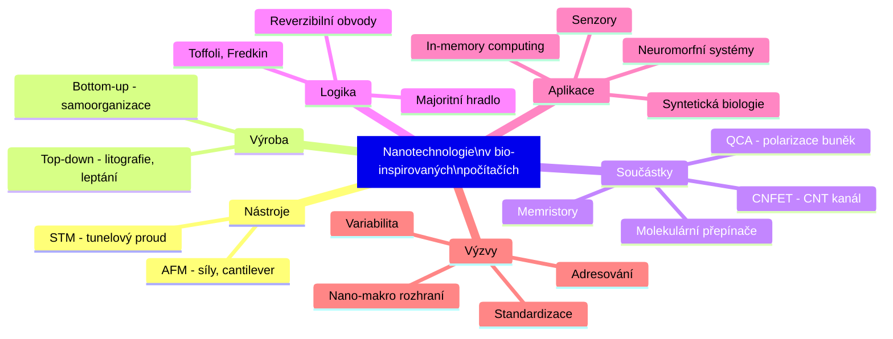

---

*Poznámka: Některé části (reverzibilita a logická hradla) nebyly explicitně součástí přednáškových materiálů, ale jsou standardní součástí kontextu nízkoenergetických nanosystémů.*