# Řádný termín 2023/2024 — Vzorové odpovědi

> [!abstract] O tomto souboru
> Vzorové odpovědi k otázkám z řádného termínu 2023/2024. Každá sekce obsahuje strukturovanou odpověď, klíčové vzorce a Mermaid diagramy pro lepší pochopení.

---

## 1. Bylova smyčka (Byl's Loop)

> [!question] Zadání
> Bylova smyčka — ukázaná na obrázku: popsat, kolik používá možných hodnot na buňku, nakreslit Von-Neumannovo okolí, kolik je tam možných přechodových funkcí, pokud má nějaká buňka všude v okolí 0, jaký bude její další stav?

### Počet hodnot na buňku

Bylova smyčka (1989, John Byl) je 2D celulární automat se **6 stavy** (hodnoty 0–5). Byl navrhl zjednodušenou variantu Langtonovy smyčky se stejnou schopností seberepolikace, ale mnohem menším pravidlovým souborem.

> [!info] Klíčové parametry
> - **Počet stavů:** 6 (hodnoty 0, 1, 2, 3, 4, 5)
> - **Typ okolí:** Von-Neumannovo (4-okolí + střed = 5 buněk)
> - **Počet explicitních pravidel:** ~12 (s využitím rotační symetrie)

### Von-Neumannovo okolí

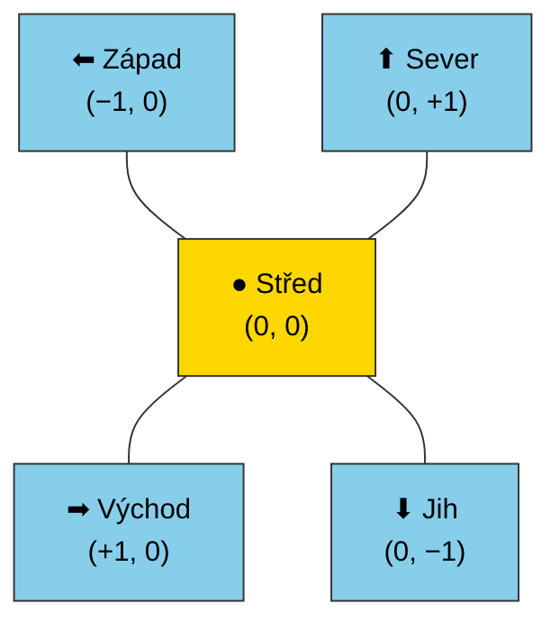

Von-Neumannovo okolí zahrnuje **5 buněk**: střed + 4 ortogonální sousedy (bez diagonál). Na rozdíl od Moorova okolí (8 sousedů + střed = 9 buněk).

### Počet možných přechodových funkcí

Každá konfigurace okolí je uspořádaná 5-tice stavů. Počet možných vstupních konfigurací:

$$|\text{konfigurace}| = 6^5 = 7\,776$$

Přechodová funkce přiřazuje každé konfiguraci jeden z 6 stavů. Celkový počet možných přechodových funkcí:

$$|\mathcal{F}| = 6^{6^5} = 6^{7776}$$

Toto číslo je astronomicky velké — Byl proto definoval pravidla pouze pro podmnožinu konfigurací a využil rotační symetrii.

### Stav buňky s nulovým okolím

Pokud má buňka **všude v okolí stav 0** (tj. všech 5 buněk vč. středu je 0), pak její příští stav bude opět **0**. Stav 0 je tzv. **klidový stav (quiescent state)** — automat musí mít tuto vlastnost, aby nekonečná plocha nul zůstala stabilní.

> [!tip] Vlastnost klidového stavu
> $\delta(0, 0, 0, 0, 0) = 0$ — pravidlo platí pro všechny celulární automaty Bylova typu.

---

## 2. Výpočet konvolučních a fully connected vrstev — MAC

> [!question] Zadání
> Výpočet konvolučních a fully connected vrstev neuronky podle obrázku, MAC nakreslit, popsat vstupy a výstupy.

### MAC (Multiply-Accumulate) operace

MAC je základní aritmetická operace neuronových sítí:

$$\text{MAC}: \quad \text{acc} \mathrel{+}= a \times b$$

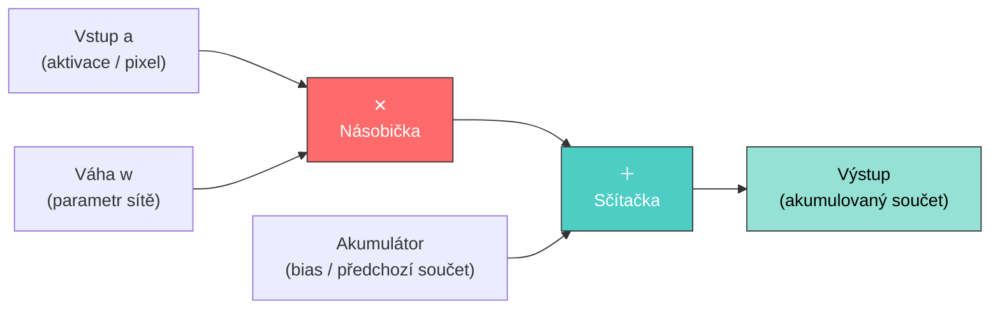

### Konvoluční vrstva

Pro vstupní feature mapu $X$ o velikosti $H \times W \times C_{in}$ a filtr $K$ o velikosti $k \times k \times C_{in} \times C_{out}$:

$$Y[i,j,c_{out}] = \sum_{di=0}^{k-1}\sum_{dj=0}^{k-1}\sum_{c_{in}} X[i{+}di,\, j{+}dj,\, c_{in}] \cdot K[di,\, dj,\, c_{in},\, c_{out}] + b[c_{out}]$$

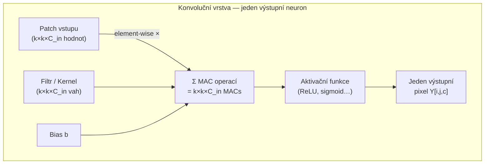

**Celkový počet MACs pro konvoluční vrstvu:**
$$\text{MACs} = H_{out} \times W_{out} \times C_{out} \times k \times k \times C_{in}$$

### Fully Connected vrstva

Pro vstupní vektor $\mathbf{x} \in \mathbb{R}^{n}$ a váhovou matici $W \in \mathbb{R}^{m \times n}$:

$$y_j = \sum_{i=1}^{n} W_{ji} \cdot x_i + b_j \quad \forall j \in \{1,\ldots,m\}$$

**Celkový počet MACs pro FC vrstvu:** $m \times n$

> [!tip] Srovnání
> FC vrstva: každý výstupní neuron je spojen se **všemi** vstupy.
> Konvoluční vrstva: každý výstupní neuron vidí pouze lokální **patch** vstupu → sdílení vah → mnohem méně parametrů.

---

## 3. SAT problém pomocí DNA počítání

> [!question] Zadání
> SAT problém pomocí DNA počítání pro formuli: $(x_1 \lor x_2) \land (x_1 \lor \lnot x_3)$ — nakreslit graf, napsat pseudokód, jak se provede DNA výpočet.

### Formule a proměnné

$$\varphi = (x_1 \lor x_2) \land (x_1 \lor \lnot x_3)$$

Proměnné: $x_1, x_2, x_3$ → $2^3 = 8$ možných ohodnocení.

### Adlemanův / Liptonův přístup — DNA filtrační pipeline

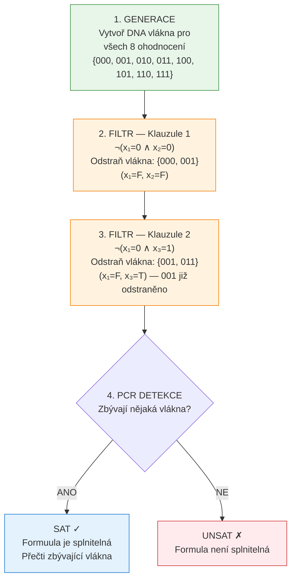

### Výsledek pro danou formuli

| $x_1$ | $x_2$ | $x_3$ | $x_1 \lor x_2$ | $x_1 \lor \lnot x_3$ | $\varphi$ |
|:---:|:---:|:---:|:---:|:---:|:---:|
| 0 | 0 | 0 | ✗ | ✓ | **✗** |
| 0 | 0 | 1 | ✗ | ✗ | **✗** |
| 0 | 1 | 0 | ✓ | ✓ | **✓** |
| 0 | 1 | 1 | ✓ | ✗ | **✗** |
| 1 | 0 | 0 | ✓ | ✓ | **✓** |
| 1 | 0 | 1 | ✓ | ✓ | **✓** |
| 1 | 1 | 0 | ✓ | ✓ | **✓** |
| 1 | 1 | 1 | ✓ | ✓ | **✓** |

Formule je **splnitelná** — po filtraci zůstanou vlákna pro: $(0,1,0), (1,0,0), (1,0,1), (1,1,0), (1,1,1)$.

### Pseudokód DNA výpočtu

```
function DNA_SAT(clauses, variables):
    // 1. Generace — kombinatorická explóze v DNA trubici
    tube ← generate_all_assignments(variables)
    // Každé ohodnocení je reprezentováno unikátní DNA sekvencí
    // x_i = TRUE  → sekvence T_i
    // x_i = FALSE → sekvence F_i

    // 2. Filtrace — pro každou klauzuli
    for each clause C in clauses:
        // Klauzule je splněna, pokud alespoň jeden literál je TRUE
        // Odstraň vlákna, která porušují klauzuli (všechny literály FALSE)
        tube ← filter_unsatisfying(tube, C)
        // Biochemicky: hybridizace + magnetické oddělení nebo gel elektroforéza

    // 3. Detekce — PCR amplifikace
    if tube is not empty:
        solution ← read_assignment(tube)
        return SAT, solution
    else:
        return UNSAT
```

**DETAILNEJI**:
```
// KROK 1: INICIALIZACE A GENEROVÁNÍ
T_vse = GENERATE(Graf) 
// Vygeneruje zkumavku se všemi možnými cestami (od V0 do V3). 
// Fyzicky: smíchání sekvencí, ligace, PCR namnožení a filtrace podle správné délky.

// KROK 2: APLIKACE KLAUZULE 1: (x1 V x2)
// Chceme zachovat vlákna, kde je x1=1 NEBO x2=1
T_x1_pravda = EXTRACT(T_vse, "x1=1")    // Vytáhne vlákna obsahující sekvenci x1=1
T_zbytek = T_vse \ T_x1_pravda          // Ve zkumavce zbylo to, co nebylo vytaženo (tedy x1=0)

T_x2_pravda = EXTRACT(T_zbytek, "x2=1") // Ze zbytku vytáhne vlákna obsahující x2=1
// Zbytek po této operaci zahodíme (obsahuje x1=0 a zároveň x2=0, což nesplňuje C1)

T_C1 = MERGE(T_x1_pravda, T_x2_pravda)  
// Zkumavka T_C1 nyní obsahuje VŠECHNA vlákna splňující první klauzuli.


// KROK 3: APLIKACE KLAUZULE 2: (x1 V ¬x3)
// Nyní pracujeme se zkumavkou T_C1. Chceme zachovat vlákna, kde x1=1 NEBO x3=0
T_x1_pravda2 = EXTRACT(T_C1, "x1=1")    // Vytáhne vlákna obsahující sekvenci x1=1
T_zbytek2 = T_C1 \ T_x1_pravda2         // Zbytek (vlákna splňující C1, kde x1=0)

T_x3_nepravda = EXTRACT(T_zbytek2, "x3=0") // Ze zbytku vytáhne vlákna obsahující x3=0
// Zbytek zahodíme (to jsou ta, kde x1=0 a x3=1, což nesplňuje C2)

T_vysledek = MERGE(T_x1_pravda2, T_x3_nepravda)
// Zkumavka T_vysledek nyní obsahuje vlákna splňující celou formuli.


// KROK 4: DETEKCE VÝSLEDKU
IF DETECT(T_vysledek) == TRUE THEN
    PRINT "Formule je splnitelná (SAT)"
    // Osekvenováním obsahu můžeme zjistit konkrétní řešení (např. x1=1, x2=0, x3=0)
ELSE
    PRINT "Formule je nesplnitelná (UNSAT)"
END IF
```

> [!note] DNA reprezentace
> Každá proměnná $x_i$ má dvě komplementární DNA sekvence: $s(x_i)$ pro TRUE a $s(\lnot x_i)$ pro FALSE. Vlákno ohodnocení je konkatenace sekvencí pro danou kombinaci. Filtrace využívá komplementaritu DNA — vlákna nesplňující klauzuli jsou odstraněna hybridizací s komplementárními značenými vlákny.

---

## 4. Pareto dominance a vícekriteriální optimalizace

> [!question] Zadání
> Formálně zapsat Pareto dominanci, vícekriteriální optimalizace — dva možné způsoby, naznačit, jak je udělat.

### Formální definice Pareto dominance

Uvažujme minimalizaci $k$ kritérií. Řešení $\mathbf{a}$ **Pareto-dominuje** řešení $\mathbf{b}$ (zapisujeme $\mathbf{a} \prec \mathbf{b}$), pokud:

$$\mathbf{a} \prec \mathbf{b} \iff \forall i \in \{1,\ldots,k\}: f_i(\mathbf{a}) \leq f_i(\mathbf{b}) \;\land\; \exists j \in \{1,\ldots,k\}: f_j(\mathbf{a}) < f_j(\mathbf{b})$$

Řešení $\mathbf{a}^*$ je **Pareto-optimální**, pokud neexistuje žádné $\mathbf{b}$ takové, že $\mathbf{b} \prec \mathbf{a}^*$.

Množina všech Pareto-optimálních řešení tvoří **Pareto frontu** $\mathcal{P}^*$.

### Vizualizace Pareto fronty (2 kritéria)

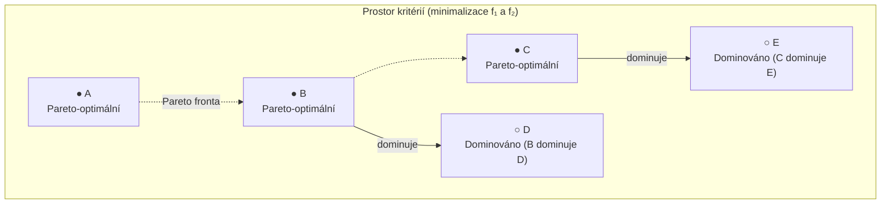

> [!info] Intuice
> Na Pareto frontě nelze zlepšit jedno kritérium bez zhoršení jiného. Všechna řešení na frontě jsou rovnocenná — výběr závisí na preferencích rozhodovatele.

### Dva přístupy k vícekriteriální optimalizaci

#### Přístup 1: Agregace (Weighted Sum)

Převod na jednokriteiriální problém lineární kombinací:

$$f_{agg}(\mathbf{x}) = \sum_{i=1}^{k} w_i \cdot f_i(\mathbf{x}), \quad w_i \geq 0, \quad \sum w_i = 1$$

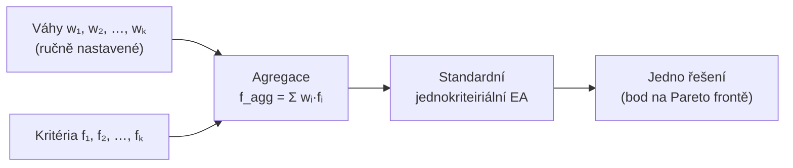

**Výhoda:** jednoduchost. **Nevýhoda:** neschopnost najít nekonvexní části Pareto fronty; váhy je nutné ladit opakovaně.

#### Přístup 2: Pareto-based EA (NSGA-II styl)

Udržuje populaci řešení pokrývající celou Pareto frontu najednou.

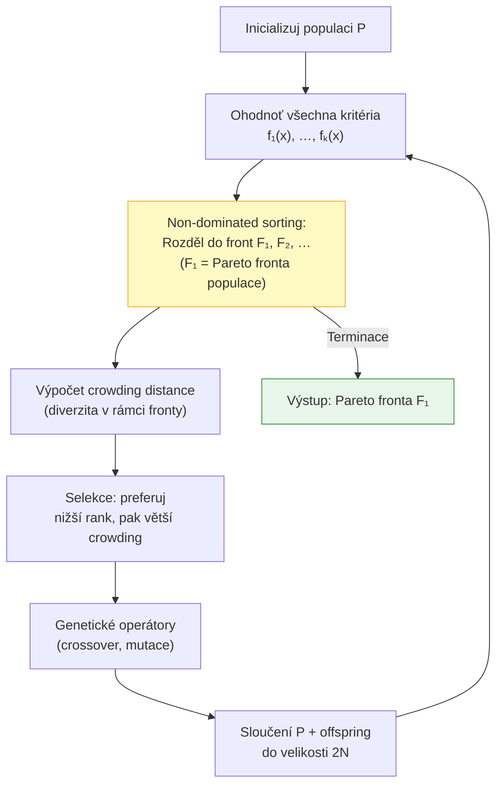

**Výhoda:** vrátí celou Pareto frontu v jednom běhu; nezávisí na váhách. **Nevýhoda:** vyšší výpočetní náročnost.

---

## 5. Neuroevoluce — evoluční algoritmus pro CNN

> [!question] Zadání
> Evoluční algoritmus pro vytvoření nějaké neuronky, napsat pseudokód, byly k dispozici funkce jako `TrainingCNN`, `GetError`, `NewPop`; dále pak k čemu slouží prediktor a jaké má vstupy.

### Pseudokód neuroevoluce

```
// Evoluční hledání architektury/vah CNN
function NeuroEvolution():
    P ← InitPopulation(λ)          // λ jedinců (architektury nebo váhy)
    best ← P[0]
    predictor ← InitPredictor()    // predikátor fitness

    while not StopCriterion():
        // --- Ohodnocení fitness ---
        for each individual ind in P:
            subset ← predictor.GetSubset(ind)   // vyber podmnožinu trénovacích dat
            TrainingCNN(ind, subset)              // trénuj CNN na podmnožině
            ind.fitness ← GetError(ind)           // změř chybu (nižší = lepší)

        // --- Selekce nejlepšího ---
        best ← argmin(ind.fitness for ind in P)

        // --- Aktualizace prediktoru ---
        predictor.Update(P, best)

        // --- Nová generace ---
        P ← NewPop(best, λ)        // mutace/křížení z nejlepšího

    return best
```

### Architektura s prediktorem

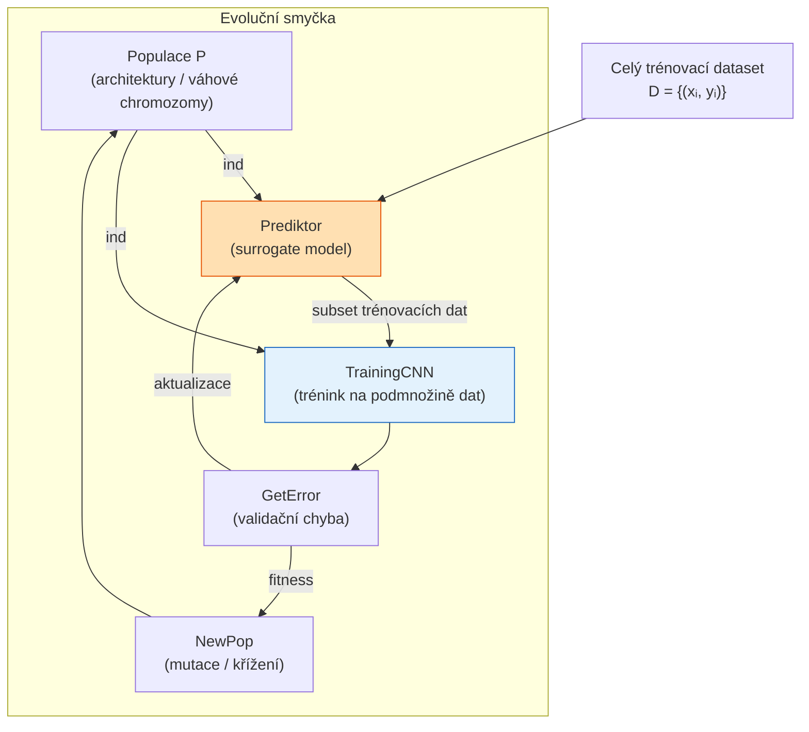

### K čemu slouží prediktor a jaké má vstupy

> [!success] Role prediktoru
> **Problém:** Plný trénink CNN pro ohodnocení každého jedince je výpočetně extrémně drahý (hodiny/dny na GPU).
>
> **Řešení — prediktor (surrogate):** Místo tréninku na celém datasetu $D$ prediktor vybere **reprezentativní podmnožinu** $D' \subset D$, na které se trénuje. Prediktor se průběžně aktualizuje, aby $D'$ co nejlépe předpovídalo chování na plném $D$.

**Vstupy prediktoru:**
- Celý trénovací dataset $D = \{(x_i, y_i)\}$
- Aktuální populace jedinců $P$ (jejich architektury/váhy)
- Historie fitness hodnot z předchozích generací
- (Volitelně) charakteristiky jedinců (počet vrstev, parametrů apod.)

**Výstup prediktoru:**
- Podmnožina $D' \subseteq D$ pro efektivní trénink (`GetSubset`)

---

## 6. Entropie, Boltzmannův zákon a Landauerův teorém

> [!question] Zadání
> Co znamená $k_B$ a $W$ v $E_{SNL}$, vypočítat nejpravděpodobnější makrostav v úloze s nádobou a 4 částicemi, $E_{bit}$ napsat vzorec, Landauerův teorém ohledně logické a fyzické reverzibility.

### Boltzmannova entropie — $k_B$ a $W$

Boltzmannova entropie:

$$S = k_B \cdot \ln W$$

- $k_B = 1{,}38 \times 10^{-23}\ \text{J/K}$ — **Boltzmannova konstanta** (vztah mezi tepelnou energií a teplotou)
- $W$ — **počet mikrostav** odpovídajících danému makrostavu (termodynamická pravděpodobnost)

### Nejpravděpodobnější makrostav — 4 částice v nádobě

Nádoba rozdělena na dvě poloviny (L a R). 4 částice se mohou nacházet kdekoliv.

| Makrostav $(n_L, n_R)$ | Počet mikrostav $W = \binom{4}{n_L}$ | Entropie $S = k_B \ln W$ |
|:---:|:---:|:---:|
| (4, 0) | $\binom{4}{4} = 1$ | $0$ |
| (3, 1) | $\binom{4}{3} = 4$ | $k_B \ln 4$ |
| **(2, 2)** | $\binom{4}{2} = \mathbf{6}$ | $k_B \ln 6$ ← **maximum** |
| (1, 3) | $\binom{4}{1} = 4$ | $k_B \ln 4$ |
| (0, 4) | $\binom{4}{0} = 1$ | $0$ |

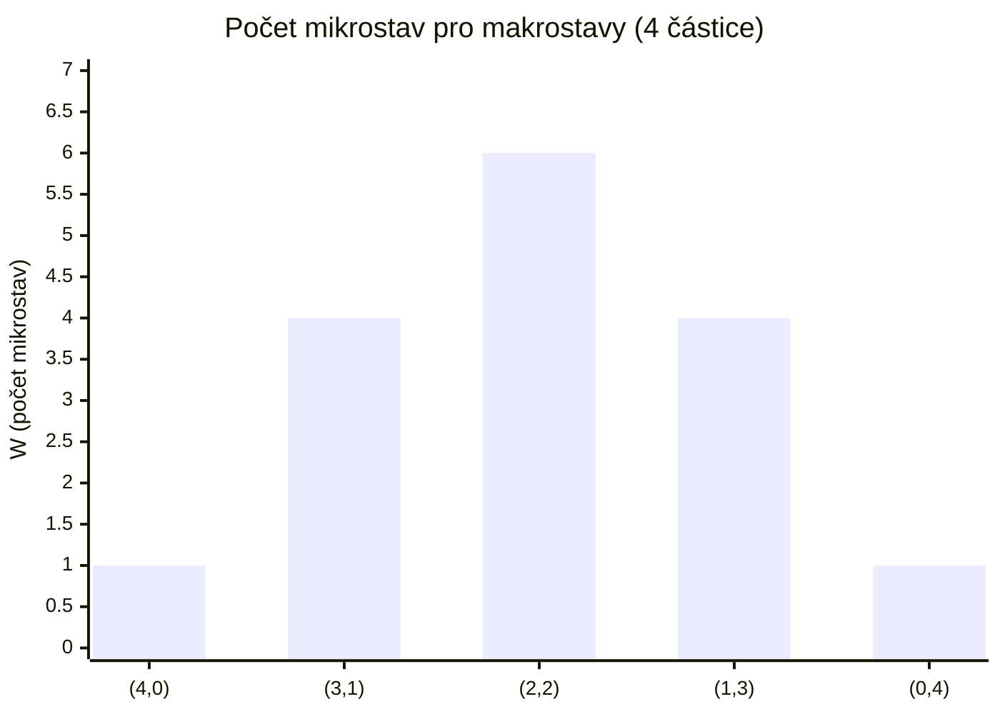

> [!success] Nejpravděpodobnější makrostav
> **(2, 2)** — rovnoměrné rozdělení, $W = 6$, maximální entropie. Tento výsledek ilustruje **druhý termodynamický zákon**: systém přirozeně směřuje ke stavu s maximální entropií.

### Energie na vymazání bitu — $E_{bit}$

$$\boxed{E_{bit} = k_B \cdot T \cdot \ln 2}$$

Při pokojové teplotě $T = 300\ \text{K}$:
$$E_{bit} \approx 1{,}38 \times 10^{-23} \times 300 \times 0{,}693 \approx 2{,}87 \times 10^{-21}\ \text{J}$$

### Landauerův teorém — logická vs. fyzická reverzibilita

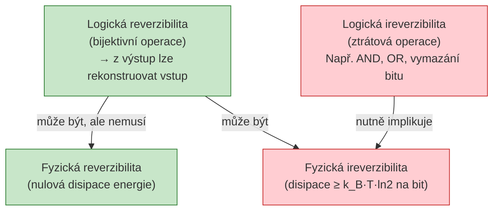

> [!important] Landauerův teorém (1961)
> Každá **logicky ireverzibilní** operace (operace, která ztrácí informaci, např. vymazání bitu) musí disipovat **minimálně** $k_B \cdot T \cdot \ln 2$ energie do okolí jako teplo.
>
> - **Logická reverzibilita** nezaručuje fyzickou reverzibilitu.
> - **Logická ireverzibilita** však fyzickou ireverzibilitu (disipaci) **zaručuje** — to je Landauerův limit.
> - Reversibilní výpočet (např. Toffoliho hradlo) je logicky reversibilní → může teoreticky probíhat bez disipace.

---

## 7. CGP pro řadící sítě

> [!question] Zadání
> CGP pro řadící sítě — napsat, kolik bude mít vstupů a výstupů, pro zadaný počet sloupců a řádků napsat délku chromozomu, navrhnout loss funkci a formálně ji zapsat.

### Počet vstupů a výstupů

Pro řadící síť řadící $n$ hodnot:
- **Počet vstupů:** $n_i = n$
- **Počet výstupů:** $n_o = n$ (každý vstupní prvek má odpovídající výstupní pozici)

Základní stavební blok je **komparátor**: 2 vstupy → 2 výstupy $(\min, \max)$.

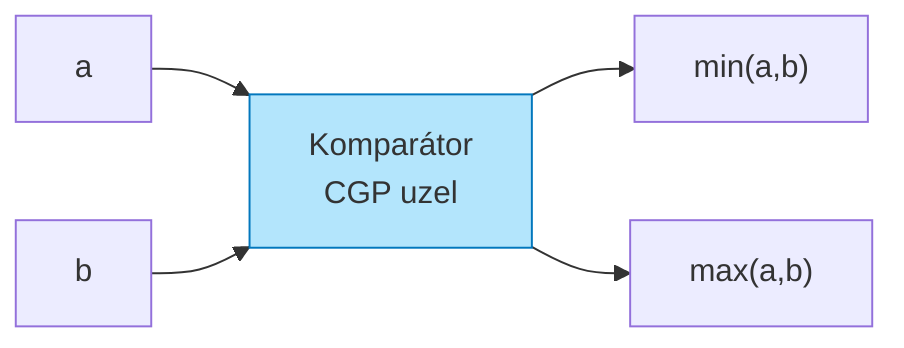

### Délka chromozomu

CGP chromozom pro konfiguraci s $r$ řádky, $c$ sloupci a aritou uzlu $a$ (komparátor: $a = 2$):

$$\underbrace{r \cdot c \cdot (a + 1)}_{\text{geny uzlů}} + \underbrace{n_o}_{\text{geny výstupů}}$$

- Každý uzel: $a$ genů pro vstupy + 1 gen pro funkci = $(a+1)$ genů
- Celkem uzlů: $r \cdot c$

$$\boxed{L_{chrom} = r \cdot c \cdot (a + 1) + n_o}$$

**Příklad:** $n = 4$ vstupy, $r = 3$ řádky, $c = 5$ sloupců, $a = 2$ (komparátor):
$$L = 3 \times 5 \times (2+1) + 4 = 45 + 4 = 49\ \text{genů}$$

### Struktura chromozomu

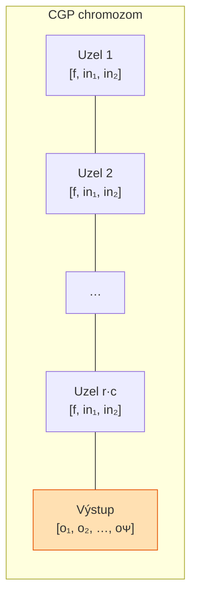

### Loss funkce pro řadící síť

**Cíl:** výstup $\mathbf{y} = (y_1, y_2, \ldots, y_n)$ musí splňovat $y_1 \leq y_2 \leq \cdots \leq y_n$.

#### Varianta 1 — Počet správně seřazených dvojic (maximalizace)

$$\text{fitness}(\mathbf{c}) = \sum_{t=1}^{T} \sum_{i=1}^{n-1} \mathbb{1}\bigl[y_i^{(t)} \leq y_{i+1}^{(t)}\bigr]$$

kde $T$ je počet testovacích vzorů, $\mathbb{1}[\cdot]$ je indikátorová funkce.

#### Varianta 2 — Penalizace neseřazených sousedů (minimalizace)

$$\mathcal{L}(\mathbf{c}) = \sum_{t=1}^{T} \sum_{i=1}^{n-1} \max\!\left(0,\; y_i^{(t)} - y_{i+1}^{(t)}\right)$$

> [!success] Doporučená loss funkce
> Varianta 2 je diferencovatelnější a lépe reflektuje **míru špatnosti** seřazení (nejen binárně správně/špatně). Pro evoluci se obvykle používá varianta 1 (maximalizace počtu správných případů přes celý testovací soubor všech $n!$ nebo $2^n$ permutací).

---

## 8. Majorita pomocí QCA

> [!question] Zadání
> Zakreslit majoritu pomocí QCA — předkreslené buňky, vybarvit správné tečky.

### QCA buňka — základy

Kvantová buněčná buňka (QCA cell) má **4 kvantové tečky** umístěné v rozích čtverce a **2 elektrony**, které tunelují mezi tečkami.

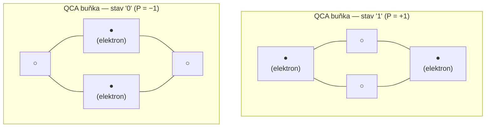

- **P = +1** (elektrony: vlevo nahoře + vpravo dole) → logická **1**
- **P = −1** (elektrony: vpravo nahoře + vlevo dole) → logická **0**

### QCA majoritní hradlo

Majoritní hradlo má **3 vstupy (A, B, C)** a **1 výstup M = Majority(A, B, C)**:

$$M(A,B,C) = AB + AC + BC$$

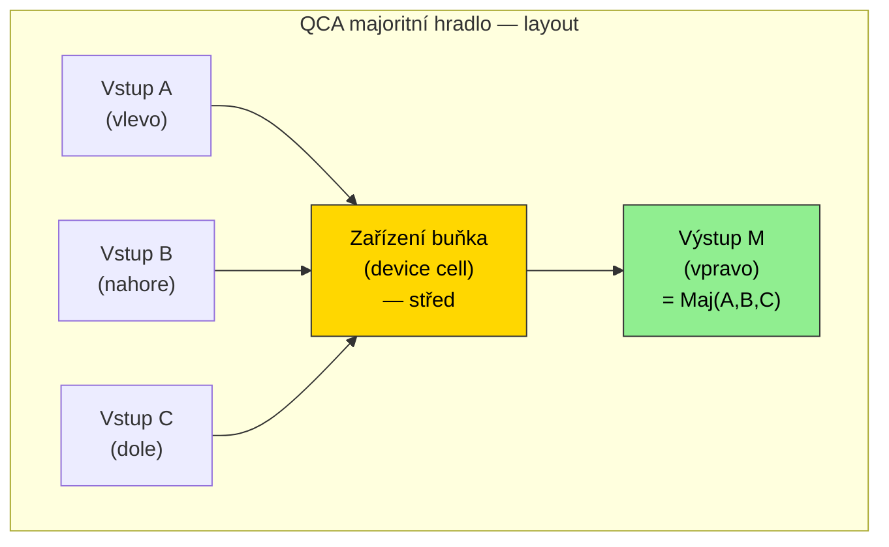

### Pravdivostní tabulka majority

| A | B | C | M = Maj(A,B,C) |
|:-:|:-:|:-:|:-:|
| 0 | 0 | 0 | **0** |
| 0 | 0 | 1 | **0** |
| 0 | 1 | 0 | **0** |
| 0 | 1 | 1 | **1** |
| 1 | 0 | 0 | **0** |
| 1 | 0 | 1 | **1** |
| 1 | 1 | 0 | **1** |
| 1 | 1 | 1 | **1** |

> [!tip] AND a OR pomocí majority
> Majorita je **universální hradlo** v QCA:
> - **AND:** $A \cdot B = M(A, B, 0)$ — třetí vstup fixován na 0
> - **OR:** $A + B = M(A, B, 1)$ — třetí vstup fixován na 1
>
> Invertory (NOT) se realizují diagonálním umístěním buněk.

### Postup vybarvení v zadání

Při správném vybarvení buňky pro výstup $M$:
1. Spočítej majoritní hodnotu ze tří sousedních vstupních buněk.
2. Pokud $M = 1$: vlevo nahoře ● a vpravo dole ● (ostatní ○).
3. Pokud $M = 0$: vpravo nahoře ● a vlevo dole ● (ostatní ○).

---

## 9. Teoretické otázky — L-systém a syntetická biologie

> [!question] Zadání
> L-systém — co u něj navrhuje evoluční algoritmus; syntetická biologie — platforma pro výpočet, čím se udává logická hodnota?

### L-systémy a evoluční návrh

L-systém (Lindenmayer, 1968) je formální přepisovací systém:
- **Abeceda** $V$ — množina symbolů
- **Axiom** $\omega$ — počáteční řetězec
- **Přepisovací pravidla** $P: V \to V^*$ — jak se každý symbol rozvíjí

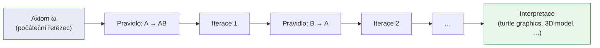

> [!success] Co navrhuje evoluční algoritmus u L-systémů
> Evoluční algoritmus navrhuje **přepisovací pravidla** $P$ (produkce). Axiom může být pevně daný nebo také součástí evoluce.
>
> **Co se optimalizuje:**
> - Pravidla $A \to \ldots$, $B \to \ldots$ (levá i pravá strana)
> - Počet iterací přepisu
> - Parametry (u parametrických L-systémů: délky úseček, úhly otočení)
>
> **Fitness** se vyhodnocuje na základě výsledné struktury (podobnost cílovému tvaru, funkčnost navržené antény, kompresní poměr pro popis rostliny apod.).

### Syntetická biologie — platforma pro výpočet

**Platforma pro výpočet:** živá buňka (nejčastěji bakterie *E. coli* nebo kvasinka *S. cerevisiae*) slouží jako výpočetní médium. Genetické obvody jsou implementovány pomocí regulačních genových sítí.

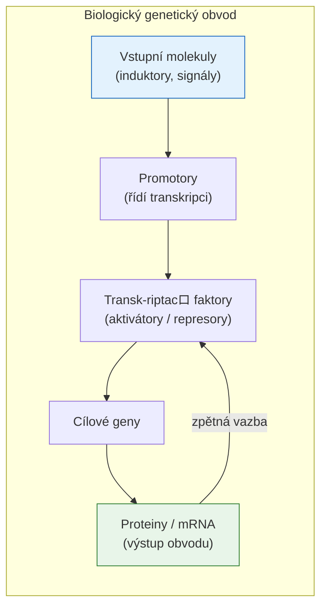

> [!success] Čím se udává logická hodnota v syntetické biologii
> Logická hodnota je udávána **koncentrací molekul** — typicky proteinu nebo mRNA:
>
> - **Logická 1 (HIGH):** koncentrace překračuje prahovou hodnotu $\theta$ → $[protein] > \theta$
> - **Logická 0 (LOW):** koncentrace je pod prahem → $[protein] < \theta$
>
> Konkrétně se nejčastěji pracuje s koncentrací:
> - **Transkripčních faktorů** (proteiny regulující přepis genů)
> - **Reportérových proteinů** (GFP — zelená fluorescence jako výstupní signál)
> - **mRNA** (messenger RNA jako meziprodukt)
>
> Logické hradlo NOT = represor (při vysoké koncentraci vstupu potlačuje výstupní gen). Hradlo AND = dva koaktivátory nutné zároveň.

---

> [!note] Zdroje
> Odpovědi vychází z přednáškových materiálů předmětu BIO (Biologically Inspired Computing), VUT FIT. Pro hlubší studium viz příslušné přednášky a doporučená literatura kurzu.